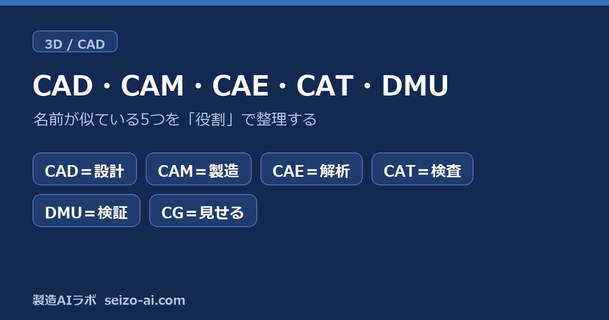
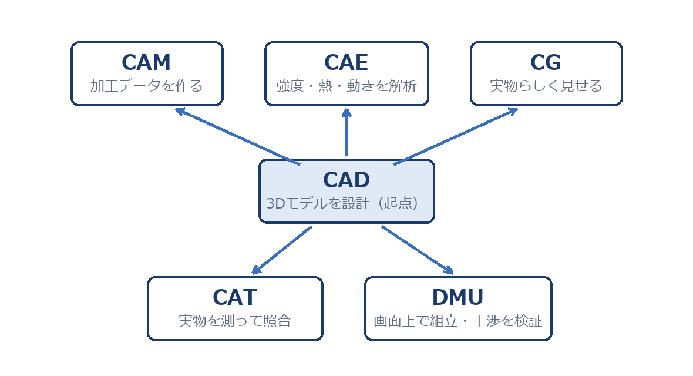
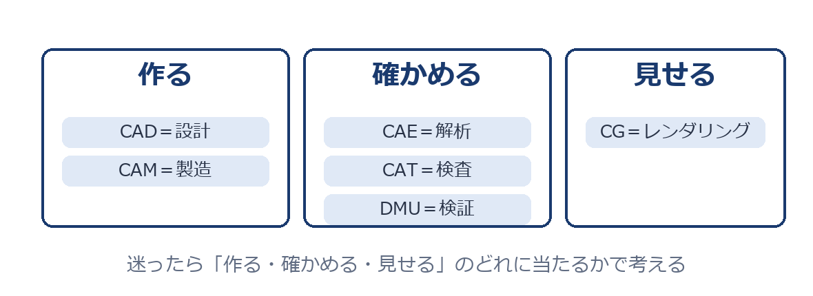

# CAD・CAM・CAE・CAT・DMUの違い｜「作る・確かめる・見せる」で整理するCAxファミリー入門

> 原始素材条目：CAD・CAM・CAE・CAT・DMU の違い ——「作る・確かめる・見せる」で整理する CAx ファミリー入門（製造 AI ラボ）

> 原文链接：https://seizo-ai.com/cax-family/

> 摘要：名前が似ていて混同しやすいCAD・CAM・CAE・CAT・DMU・CGを「役割」で整理する。作る・確かめる・見せるの3分類と図解で、一度で区別できるようにする入門解説。

## 正文

# CAD・CAM・CAE・CAT・DMUの違い｜「作る・確かめる・見せる」で整理するCAxファミリー入門

- まず全体像：役割の早見表

- CAD：すべての起点

- CAM：加工データを作る

- CAE：計算で確かめる

- CAT：実物を測って照合する

- DMU：画面上で組み立てて検証する

- CG：実物らしく見せる

- まとめ：「作る・確かめる・見せる」で仕分ける

## 图片

### 图片 1

原图：https://seizo-ai.com/wp-content/uploads/2026/07/eyecatch-cax-family.png

### 图片 2：CADを起点に、CAM・CAE・CG・CAT・DMUへつながる関係図

原图：https://seizo-ai.com/wp-content/uploads/2026/07/fig_cax_map.png

### 图片 3：作る=CAD・CAM、確かめる=CAE・CAT・DMU、見せる=CGの3分類

原图：https://seizo-ai.com/wp-content/uploads/2026/07/fig_cax_3roles.png

## 抓取记录

- 页面标题：CAD・CAM・CAE・CAT・DMUの違い｜「作る・確かめる・見せる」で整理するCAxファミリー入門
- 抓取状态：ok
- 成功下载图片：3
- 图片失败：0
- 处理耗时：8.0 秒