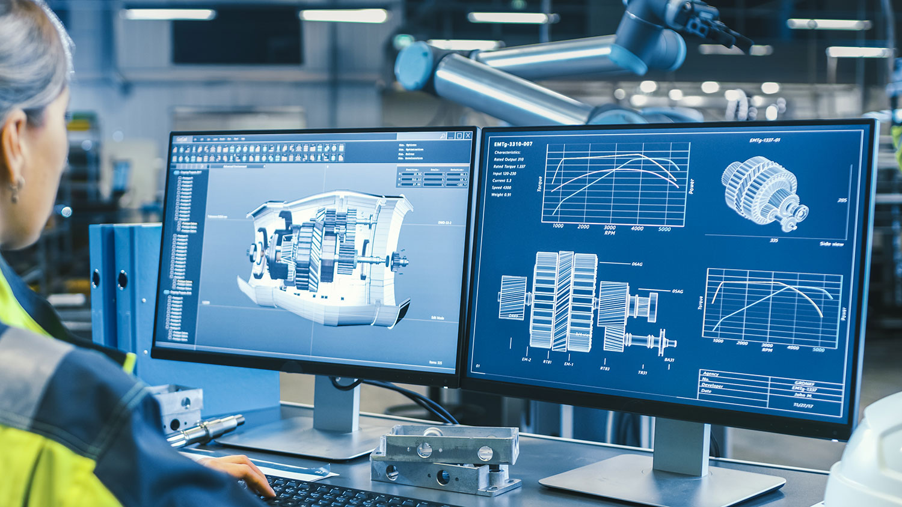
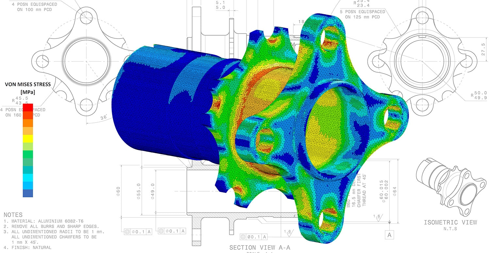

# CAD・CAM・CAEの違いとは？基本機能からおすすめソフトまで分かりやすく解説

> 原始素材条目：CAD・CAM・CAE の違い（ABKSS）

> 原文链接：https://www.abkss.jp/blog/137

> 摘要：製造業で重要な役割を果たす「CAD」「CAM」「CAE」は、それぞれ異なる機能と目的を持つソフトウェアです。本記事では、これら3つのソフトウェアの特徴や用途を解説し、おすすめのツールも併せて紹介します。

## 正文

# CAD・CAM・CAEの違いとは？基本機能からおすすめソフトまで分かりやすく解説

製造業３次元CAD２次元CADCAD/CAMCAE/シミュレーション

製造業で重要な役割を果たす「CAD」「CAM」「CAE」は、それぞれ異なる機能と目的を持つソフトウェアです。名前は似ていますが、設計から加工、解析まで、活用される場面や用途は異なります。

この記事では、これら3つのソフトウェアの特徴や用途を解説し、おすすめのツールも併せて紹介します。これを機に、CAD・CAM・CAEそれぞれの役割をおさらいしてみましょう。

このような方におすすめの記事です

- CAD/CAM/CAEの基本的な知識を抑えたい方

- ソフトの導入にあたり、それぞれの違いをしっかり理解しておきたい方

- 現状の問題を解決するために、新たな視点やツールを模索している方

目次[非表示]

- ・CADとは

- ・CAMとは

- ・CAEとは

- ・CAD・CAM・CAEの違い

- ・CADのおすすめソフト

- ・SOLIDWORKS

- ・CADSUPER Works

- ・AutoCAD

- ・CAMのおすすめソフト

- ・Mastercam

- ・CAMCORE EX

- ・CAEのおすすめソフト

- ・Ansys Mechanical

- ・SOLIDWORKS Simulation

- ・CAD/CAM/CAEが統合されたソフト

- ・Autodesk Fusion（Fusion360）

- ・CAD/CAM/CAE製品ならABKSSにご相談ください

- ・おわりに

## CADとは

CADとは「Computer-Aided Design」の略で、コンピュータを利用して設計や製図を行う技術です。主に製造業や建築業、機械工学、電子工学などの分野で使用され、手書きでの設計よりも正確で効率的な図面作成が可能です。

CADには「2D（2次元）」と「3D（3次元）」の2種類があります。2DCADは平面図の作成に適し、紙の製図をコンピュータ上で再現する用途に利用されます。一方、3DCADは立体的なモデルを作成し、そのまま製造工程で活用できます。

また、CADソフトには、建築や土木などの専門分野に特化したものや、汎用的に使用できるものがあり、幅広い業界で活用されています。

さらに、設計作業の効率化だけでなく、後工程でのデータ活用やコスト削減、作業効率の向上にも貢献します。

## CAMとは

CAMとは「Computer Aided Manufacturing」の略で、製品や部品の製造・加工を行う際、CADで作成した図面を基に、工作機械での加工に必要なNC（数値制御）プログラムなどを作成するツールです。

CADなどのシステムで作成された設計図面を元に、CAMで加工プログラムを作成し、工作機械にプログラムを渡して実際の加工を行います。CAMソフトには、2D加工に特化したものから、複雑な3D形状の多軸加工をサポートするものまで多岐にわたる種類があります。

CAMを導入すると、工具経路を自動生成できるため、加工前のシミュレーションが可能となり、作業効率を向上させることが可能です。さらに、多軸加工にも対応しており、複雑な形状や精密部品の加工が容易になります。

> 一般的にはCADシステムで作成した設計データをCAMに出力して加工を行いますが、CADとCAMの工程をまとめたツールも多く、これを「CADCAM（キャドキャム）」と呼びます。工作機械との互換性により、さらに高い精度での製造・加工を実現することができます。

一般的にはCADシステムで作成した設計データをCAMに出力して加工を行いますが、CADとCAMの工程をまとめたツールも多く、これを「CADCAM（キャドキャム）」と呼びます。工作機械との互換性により、さらに高い精度での製造・加工を実現することができます。

## CAEとは

CAEとは「Computer Aided Engineering」の略で、製品設計の段階でコンピュータを用いて解析やシミュレーションを行い、設計の妥当性を確認するためのツールです。CADで作成した設計図を基に、製品が求められる機能や性能を発揮できるかを検証します。

従来は試作品を作成し、実際の環境で動作テストを繰り返すことで設計の最適化を図っていました。しかし、CAEを利用することで、コンピュータ内で条件を設定し、構造解析や熱伝導解析、音響解析、電磁波解析などのシミュレーションを行うことが可能になりました。この方法は、試作品を作る手間やコストを削減し、開発期間の短縮にもつながります。

例えば、力が加わった際の構造の変化や、熱がどのように伝わるかといった物理特性をCAEでシミュレーションすることで、問題点を事前に発見し、改善策を検討できます。これにより、製品開発におけるリスクを低減し、品質の向上を図ることができます。

CAEは、設計の段階で問題を解決し、最適化されたデータを基にCAMを使って加工工程へと進む、効率的な製造プロセスを支える重要な役割を担っています。

## CAD・CAM・CAEの違い

CAD、CAM、CAEは、それぞれ設計、解析、製造プロセスにおいて重要な役割を果たすツールです。これらは全く異なる種類のツールですが、うまく連携させることで、製品開発の効率化や品質の向上が可能となります。

一般的なプロセスとして、CADで設計したデータをCAEで解析・検証し、問題がなければCAMを用いて製造を進めます。これにより、設計から製造までを一貫して効率的に行うことができます。

以下で、これら3つのツールの役割や工程ごとの違いについてまとめます。

|  | CAD | CAM | CAE |\n| --- | --- | --- | --- |\n| 基本機能 | 設計図やモデルを作成し、設計プロセスを効率化する | 設計データを基に製造機械を制御するプログラムを作成する | 製品設計を解析・シミュレーションし性能を検証する |
| 工程 | 設計工程 | 製造工程 | 解析や検証工程 |
| 目的 | 形を作ること | その形を加工すること | その形が正しいか確かめること |

設計図やモデルを作成し、設計プロセスを効率化する

設計データを基に製造機械を制御するプログラムを作成する

製品設計を解析・シミュレーションし性能を検証する

設計工程

製造工程

解析や検証工程

形を作ること

その形を加工すること

その形が正しいか確かめること

## CADのおすすめソフト

### SOLIDWORKS

「SOLIDWORKS」は、ダッソー・システムズが提供する3D CADソリューションです。

製品開発時間の短縮、製造コストの削減、製品品質および信頼性の向上を実現し、製品の開発方法と製造方法を飛躍的に改善します。SOLIDWORKS CADパッケージは、3次元設計・製品設計・図面作成、シミュレーション、コスト見積り、製造可能性チェック、CAM、環境配慮設計、データ管理に対応しています。

### CADSUPER Works

「CADSUPER Works」は、マーブル（旧アンドール）が提供する初心者からプロフェッショナルまで利用可能な高精度で使いやすい国産3DCADソフトウェアです。

自由度の高い2次元環境と高度な3次元環境が共存した統合CADシステムで、上流から図面作成まで全方位に優れた設計支援環境を提供します。 特に、小規模から中規模の製造企業におすすめです。

### AutoCAD

「AutoCAD」は、Autodesk社が提供する業界標準の2DCADソフトウェアで、初心者からプロフェッショナルまで幅広く支持されています。

直感的なインターフェースと豊富な機能により、製図、建築図面、インフラ設計など、多岐にわたる用途で利用されています。特にその高度なツールセットが設計作業の効率化を図る上で評価されており、初心者からプロフェッショナルにまで推奨されるソフトウェアです。

## CAMのおすすめソフト

### Mastercam

「Mastercam」は、米国Mastercam社が提供するCAD/CAMソフトウェアです。汎用性が高く、2次元CADデータからツールパスを作成するなど2/3次元を混在したツールパス作成が可能です。

また「Mill」「Mill 3D」「Multi-Axis」「Lathe」「Mill-Turn」などのモジュールを組み合わせることで、金型・旋削・部品加工などあらゆる加工に対応します。

### CAMCORE EX

「CAMCORE EX」は、マーブル社が提供する2.5次元CAMです。3次元CADからの大容量データ（図面データ容量無制限）に対応して、スムーズに取り込むことが出来ます。

図面と加工データを同一ファイル上で管理しているため、加工データの作成後に必要な項目のみを変更するだけで、新たなNCデータを作成することが可能です。

## CAEのおすすめソフト

### Ansys Mechanical

「Ansys Mechanical」は、Ansys 社が提供する構造工学向けの有限要素法解析（FEA）ソフトウェアです。構造、熱、音響、非定常、非線形解析に対応し、直感的でカスタマイズ可能なユーザーインターフェースを備えています。

パラメトリック最適化、形状最適化、トポロジー最適化などの機能を通じて、設計の効率化と品質向上を実現します。

### SOLIDWORKS Simulation

「SOLIDWORKS Simulation」は、SOLIDWORKSに組み込まれた有限要素法構造解析ソフトウェアです。作成したモデルをCADと同じGUI上で直接解析が実行できます。完全オートメッシュ、アダプティブP法などで、手軽に高度な計算精度が得られます。

また、アセンブリモデルも多様な設定（接触条件・結合条件・摩擦効果・大変位接触等）を用い、動きや変形の大きな解析も精度よく検証できます。線形静解析から固有値・座屈解析、熱伝導解析、さらには非線形解析まで幅広い解析機能を搭載しています。​​​​​​​

## CAD/CAM/CAEが統合されたソフト

### Autodesk Fusion（Fusion360）

CAD、CAM、CAEが一つに統合されたソフトウェアとして注目されるのが、Autodesk社が提供する「Autodesk Fusion（Fusion 360）」です。

こちらのツールは、CADで設計した後にそのままCAEで解析を行い、さらにCAMで工作機械用のプログラムを作成する、といった製造プロセス全体を一貫して行うことが可能です。データ変換の手間が不要なため、効率的な作業が実現します。

また、クラウドベースで運用されており、常に最新バージョンを使用可能で、クラウド上でのデータ共有やコラボレーションが容易です。その柔軟性から、個人利用から法人利用まで幅広い場面で活躍しています。

## CAD/CAM/CAE製品ならABKSSにご相談ください

CAD/CAM/CAE製品を選ぶ際には、まず目的や必要な機能を明確にし、業界に適した機能を備えた製品を選ぶことが重要です。

加えて、既存システムとの連携やサポート体制、ライセンス形態、将来的な拡張性などを考慮し、コストとのバランスを慎重に検討することも必要となります。

ただし、選定を誤ると製品の効果を十分に引き出せない可能性があるため、製品選びの段階から具体的なニーズに合致した機能や操作性、将来の拡張性をしっかり見極めることが大切です。ABKSSでは、こうしたポイントを踏まえた最適なソリューションをご提案します。

CAD/CAM/CAEシステムの導入をお考えの際は、ぜひお気軽にご相談ください。

## おわりに

本記事では、CAD、CAM、CAEそれぞれの特徴や用途を解説し、おすすめのツールを紹介しました。

CADは2D・3Dモデルの作成や設計効率化、データ共有を支援するツールです。CAMは設計データを基に工作機械を制御し、高精度な製品製造を実現します。CAEは設計の解析やシミュレーションを行い、性能検証と最適化を支援します。

これらを連携させることで、設計から製造まで一貫して効率的に進めることが可能です。それぞれの特徴を理解し、自分に最適なソフトを選びましょう。

## 图片

### 图片 1

原图：https://ferret-one.akamaized.net/images/673564acbbf26600648e31ec/original.jpeg?utime=1731552430

### 图片 2

原图：https://ferret-one.akamaized.net/images/66d00b56c0a41a0110c63f50/original.png?utime=1724910423

### 图片 3

原图：https://ferret-one.akamaized.net/images/66ac55245923c30769532d9d/original.jpeg?utime=1722570021

### 图片 4

原图：https://ferret-one.akamaized.net/images/6708aefe472a4927ef247422/original.jpeg?utime=1728622334

### 图片 5

原图：https://ferret-one.akamaized.net/images/673564c5bbf26600648e31f0/original.jpeg?utime=1731552454

### 图片 6

原图：https://ferret-one.akamaized.net/images/6938f9429854f056352e05a0/original.png?utime=1765341506

## 抓取记录

- 页面标题：CAD・CAM・CAEの違いとは？基本機能からおすすめソフトまで分かりやすく解説
- 抓取状态：ok
- 成功下载图片：6
- 图片失败：0
- 处理耗时：14.4 秒