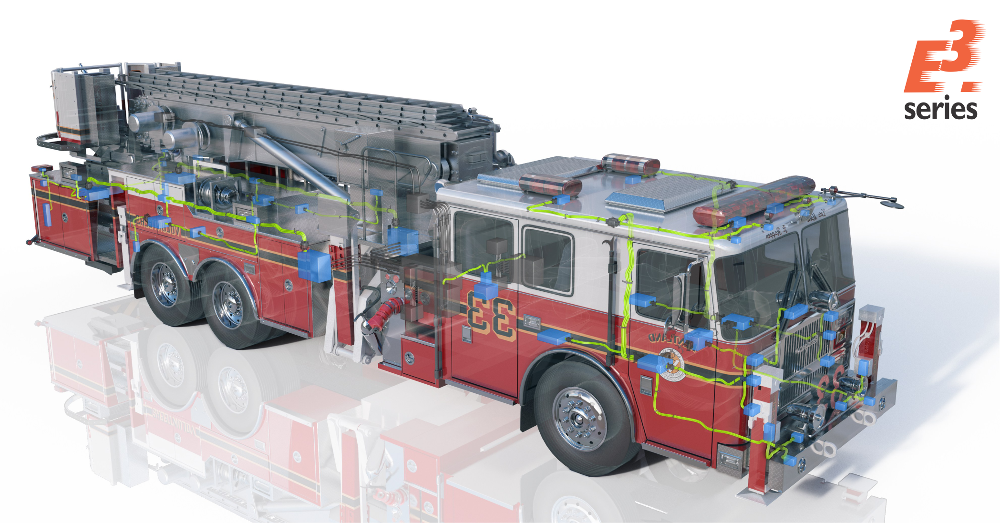
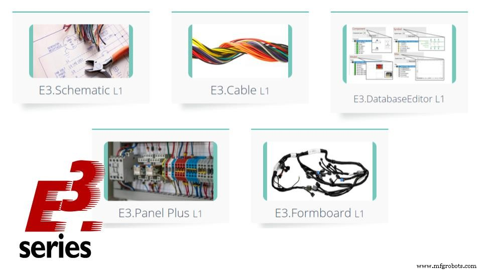

# CAD, CAE 및 CAM:차이점은 무엇입니까?

> 原始素材条目：CAD, CAE 및 CAM: 차이점은 무엇입니까?（MFGRobots）

> 原文链接：https://ko.mfgrobots.com/mfg/it/1008014616.html

## 正文

# CAD, CAE 및 CAM:차이점은 무엇입니까?

캐드란? CAE란? 캠이란? 이러한 소프트웨어는 무엇이며 서로 어떻게 다릅니까?

첫 번째 단계는 각 약어에서 공통된 처음 두 글자의 의미를 아는 것입니다. "CA"는 Computer-Aided(computer-assisted)라는 용어의 약어로, 세 가지 시스템이 사용자를 돕기 위해 만들어졌음을 의미합니다. 컴퓨터의 처리 능력을 사용하여 가능한 한 빨리 목표를 달성하십시오. CAD에서 마지막 약어는 CAE - 엔지니어링(엔지니어링) 및 CAM - 제조(제조)의 디자인(설계, 플랜트)이라는 용어에서 유래합니다. 각 프로그램은 실행과 목적에 중점을 두고 있습니다. 이 기사에서는 세 가지 시스템을 더 자세히 다루고 각 시스템의 적용을 보여줍니다.

##### CAD(Computer-Aided Design)

CAD 프로그램은 엔지니어링 프로세스 중 제품 설계 및 설계 단계의 문서화에 중점을 둔 컴퓨터 기술입니다. CAD는 제품, 프로세스, 공차 및 설계에 사용된 재료의 세부 다이어그램을 전송하여 제조 프로세스를 용이하게 할 수 있습니다. 이것은 2D 및 3D 제작 모두에 사용할 수 있으므로 모든 보기와 내부 보기에 대해 어떤 각도로든 회전할 수 있습니다. Computer-Aided Design은 프로젝트 생성, 수정 및 최적화를 지원하는 컴퓨터 시스템의 사용을 정의하며 최신 CAD 프로그램은 다음과 같은 상당한 개선을 제공할 수 있습니다.

1. 엔지니어 생산성 향상 2. 프로젝트 품질 향상 3. 문서화를 통한 커뮤니케이션 개선 4. 제조용 데이터베이스 생성

기술 교육 과정이 포함된 세계 최고의 E-CAE E3.series 도구를 지금 사용해 보십시오!

아래 배너를 클릭하세요.

CAD 디자인은 일반적으로 인쇄, 기계 가공 또는 기타 제조 작업을 위해 파일 형식으로 내보내집니다.

기계 도면을 위한 대부분의 CAD 프로그램은 개체에 대해 벡터 그래픽을 모두 사용하며 그려진 개체의 일반적인 모양을 보여주는 래스터 그래픽을 생성할 수 있습니다. 그러나 엔지니어링 소프트웨어에는 단순한 모양 이상이 필요합니다. 수동 도면 또는 기술 엔지니어링 도면에서와 같이 가장 현대적인 프로그램은 각 응용 프로그램의 특정 규칙에 따라 재료, 프로세스, 치수 및 공차와 같은 정보를 전송해야 합니다.

CAD는 자동차, 조선 및 항공우주 산업, 건축, 보철 프로젝트 및 기타 여러 분야를 포함한 여러 응용 분야에서 널리 사용되는 중요한 산업 도구였습니다. 또한 컴퓨터 애니메이션 제작, 영화의 특수 효과, 광고 및 기술 매뉴얼(종종 DCC(디지털 콘텐츠 제작))에 널리 사용됩니다. 또한 계산 기하학, 컴퓨터 그래픽 및 이산 기하학 연구의 중요한 원동력이었습니다.

##### 현대 CAD 프로그램:응용 프로그램:

엔지니어와 디자이너가 사용하는 많은 도구 중 하나일 뿐만 아니라 다양한 직업에서도 다양한 응용 프로그램을 사용하는 CAD는 PLM(제품 수명 주기 관리) 프로세스 내에서 전체 DPD(디지털 제품 개발) 활동의 일부입니다. 다른 도구와 통합된 방식으로 사용되며, 이는 다음과 같은 통합 모듈 또는 독립형 제품일 수 있습니다. :

1. 컴퓨터 지원 공학(CAE) 2. CAM(Computer Aided Manufacturing) 3. 렌더링 4. PDM(제품 데이터 관리)을 사용한 문서 관리 및 검토 제어

CAD는 기본적으로 4가지 주요 속성을 통해 엔지니어에게 유용한 것으로 입증되었습니다.

1. 연혁 2. 사양 3. 매개변수화 4. 높은 수준의 제한

건설 이력은 모델 사양을 참조하는 데 사용할 수 있습니다. 매개변수 및 제한 사항을 사용하여 다양한 모델링 요소의 크기, 모양 및 기타 속성을 결정할 수 있습니다.

##### Computer Aided Design을 사용하는 사람:

작업에 CAD를 사용할 가능성이 있는 짧은 전문가 목록:

- 건축가

- 토목 엔지니어

- 전기 엔지니어

- 기계 엔지니어

- 제작 엔지니어

- 구조 엔지니어

- 음향 엔지니어

- 디자이너

- 시설 관리

- 조사자

이 목록은 먼 길을 간다. Computer-Aided Design은 항공 우주, 자동차, 섬유, 전자 제품 등 많은 산업 분야에서 사용됩니다. 이를 통해 기업은 물리적 프로토타입을 구현하기 전에 모델링된 아이디어를 탐색할 수 있습니다.

##### CAE(컴퓨터 지원 공학)

엔지니어링 분석 작업을 지원하기 위해 컴퓨터 프로그램이 널리 사용됩니다. 엔지니어링 프로그램에는 유한 요소 해석(FEA), 전산 유체 역학(CFD), 다물체 역학(MDB) 및 최적화가 포함됩니다. 이러한 활동을 지원하기 위해 개발된 엔지니어링 소프트웨어는 CAE 도구로 간주되며 예를 들어 구성 요소 및 어셈블리의 견고성과 성능을 분석하는 데 사용됩니다. 이 용어는 제품 및 제조 도구의 시뮬레이션, 검증 및 최적화를 포함합니다. 앞으로 CAE 시스템은 프로젝트 팀의 의사 결정을 지원하는 주요 정보 제공자가 될 것입니다.

CAE - 노드 네트워크

정보 네트워크와 관련하여 CAE 시스템은 대규모 정보 네트워크에서 개별적으로 단일 노드로 간주되며 각 노드는 동일한 네트워크에서 다른 노드와 상호 작용할 수 있습니다. 이러한 노드는 유한 요소 방법에서 역할을 합니다. 이 방법은 기존 모델 형상을 사용하여 전체 모델에 걸쳐 노드 네트워크를 구축한 다음 입력 매개변수를 기반으로 모델이 작동하는 방식을 결정하는 데 사용됩니다. 실제 부분이 실제 세계에서 경험할 것입니다. 다음 매개변수는 일반적으로 CAE 시뮬레이션을 위한 기계 공학에서 사용됩니다.

1. 온도 2. 압력 3. 컴포넌트 간의 상호작용 4. 적용된 힘

시뮬레이션에 사용되는 대부분의 매개변수는 작동 중 모델이 경험할 수 있는 환경 및 상호 작용을 기반으로 합니다. 그런 다음 당사자가 설계 제약 조건을 이론적으로 제어할 수 있는지 여부를 확인하는 방법으로 CAE 소프트웨어에 삽입됩니다.

CAE 시스템은 기업에 지원을 제공할 수 있습니다. 이는 참조 아키텍처와 비즈니스 프로세스에 대한 정보 관점을 제시하는 기능을 통해 가능합니다. 참조 아키텍처는 정보 모델, 특히 제품 및 제조 모델의 기초입니다.

기술 교육 과정이 포함된 세계 최고의 E-CAE E3.series 도구를 지금 사용해 보십시오!

아래 배너를 클릭하세요.

##### 대상 CAE 영역:

1. FEA를 이용한 부품 조립의 응력 해석 2. CFD를 이용한 열 및 유체 흐름 해석 3. 다물체 역학(MBD) 및 운동학 4. 제조 공정의 공정 시뮬레이션을 위한 분석 도구 5. 프로세스 문서 최적화 6. 제품 개발 최적화 7. 지능형 부적합 검사 8. 어셈블리의 보안 분석

일반적으로 컴퓨터 지원 엔지니어링 작업에는 세 단계가 있습니다.

1. 전처리:적용할 모델 및 환경적 요인을 정의합니다. 2. 문제 해결 분석 3. 결과 후처리

엔지니어링용 주요 소프트웨어:Abaqus, Ansys, MSC Adams Car 및 기타 다수. 가상 프로토타입 분석을 위해 CAD 프로그램의 간단한 모델을 엔지니어링 프로그램으로 내보낼 수 있습니다.

##### CAM(Computer-Aided Manufacturing)

컴퓨터 지원 제조는 소프트웨어를 사용하여 제조 공정과 관련된 공작 기계 및 장비를 제어하는 ​​것으로 구성됩니다. 기술적으로 엔지니어링 소프트웨어 프로그램 시스템으로 간주되지 않고 오히려 제조 기계에 맞춰져 있습니다. CAM은 계획, 관리, 운송 및 보관을 포함하여 제조 공장의 모든 작업을 지원하기 위해 컴퓨터를 사용하는 것을 의미할 수도 있습니다. 주요 목표는 보다 정확한 치수와 재료 일관성으로 보다 빠른 생산 프로세스와 구성 요소 및 도구를 만드는 것입니다. CAM은 CAD에 이어 때로는 CAE(Computer-Aided Engineering) 후에 컴퓨터 지원 프로세스입니다. CAD에서 생성된 모델로서 CAE에서 검증되며 공작 기계를 제어하는 ​​CAM 소프트웨어에 대한 입력을 생성합니다.

##### CNC에서 사용되는 CAM

Computer-Aided Manufacturing은 제품을 제조하는 기계 뒤에 있는 소프트웨어 코드입니다. 수치 컴퓨터로 제어되는 기계는 CAM 코드를 사용하여 제품을 제조하는 장치입니다. CNC 기계에는 다음이 포함됩니다.

- 밀링 머신

- 선반

- 음반 레이블

- 샌더스

- 용접기

- EDM 또는 방전 제조

작업자가 기존 기계로 수행해야 하는 모든 작업을 CNC 기계로 프로그래밍할 수 있습니다. CAM은 기계가 제품 제조를 완료하기 위해 따라야 할 단계별 지침을 제공합니다. 소프트웨어 이전에는 작업자가 프로그램을 구현하기 전에 수동으로 코드를 입력해야 했으며 이 수동 입력은 최종 제품의 복잡성으로 인해 힘들 수 있습니다. CAM을 사용하면 지능형 소프트웨어를 사용하여 플랫폼(그래픽 사용자 인터페이스 - GUI)을 기반으로 코드를 쉽게 개발할 수 있습니다. 따라서 원하는 프로세스를 클릭하기만 하면 CNC 기계용 코드가 생성되어 제조 코드를 쉽게 생성할 수 있습니다.

##### CAD, CAE 및 CAM이 함께 작동하는 방식

CAD 프로그램은 제조(CAM)와 엔지니어링 소프트웨어(CAE) 모두에서 필요합니다. 두 시스템 모두 분석이나 제조를 수행하기 위해 모델이 필요하기 때문입니다. CAE는 분석에 사용할 통합 노드 네트워크를 결정하기 위해 기하학적 모델이 필요합니다. CAM은 기계 경로 및 절단을 결정하기 위해 부품 형상이 필요합니다. 둘 다 CAD가 필요하지만 가상 모델 엔지니어링을 위한 독립 실행형 시스템으로 사용할 수 있습니다. CAD는 모든 CAM 또는 CAE의 중추이며 제대로 작동하는 데 필요합니다. 오늘날의 소프트웨어는 엔지니어와 기술자가 일상 업무를 보다 쉽고 효율적으로 수행할 수 있는 강력한 도구입니다. 올바르게 사용하면 이를 구현하는 개인과 회사에 최상의 혜택을 제공합니다.

이러한 소프트웨어 플랫폼을 사용해 본 적이 있습니까? 그렇다면 직장 생활이 정말 쉬워졌습니까?

산업기술

- 제조공정

- 3D 프린팅

- 자동화 제어 시스템

- 산업기술

- 마케팅 목표와 비교 마케팅 전략:차이점

- 공급망 관리 및 물류:차이점은 무엇입니까?

- PLC, PAC 및 IPC:차이점은 무엇입니까?

- 차이점은 무엇입니까:MIG 대. TIG 용접

- 철과 비철 금속:차이점은 무엇입니까?

- 탄소강과 스테인리스강의 차이점은 무엇입니까?

- 인더스트리 4.0과 인더스트리 5.0의 차이점은 무엇입니까?

- EAM 대 CMMS:차이점과 기능

- DC 모터와 AC 모터의 차이점

- CAM(Computer-Aided Manufacturing) 소프트웨어:기본 프로세스 및 응용 프로그램

- SP6과 SP10 샌드 블라스팅의 차이점은 무엇입니까? 적절하게 분사된 표면은 금속에 사용될 코팅 시스템에 앞서 필수적입니다. 가공된 금속은 샌드블라스팅을 통해 제대로 세척되기 전에는 마감 처리가 불가능합니다. 이 준비는 접착력에 영향을 미치거나 부식을 일으킬 수 있는 모든 오염을 제거합니다. 오일, 그리스, 녹, 스케일, 용해성 염분을 모두 제거해야 합니다. 오일, 그리스 및 기타 화학 물질과 같은 오염 물질은 일반적으로 솔벤트를 적신 헝겊으로 샌드 블라스팅하기 전에 제거해야 합니다. 초기 청소 후 샌드블라스팅으로 남아 있는 표면 오염 물질을 처리하므로 이후의 모든 마감재가 금속에 부

적절하게 분사된 표면은 금속에 사용될 코팅 시스템에 앞서 필수적입니다. 가공된 금속은 샌드블라스팅을 통해 제대로 세척되기 전에는 마감 처리가 불가능합니다. 이 준비는 접착력에 영향을 미치거나 부식을 일으킬 수 있는 모든 오염을 제거합니다. 오일, 그리스, 녹, 스케일, 용해성 염분을 모두 제거해야 합니다. 오일, 그리스 및 기타 화학 물질과 같은 오염 물질은 일반적으로 솔벤트를 적신 헝겊으로 샌드 블라스팅하기 전에 제거해야 합니다. 초기 청소 후 샌드블라스팅으로 남아 있는 표면 오염 물질을 처리하므로 이후의 모든 마감재가 금속에 부

- 결함과 불연속성의 차이 모든 훌륭한 용접공은 자신의 작업에 자부심을 느낍니다. 이러한 타고난 자부심과 생산 품질 표준을 충족하려는 열망은 용접 불연속성 및 결함을 모든 전문 용접공에게 주요 관심사로 만듭니다. 두 용어 모두 위협적으로 들리지만 반드시 동의어는 아닙니다. 용접 불연속성 기술적으로 용접 불연속성은 용접에서 기계적, 물리적 또는 금속학적 조화가 결여된 것입니다. 이는 다양한 다공성 불완전한 융합 또는 관절 침투 허용되지 않는 프로필 미묘한 찢어짐 및 균열 용접 결함 모든 용접 결함은 불연속성을 개발합니다. 불연속성이 용접을 부적합

모든 훌륭한 용접공은 자신의 작업에 자부심을 느낍니다. 이러한 타고난 자부심과 생산 품질 표준을 충족하려는 열망은 용접 불연속성 및 결함을 모든 전문 용접공에게 주요 관심사로 만듭니다. 두 용어 모두 위협적으로 들리지만 반드시 동의어는 아닙니다. 용접 불연속성 기술적으로 용접 불연속성은 용접에서 기계적, 물리적 또는 금속학적 조화가 결여된 것입니다. 이는 다양한 다공성 불완전한 융합 또는 관절 침투 허용되지 않는 프로필 미묘한 찢어짐 및 균열 용접 결함 모든 용접 결함은 불연속성을 개발합니다. 불연속성이 용접을 부적합

언어

- 고전 예술

- 개인 금융

- 애완동물

- 컴퓨터

- German

- French

- Portuguese

- Chinese

- Indonesian

- Japanese

- Korean

- Russian

- Spanish

- Netherlands

## 图片

### 图片 1

原图：https://www.mfgrobots.com/article/uploadfiles/202112/2021122713352984.png?width=600&name=file-2408499983.png

### 图片 2

原图：https://www.mfgrobots.com/article/uploadfiles/202112/2021122713352984.jpg?width=616&name=cursose3series.jpg

## 抓取记录

- 页面标题：CAD, CAE 및 CAM:차이점은 무엇입니까?
- 抓取状态：ok
- 成功下载图片：2
- 图片失败：0
- 处理耗时：12.0 秒