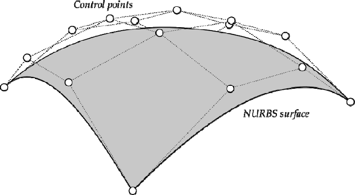
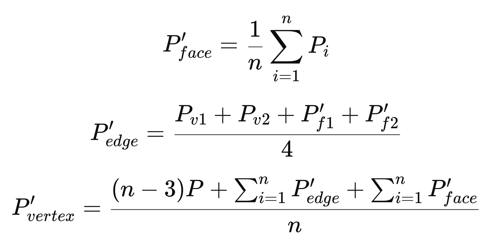
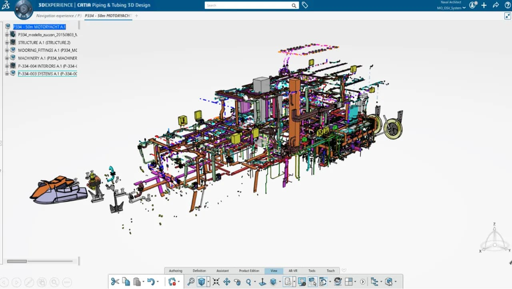
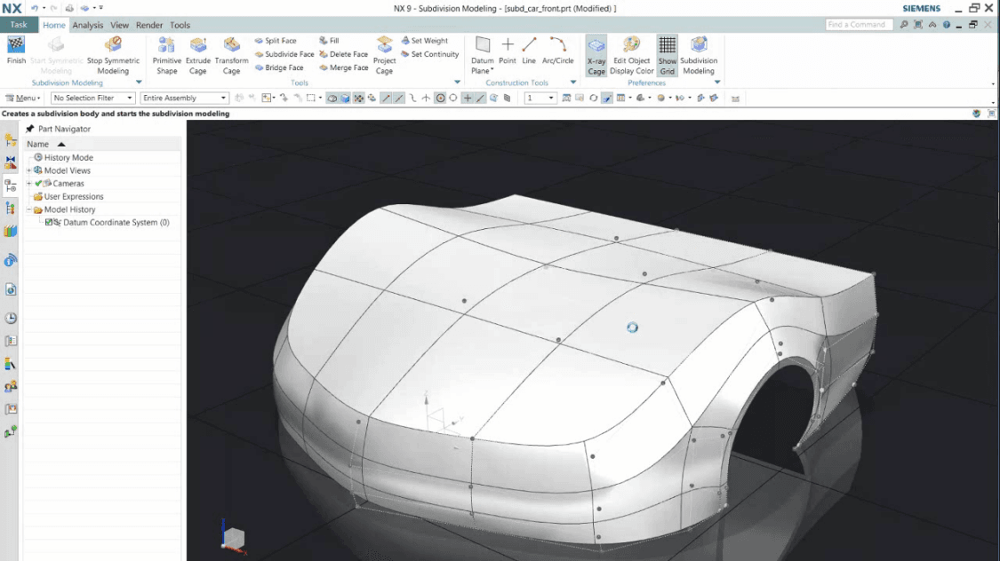
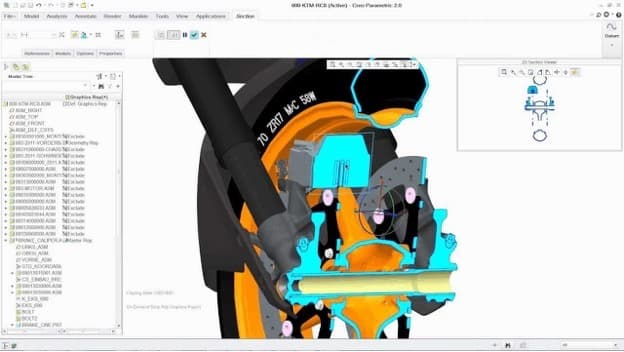
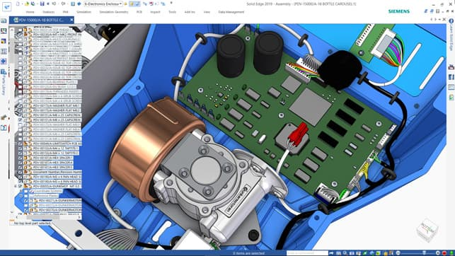
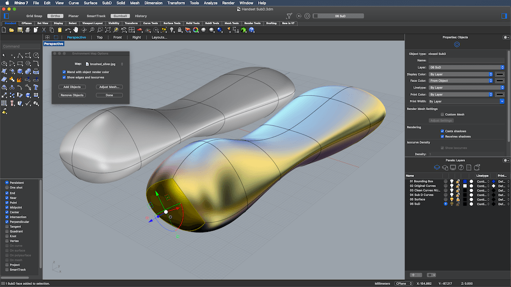
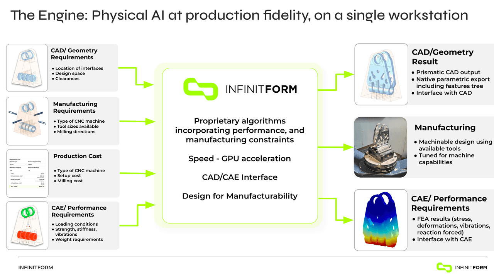
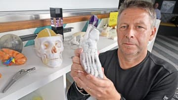
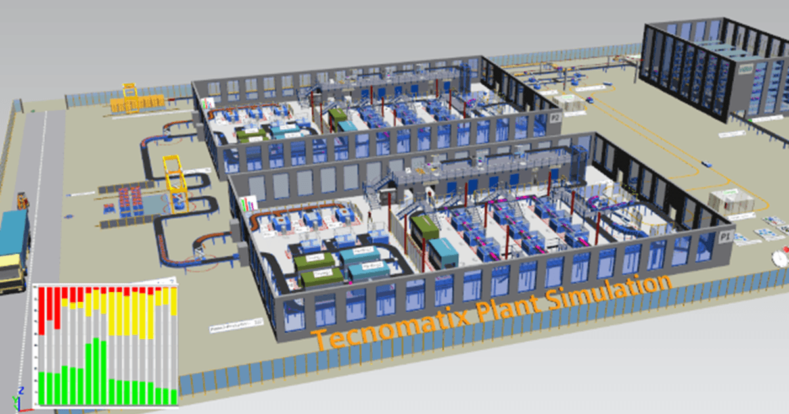

# Four Ways to Define a Solid: The CAD Modeling Paradigms Behind Modern PLM

> 原始素材条目：CAD Modeling Paradigms: NURBS, Parametric, Implicit, SubD（DemystifyingPLM）

> 原文链接：https://www.demystifyingplm.com/cad-modeling-paradigms-nurbs-parametric-implicit

> 摘要：A comprehensive breakdown of the four CAD modeling paradigms — NURBS surface modeling, parametric feature-based MCAD, implicit/SDF geometry, and subdivision surface modeling — covering mathematical foundations, workflows, industry use cases, and tool selection strategy for PLM practitioners.

## 正文

## KEY TAKEAWAYS

- Kernel choice is architecture: switching a geometry kernel in a CAD system is a multi-year, multi-million dollar project — the math underneath determines what your engineers can build

- The parametric era is not ending — it is being complemented; 99% of engineering documentation still requires B-rep geometry in a conventional CAD format

- Implicit modeling is inherently automation-friendly; AI can train on and modify SDF-based geometry far more reliably than B-rep feature trees

- The dominant pattern in high-performance product teams is NURBS for concept → parametric MCAD for documentation → implicit for performance-critical AM production

SHORT ANSWER

The four CAD modeling paradigms are NURBS surface modeling (Rhino, Plasticity, CATIA), parametric feature-based MCAD (SolidWorks, NX, Creo, Onshape, Solid Edge, Fusion 360), implicit/SDF modeling (nTop, Cognitive Design, Metafold3D), and subdivision surface modeling (Rhino SubD, Fusion 360 Form, Blender). Each has a distinct mathematical core, workflow mental model, and industry sweet spot. High-performance engineering teams run a layered stack — NURBS or SubD for concept, parametric MCAD for documentation, implicit for performance-critical AM production.

- NURBS geometry is defined by control points, knot vectors, and degree — giving designers direct, artist-centric control over surface quality and continuity (G0/G1/G2/G3)

- Parametric MCAD (SolidWorks, CATIA, Creo) stores a feature tree — a sequential design history that makes dimensions drive geometry and enables downstream re-use in PDM/PLM systems

- Implicit/SDF geometry represents solids as a scalar field in 3D space, making Boolean operations (union = min, intersection = max) mathematically guaranteed and enabling physics-driven, simulation-first design via nTop, Cognitive Design, and Metafold3D

- Subdivision surface modeling (Catmull-Clark, Loop) bridges concept sculpting and NURBS Class-A refinement — topologically flexible but dimensionally unconstrained; used in Rhino SubD, Fusion 360 Form, Blender, and Maya

- Parasolid (used in NX, SolidWorks, Onshape, Solid Edge, and Plasticity) includes hybrid implicit functions internally — delivering robust B-rep output from implicit kernel math

- No single tool spans all paradigms optimally; leading engineering organizations run a concept-to-documentation-to-production stack

- Additive manufacturing, simulation-driven design, and AI automation are the three forces accelerating adoption of implicit modeling

Every CAD tool you use is built on one of four fundamentally different mathematical bets about what geometry is. The bet your vendor made in the 1980s or 1990s still shapes what your engineers can build today — and what they cannot.

This article unpacks the four paradigms: NURBS-based surface modeling (Rhino, Plasticity, CATIA), parametric feature-based MCAD (SolidWorks, CATIA, NX, Creo, Onshape, Solid Edge, Fusion 360), implicit/SDF modeling (nTop, Cognitive Design, Metafold3D), and subdivision surface modeling (Rhino SubD, Fusion 360 Form, Blender, Maya). InfinitForm is the only platform in this survey that spans both the implicit and parametric B-rep categories: it uses implicit methods to simultaneously solve manufacturing and simulation constraints, then delivers the output as fully parametric, feature-based CAD for NX, SolidWorks, CATIA, Creo, and Fusion 360. Understanding the mathematical foundations, workflow mental models, and industry sweet spots of each is becoming a core competency for PLM strategists, engineering leaders, and product design teams evaluating tool selection or integration strategy in 2026.

For context on why the kernels underneath these tools matter strategically, see our geometry kernel overview and the Kernel Wars series.

## The Mathematical Core: Four Different Answers to "What is a Solid?"

### 1. NURBS: Geometry as Controlled Surface

Non-Uniform Rational B-Splines are the dominant mathematical representation for surface-oriented CAD. A NURBS entity is defined by four components: degree, control points, a knot vector, and an evaluation rule.

The degree 𝑑 d is a positive integer (typically 1, 2, 3, or 5) representing the polynomial order. Cubic (degree-3) curves are the standard for free-form design. Control points 𝑃 𝑖 P i ​ are weighted positions whose manipulation directly reshapes the geometry. The key property of B-spline basis functions 𝑁 𝑖 , 𝑑 ( 𝑡 ) N i,d ​ (t) is local support: moving a control point affects only the 𝑑 + 1 d+1 adjacent spans — not the entire curve. This is what makes precision surface editing possible without unintended global distortion.

A Bézier curve of degree 𝑛 n is the special case of a B-spline with a single span and a fully-clamped knot vector:

𝐶 ( 𝑡 ) = ∑ 𝑖 = 0 𝑛 𝐵 𝑖 , 𝑛 ( 𝑡 ) 𝑃 𝑖 , 𝑡 ∈ [ 0 , 1 ] C(t)=∑ i=0 n ​ B i,n ​ (t)P i ​ ,t∈[0,1]

where 𝐵 𝑖 , 𝑛 ( 𝑡 ) = ( 𝑛 𝑖 ) 𝑡 𝑖 ( 1 − 𝑡 ) 𝑛 − 𝑖 B i,n ​ (t)=( i n ​ )t i (1−t) n−i are the Bernstein basis polynomials.

A general NURBS curve of degree 𝑑 d with 𝑛 + 1 n+1 control points 𝑃 𝑖 P i ​ and weights 𝑤 𝑖 > 0 w i ​ >0 is:

𝐶 ( 𝑡 ) = ∑ 𝑖 = 0 𝑛 𝑁 𝑖 , 𝑑 ( 𝑡 ) 𝑤 𝑖 𝑃 𝑖 ∑ 𝑖 = 0 𝑛 𝑁 𝑖 , 𝑑 ( 𝑡 ) 𝑤 𝑖 C(t)= i=0 ∑ n ​ N i,d ​ (t)w i ​ i=0 ∑ n ​ N i,d ​ (t)w i ​ P i ​ ​

where the B-spline basis functions are defined by the Cox–de Boor recursion:

𝑁 𝑖 , 0 ( 𝑡 ) = { 1 if 𝑡 𝑖 ≤ 𝑡 < 𝑡 𝑖 + 1 0 otherwise N i,0 ​ (t)={ 1 0 ​ if t i ​ ≤t<t i+1 ​ otherwise ​

𝑁 𝑖 , 𝑑 ( 𝑡 ) = 𝑡 − 𝑡 𝑖 𝑡 𝑖 + 𝑑 − 𝑡 𝑖 𝑁 𝑖 , 𝑑 − 1 ( 𝑡 ) + 𝑡 𝑖 + 𝑑 + 1 − 𝑡 𝑡 𝑖 + 𝑑 + 1 − 𝑡 𝑖 + 1 𝑁 𝑖 + 1 , 𝑑 − 1 ( 𝑡 ) N i,d ​ (t)= t i+d ​ −t i ​ t−t i ​ ​ N i,d−1 ​ (t)+ t i+d+1 ​ −t i+1 ​ t i+d+1 ​ −t ​ N i+1,d−1 ​ (t)

The knot vector { 𝑡 0 , 𝑡 1 , … , 𝑡 𝑑 + 𝑛 + 1 } {t 0 ​ ,t 1 ​ ,…,t d+n+1 ​ } is a non-decreasing sequence of ( 𝑑 + 𝑛 + 1 ) (d+n+1) parameter values that partition the parameter space into spans. A full-multiplicity knot of degree 𝑑 d introduces a 𝐶 0 C 0 discontinuity (a sharp kink); simple interior knots preserve 𝐶 𝑑 − 1 C d−1 continuity. The "Non-Uniform" qualifier means knot spacing need not be uniform — enabling multi-knot clusters and exact Bézier curve representation. The "Rational" qualifier allows weighted control points 𝑤 𝑖 w i ​ , which is what makes NURBS capable of representing exact conics (circles, ellipses, parabolas) — something non-rational splines can only approximate.

NURBS surfaces extend the curve definition to a bivariate grid of control points in u and v directions, producing smooth surfaces of arbitrary complexity.

A NURBS solid model (like those produced by Rhino or Plasticity) is therefore a boundary representation (B-rep) composed of trimmed NURBS surface patches joined by topological edges and vertices — sometimes called a polysurface or shell. The Plasticity Studio licence includes the variational xNURBS surfacing engine — normally a $400 add-on to Rhino and SolidWorks — which enables high-quality surface generation from boundary and interior constraints.

### 2. Feature-Parametric B-Rep: Geometry as Manufacturing Intent

Mainstream mechanical CAD systems — SolidWorks, CATIA, NX, Creo, Onshape, Solid Edge, and Fusion 360 — adopt a feature-based, history-driven parametric solid modeling paradigm. At the kernel level these tools also produce B-rep solids, typically built on Parasolid (SolidWorks, NX, Solid Edge, Onshape, Plasticity) or ACIS/ShapeManager (Autodesk products). CATIA uses Dassault's proprietary CGM kernel, which supports NURBS surfaces natively.

A notable capability that often surprises practitioners: Parasolid includes hybrid implicit modeling functions in its kernel API. Operations like lattice generation, offset, and certain Boolean-on-mesh workflows are computed implicitly inside Parasolid before the result is extracted as B-rep. NX, SolidWorks, Onshape, Solid Edge, and CATIA all benefit from this capability to varying degrees — though none exposes the full SDF programming model that dedicated implicit tools like nTop provide. Think of it as "implicit math, B-rep output": the kernel handles the robust computation internally; the user sees a clean solid.

What differentiates MCAD from pure NURBS modelers is the feature tree: a sequential log of parametric operations — sketches, extrusions, fillets, patterns, Boolean cuts — stored as editable, ordered steps. "Dimensions drive geometry and features reference each other; change a dimension and dependent geometry updates automatically." This design intent capture enables downstream re-use: an engineer can change a wall thickness, fillet radius, or hole pattern and the entire feature tree replays.

The cost is rebuild fragility: late-stage topological changes can break downstream feature references ("dangling relations"), and complex assembly models with thousands of features can take minutes to rebuild.

The Dassault Systèmes parametric modeling guide defines the canonical workflow explicitly: Create units and part names → Create initial 2D sketch → Apply/modify parameters and constraints → Create detailed 3D model → Add features → Analyze via simulation → Generate 2D and 3D drawings. SolidWorks 2025 introduced over 200 user-driven enhancements including AI-assisted command prediction, interference detection in Large Design Review, and improved PDM check-in performance.

The mental model is that of an engineer documenting manufacturing intent: every dimension is meaningful, every feature has a clear fabrication-step analog. This audit trail is what PDM and PLM systems version-control, and what regulatory agencies expect for Design History File (DHF) integrity in medical and aerospace applications.

### 3. Implicit Modeling / Signed Distance Fields: Geometry as Output

Implicit modeling represents geometry not as an enumerated boundary but as a scalar field defined over all of 3D space. The canonical form is a signed distance function (SDF): a mathematical function F(x, y, z) that returns the shortest Euclidean distance from any point to the nearest surface — negative inside the solid, positive outside, zero on the boundary surface.

Boolean operations on SDFs reduce to elementary min/max operations. For two solids with distance fields F₁ and F₂:

- Union: F₁ ∪ F₂ = min(F₁, F₂)

- Intersection: F₁ ∩ F₂ = max(F₁, F₂)

- Difference: F₁ − F₂ = max(F₁, −F₂)

Offsetting a shape by distance δ is equally trivial: the new field is simply F′(x, y, z) = F(x, y, z) − δ, raising the iso-surface level by δ without any geometric recomputation.

This mathematical guarantee means operations that frequently fail in B-rep — complex Boolean intersections, offsets on organic geometry, lattice generation — are trivially robust in SDF. The theoretical foundation of functional representation (FRep) was established independently by Rvachev and Ricci, and formalized in the survey "Function-based shape modeling: mathematical framework and specialized language" (Pasko et al., MIT CSAIL). Modern implicit platforms extend beyond pure distance fields to arbitrary scalar fields — density, temperature, stress — that can drive geometry directly, enabling what nTop calls field-driven design: "your data goes in; optimized designs come out."

nTop (formerly nTopology), the leading commercial implicit modeler, formalizes this: "implicit modeling is a unique and lightweight way of representing three-dimensional objects using a single mathematical function to describe a solid body." Their B-rep vs. implicits explainer captures the key distinction: B-rep "only defines information on the circle itself; information about every other point in space is an extra calculation" — whereas "every point in space knows exactly how far it is from the nominal surface" in a distance field.

Cognitive Design (by Cognitive Design Systems) extends the SDF approach with manufacturing analysis solvers for die casting, molding, machining, additive manufacturing, and forging — enabling what they call Manufacturing-Driven Design (MDD): the platform simultaneously optimizes geometry for performance and manufacturing constraints from the first computation.

Metafold3D focuses specifically on lattice and porous structure design for additive manufacturing — providing a cloud-accessible platform for generating, analyzing, and exporting TPMS and beam-lattice geometries directly to AM build preparation tools, signaling a broader market trend toward implicit modeling capabilities accessible outside expert-only engineering platforms.

InfinitForm takes a fundamentally different approach from the SDF-native tools above. Rather than working in an implicit field representation, InfinitForm's proprietary algorithms incorporate manufacturing constraints — CNC machining (including tool libraries and machining directions), extrusion, injection molding, die casting, and additive manufacturing — simultaneously with simulation requirements (GPU-accelerated FEA at ~1 million degrees of freedom in half a second). The output is fully parametric, feature-based CAD geometry with an editable feature tree and sketches — not a mesh or STL — directly importable into NX, SolidWorks, CATIA, and Fusion 360 via native CAD plugins. At the Siemens PLM Components event (April 2026), InfinitForm demonstrated generating a design from requirements and bringing it back into NX and CATIA with a full parametric feature tree. The platform closes the simulation–manufacturing–CAD loop from the design requirements stage, compressing multi-week iteration cycles to 5–10 minutes.

### 4. Subdivision Surface Modeling: Geometry as Refined Mesh

Subdivision surface modeling (SubD) is the third major geometric paradigm, sitting historically between NURBS and implicits and increasingly relevant in engineering CAD through tools like Rhino 8's SubD workspace, Fusion 360's Form environment, and Maya/Blender for industrial design concept work.

The underlying mathematics: a control mesh of polygonal faces is iteratively refined by a subdivision rule. The two dominant schemes are Catmull-Clark (generalizes bicubic B-splines to arbitrary topology, converging to a C² smooth surface at all regular vertices) and Loop (for triangular meshes, converges to C² almost everywhere). At extraordinary vertices — mesh points with a valence other than 4 — the surface degrades to C¹ continuity, which is acceptable for most industrial design applications. Pixar's OpenSubdiv library, open-sourced in 2012 and adopted by Blender, Maya, Houdini, and increasingly CAD tools, is the industry reference implementation. Sharp features (edges, corners) are controlled via creases — fractional weights on mesh edges that hold sharpness through subdivision iterations, replacing the NURBS multi-knot multiplicity mechanism.

In engineering workflows, SubD occupies the concept sculpting phase between rough sketch and NURBS Class-A surfacing. Its advantage over raw NURBS is topological freedom: a SubD cage can represent closed genus-n surfaces (think a coffee mug with a handle, or a shoe last with complex undercuts) without the seam management and trimming complexity that NURBS patch networks require. A designer can rapidly block out an ergonomic consumer product shape in SubD, then convert to NURBS for Class-A refinement or export as STEP for downstream engineering. Fusion 360's T-Splines-derived Form workspace makes this conversion explicit: the SubD T-spline form is converted to NURBS B-rep with a single operation. The key limitation for production engineering is that SubD meshes do not carry explicit dimensional constraints — there is no "make this edge exactly 24.5 mm" mechanism. They are a shape language, not an engineering documentation format. For that reason, SubD typically feeds into NURBS or parametric MCAD rather than replacing them.

Blender (open-source, Blender Foundation) deserves specific mention here: while it is primarily used for entertainment — film VFX, game assets, animation — its Catmull-Clark SubD implementation and Shrinkwrap/MultiRes sculpting tools have attracted a growing engineering audience, particularly designers transitioning from game art into industrial product concept work. Blender is not a PLM-adjacent tool; it has no BOM, no PDM, no engineering standards compliance, and no kernel capable of producing certified B-rep geometry. Its role in the engineering context is upstream concept visualization only: a Blender concept mesh would typically be retopologized and rebuilt in Rhino or Plasticity before entering an engineering workflow. Plasticity's user community reflects this directly — many Plasticity users describe themselves as "coming from Blender."

## Workflow Paradigms: How Designers Think in Each System

### NURBS: Sculpt, Trim, Join

NURBS modelers operate on a direct modeling mental model — there is no parametric history tree. The designer works with curves, surfaces, and solids as first-class entities, manipulating control points and surface continuity (G0/G1/G2/G3) to achieve the desired form.

The mental model is analogous to digital clay or industrial design sketching: the designer thinks in terms of surface flow, curvature continuity, highlight lines, and aesthetic proportions. Tools like zebra stripe analysis (curvature continuity check) and curvature analysis maps are central to quality verification.

In Rhino, the Grasshopper visual programming environment (included since Rhino 6) adds algorithmic and parametric capabilities — enabling designers to build generative systems and drive NURBS geometry with data. Plasticity combines the Parasolid NURBS kernel with a workflow borrowed from polygonal modelers like Blender, optimized for industrial designers transitioning from game art or consumer product design.

Representative workflow: "For efficient NURBS models you break down the shape into a number of base shapes that are trimmed and rounded off... the further along things get the harder changes become, so I try to get feedback early and often." — McNeel Forum

### Parametric MCAD: Sketch, Feature, Assemble, Document

SolidWorks and Fusion 360 embody a bottom-up feature-based parametric paradigm: create 2D sketch → apply feature → accumulate history → assemble → document. The SolidWorks PDM (EPDM) and 3DEXPERIENCE platform extend this with vault-based version control, BOM management, ECO workflows, and ERP integrations. Fusion 360 adds cloud-native PDM with real-time co-editing and Fusion Manage for integrated PLM.

The professional consensus: SolidWorks outperforms in nearly every production workflow area — sheet metal, surfacing, assemblies, sketching — thanks to almost three decades of continuous improvement. Fusion benefits from being cloud-based and advantageous for multi-user setups; SolidWorks is preferred for structural steel, piping, or production-level workflows. Autodesk's own comparison notes that "Fusion makes it easier to explore, modify, and refine designs without fighting feature trees or rebuilding models."

### Implicit/Field-Driven: Define, Optimize, Generate

Implicit modelers replace the sequential feature tree with a node-based, non-linear computational graph. The designer thinks in terms of functions and fields: what scalar values should govern geometry at every point in space?

The workflow typically proceeds: (1) import B-rep/mesh geometry or define a design space; (2) assign scalar fields (stress, thermal, density, distance) from simulation or manufacturing analysis; (3) define implicit geometry operations (lattice generation, shell infill, topology optimization, offset); (4) couple field values to geometric parameters; (5) export to manufacturing — directly as slice data for AM, simplified B-rep for CAD documentation, or mesh for FEA validation.

The mental model is that of a systems engineer working with physics and data: geometry is an output of optimization, not an input. nTop's computational design era article frames the paradigm shift historically: from the Drafting Era (static geometry), through the Parametric Era (Pro/ENGINEER's replay capability, 1988 onward), to the Computational Design Era (physics-driven, automated geometry generation).

## Industry Use Cases: Where Each Paradigm Wins

The nine verticals below map each paradigm to its primary value zone — where it delivers the highest professional productivity, quality, and business return.

| Industry | NURBS (Rhino, Plasticity) | Parametric MCAD (SW, Fusion) | Implicit/SDF (nTop, Cognitive Design) |\n| --- | --- | --- | --- |\n| Industrial & Product Design | Concept surfacing, CMF exploration, ergonomic form development; visualization renders; Rhino dominates ID workflows globally | Detail engineering: toleranced dimensions, material specs, DFM analysis, vendor communication via STEP | Lightweight optimization of structural housings; generative concepts for reduced-part-count assemblies |
| Mechanical Engineering | Surface modeling for casings and enclosures; reverse engineering from scan data; tooling geometry | Primary tool: assemblies, GD&T, BOM, FEA/CFD via simulation add-ons; standard in 95%+ of ME workflows | Topology optimization of brackets and structural members; lattice infill for complex load paths; automation of design families |
| Aerospace & Defense | Aerodynamic surface development (fuselage contours, wing leading edges); interior design; composite layup geometry | Structural components with tight tolerances; complex assemblies; certified simulation (SolidWorks Simulation, ANSYS) | Lattice-filled structural parts for AM; blueflite reduced fuselage mass 25% in 4 hours with nTop; Cognitive Design: 15–30% weight reduction in complex machined metal components |
| Automotive | Class-A surface development (exterior body panels, interior trim); clay digitization; styling studios globally depend on NURBS | Powertrain components, chassis parts, tooling design, production-intent geometry; CATIA/NX dominate Tier 1, SolidWorks at Tier 2+ | Lightweighting structural brackets; generative door hinges; Cognitive Design demonstrated 91% reduction in new product development time in automotive applications |
| Medical Devices | Patient-specific device geometry; ergonomic handle design; hearing aid shells; ophthalmic lens surfaces | Validated CAD for FDA submissions; design history file (DHF) integrity; PDM-controlled revision management; industry standard for regulated devices | Orthopedic implants with osseointegrative lattices; FDA-cleared devices designed in nTop; trabecular structures impossible to model in B-rep; nTop enables reusable workflows across product lines |
| Additive Manufacturing | STL export from NURBS surfaces; generative surface textures; Rhino/Grasshopper for rule-based AM geometry | Print-ready parts from parametric CAD; Fusion 360 includes integrated slicer toolpaths and AM setup workspaces | Primary value zone: SDF → direct slice output removes STL conversion bottleneck; variable-density lattices, TPMS heat exchangers, graded material zones |
| Consumer Products | Premium form development for electronics, wearables, furniture, sporting goods; Rhino is dominant in consumer product design studios | Mechanical internals (PCB enclosures, battery mounts, snap fits); BOM-driven configurations; sheet metal; injection molding analysis | Emerging use: weight-optimized structural components inside consumer electronics; custom fit insoles and wearable orthotics |
| Computational / Generative Design | Rhino + Grasshopper dominant platform; NURBS geometry coupled to algorithmic scripts, evolutionary solvers (Galapagos), structural analysis plugins (Karamba3D) | Fusion 360 Generative Design: define preserved geometry, loads, obstacle zones → cloud solver generates variants; post-processing required ("output is a faceted mesh, not a parametric solid") | Native paradigm: field-driven lattice, field-driven rib orientation, topology optimization feedback loops — all without mesh conversion |
| Manufacturing Optimization | Limited direct role; tooling path geometry; NURBS surfaces for die inserts and injection molds | CAM toolpath generation (Fusion 360 CAM, SolidWorks CAM/HSMWorks); assembly simulation; production documentation | Strongest differentiator: Cognitive Design integrates DfM checks and auto-geometry correction for five manufacturing processes simultaneously; nTop generates toolpath data directly from implicit geometry for AM and CNC |

## The Structured Comparison: Seven Dimensions Across Six Tools

The following matrix uses a qualitative scale: ★★★★★ = industry-leading/native strength; ★★★★ = strong/standard capability; ★★★ = adequate with effort; ★★ = limited/workaround required; ★ = not designed for this use case.

| Dimension | Rhino 8 | Plasticity | SolidWorks | Fusion 360 | nTop | Cognitive Design | InfinitForm |\n| --- | --- | --- | --- | --- | --- | --- | --- |\n| Mathematical Core | NURBS B-rep, OpenNURBS | NURBS B-rep, Parasolid | Feature-BRep, Parasolid | Feature-BRep, ASM ShapeManager | SDF/Implicit + BRep interop | SDF/Implicit hybrid + mesh ops | Implicit geometry (constraint solving) + B-rep output; both representations used internally |
| Topology Robustness | ★★★ — Trimmed surface gaps common; manual repair needed | ★★★★ — Parasolid's Extreme Modeling reduces failures | ★★★★ — Mature BRep; fillet/offset issues at high complexity | ★★★ — Cloud rebuilds can be slow; large assemblies limited | ★★★★★ — Math guarantees booleans/offsets never fail | ★★★★★ — Same implicit guarantee; watertight by construction | ★★★★★ — Implicit-to-B-rep pipeline avoids topology failures; output is clean parametric B-rep |
| Design Editability | ★★★ — No history; direct edits only; harder late changes | ★★★ — Direct modeling; flexible but no parametric replay | ★★★★★ — Full parametric history; equations; configurations | ★★★★ — History + direct editing; cloud-based branching | ★★★★ — Node graph; change inputs → geometry regenerates | ★★★★ — Parametric workflows; full parameter history logged | ★★★★★ — Output is fully parametric B-rep with editable feature tree and sketches; opens natively in NX, SolidWorks, CATIA, Creo, Fusion 360 |
| Manufacturability Checks | ★★ — Manual; plugin-based (RhinoCAM); no DfM checks | ★★ — STEP/IGES export for downstream CAM; no built-in DfM | ★★★★ — DraftXpert, Design Study, SOLIDWORKS MBD; CAM integration | ★★★★ — Integrated CAM, simulation, DfM tools; generative mfg constraints | ★★★ — AM-optimized; direct slice output; limited machining DfM | ★★★★★ — Multi-process DfM (AM, machining, casting, forging) with auto-correction | ★★★★★ — Manufacturing constraints (CNC 5-axis, extrusion, injection molding, die casting, AM) solved simultaneously at algorithm level, not checked post-generation |
| Simulation / Optimization Readiness | ★★ — Rhino.Inside/FEA; Karamba3D plugin; not native | ★ — No built-in simulation; export-only | ★★★★ — SolidWorks Simulation FEA; Flow Simulation CFD; Plastics | ★★★★ — Integrated structural, thermal, modal, fluid; generative design | ★★★★★ — Fields from simulation drive geometry directly; topology opt native | ★★★★★ — Simulation-Driven Design native; stress/thermal coupled to geometry optimization | ★★★★★ — GPU-accelerated FEA (~1M DOF in 0.5s); simulation and manufacturing constraints solved simultaneously in the same computation |
| Collaboration / PLM Fit | ★★★ — .3DM, STEP, IGES; no native PDM; Rhino Accounts for teams | ★★ — Standalone license; no PDM; STEP/IGES/Parasolid export | ★★★★★ — SOLIDWORKS PDM, 3DEXPERIENCE ENOVIA; full BOM/ECO/ERP integration | ★★★★ — Cloud PDM native; Fusion Manage PLM; real-time collaboration | ★★★ — nTop Workspace for team workflows; STEP/BRep export; integration via API | ★★★ — On-premise deployment; STEP/STL export to SW/CATIA/NX/Creo; secure reusable workflows | ★★★★ — Native CAD plugins for NX, SolidWorks, CATIA, Creo, Fusion 360; designs land as editable parametric parts; PLM-ready feature trees |
| Business Value / Entry Cost | ★★★★ — approx. $1,195/yr. Industry standard in ID with massive plugin ecosystem (Grasshopper) | ★★★★★ — $299 perpetual Studio. Parasolid kernel for the price of a weekend course | ★★★ — $4,000+ USD + maintenance. Near-universal engineering acceptance; high switching cost | ★★★★ — approx. $545/yr. Integrated platform value; free personal use; cloud reduces IT overhead | ★★★ — Enterprise pricing. High ROI for AM-heavy workflows; specialized | ★★★ — Enterprise pricing. DfM-first approach reduces design iteration cycles | ★★★ — Contact for quote. ROI strongest for programs requiring concurrent manufacturing method selection and structural performance validation |

Key insight: No single tool spans all seven dimensions optimally. The dominant pattern in high-performance product teams is a three-layer stack: NURBS for concept visualization → parametric MCAD for engineering documentation → implicit modeling for performance-critical geometry generation and AM production.

## The Paradigm Transition: Three Eras and What Comes Next

NURBS modeling, pioneered commercially in Rhino (1998) and earlier in CATIA and Pro/ENGINEER surfaces, was revolutionary in enabling the precise digital representation of complex free-form surfaces for automotive clay digitization, yacht hull design, industrial product design, and architectural form-finding. The paradigm is artist-centric: the designer directly manipulates geometry, guided by aesthetic judgment, continuity analysis, and material-aware surface thinking. Skilled NURBS modelers command premium salaries because the craft of controlling surface quality at G2/G3 continuity across complex patches is genuinely difficult and high-value.

nTop frames CAD evolution across three eras:

- The Drafting Era — static, 2D-equivalent geometry; no parametric history; geometry is a drawing artifact.

The Drafting Era — static, 2D-equivalent geometry; no parametric history; geometry is a drawing artifact.

- The Parametric Era — Pro/ENGINEER's 1988 replay capability; "change a few numbers and wait for the model to rebuild, typically taking several minutes to hours." Design intent captured in feature tree. The era most engineering organizations currently operate in for documentation.

The Parametric Era — Pro/ENGINEER's 1988 replay capability; "change a few numbers and wait for the model to rebuild, typically taking several minutes to hours." Design intent captured in feature tree. The era most engineering organizations currently operate in for documentation.

- The Computational Design Era — geometry is an output of data, physics, and algorithms rather than a manually constructed artifact. nTop calls this "engineering at the speed of light."

The Computational Design Era — geometry is an output of data, physics, and algorithms rather than a manually constructed artifact. nTop calls this "engineering at the speed of light."

### Three Forces Accelerating the Transition to Implicit

Additive manufacturing complexity. Metal AM parts with lattice infill, TPMS structures, graded porosity, and conformal cooling channels cannot be feasibly designed in B-rep or NURBS. "B-rep and mesh modelers cannot handle the complexity of 3D printed models, manually or in automated workflows, let alone describe parts with varying material properties." The SDF's inherent volumetric nature maps naturally to the voxel-level AM process.

Simulation-driven design pressure. Performance-driven industries (aerospace, defense, medical) require geometry to be functionally justified by simulation evidence. The traditional workflow (design in CAD → mesh → simulate → manually redesign) is too slow. Implicit modeling closes the loop: simulation fields directly drive geometry parameters, enabling near-real-time physics-in-the-loop iteration. The CAD/finite-elements/NURBS isogeometric analysis paper (Hughes et al., published in Computer Methods in Applied Mechanics) recognized this CAD-to-mesh translation gap as early as 2005, proposing NURBS-based isogeometric analysis to eliminate the conversion step — a problem that SDF-native tools solve more completely by keeping geometry and simulation in the same mathematical space.

Automation and AI integration. Traditional B-rep models are fragile to automated modification — rebuild failures block automated design pipelines. Implicit models, defined by equations, are inherently automation-friendly. "AI engineering will drive mainstream use of implicit modeling, as these models can be trained faster and more accurately with implicit models than with traditional CAD models."

### Complementary Coexistence, Not Replacement

The Altair assessment captures industry consensus: "Implicit modeling isn't positioned to replace traditional CAD because each approach excels at different parts of the design process. Traditional CAD remains unmatched for creating precise, dimension-driven components, defining manufacturing features, and producing drawings that align with established engineering workflows. Implicit modeling shines when handling complex, organic geometry and rapid iteration."

In practice, leading engineering organizations are developing hybrid workflows: functional zones requiring tight tolerances and drawing documentation remain in B-rep/parametric CAD (SolidWorks or CATIA), while performance-critical geometry (organic transitions, lattice fills, optimized load paths) is generated in nTop and exported as simplified B-rep for CAD integration or directly as manufacturing-ready geometry. Cognitive Design Systems addresses the remaining gap by automating the conversion of implicit/mesh optimization results back to "watertight geometries" for CAD import — recognizing that "99% of the time" industry still needs geometry in a conventional CAD format.

For concept visualization specifically, NURBS remains unchallenged: the designer's eye and hand still guide aesthetic decisions that no optimization algorithm can replace. The shift is that the NURBS concept model increasingly becomes a starting envelope — a set of preserved geometric interfaces and design space constraints that feed downstream implicit optimization, rather than the final deliverable. This represents the completion of the transition from geometry-as-craft to geometry-as-output.

## Buyer Profiles: Distinct Business Value by Tool

Understanding which tool is right for your organization requires matching the tool's core strength to your specific workflow, team profile, and budget constraints.

### Major Platforms

### CATIA (Dassault Systèmes)

Vendor: Dassault Systèmes | Pricing: Enterprise (3DEXPERIENCE role-based licensing; typically $10,000–$30,000+/seat/yr depending on role bundle) | Kernel: CGM (Geometric Modeling Component — proprietary Dassault)

Best for:

- Tier 1 automotive OEMs requiring Class-A surface development, CATIA V5/V6 continuity, and full vehicle program management

- Aerospace and defense programs requiring certified simulation (SIMULIA), DMU digital mockup, and MBSE integration

- Large enterprises already committed to the 3DEXPERIENCE platform for PLM, simulation, and manufacturing

- Complex surface-intensive products: aircraft fuselages, automotive bodies, consumer electronics with tight aesthetic tolerances

- Organizations with CATIA-trained workforces where retraining cost exceeds platform cost

Distinct business value: CATIA is the benchmark for Class-A surface development in the automotive and aerospace industries, with dominant installed base at BMW, Volkswagen Group, Airbus, Boeing, and most Tier 1 suppliers. Its CGM kernel natively supports both NURBS surface modeling and parametric solid modeling in the same environment — enabling surface-to-solid workflows without format conversion. The 3DEXPERIENCE platform integrates CATIA with ENOVIA (PLM), SIMULIA (simulation), DELMIA (manufacturing simulation), and EXALEAD (search and analytics) — making it the most complete product development platform available at enterprise scale. CATIA's Generative Shape Design (GSD) and Free Style Shaper (FFS) workbenches set the standard for automotive Class-A surfacing workflows globally.

Key limitations: Extremely high licensing and implementation cost; typically requires dedicated CATIA administrators and structured training programs. Steep learning curve. The 3DEXPERIENCE cloud platform has received mixed reviews from users transitioning from CATIA V5 on-premise. Overkill for SMEs, startups, or teams without existing CATIA investment. CGM kernel is proprietary — less interoperable than Parasolid-based tools in mixed-vendor environments.

### Siemens NX

Vendor: Siemens Digital Industries Software | Pricing: Enterprise licensing (Siemens Industry Software); typically $8,000–$25,000+/seat/yr depending on module bundle | Kernel: Parasolid (developed and owned by Siemens)

Best for:

- Aerospace, defense, and automotive Tier 1 suppliers with complex surface and structural requirements

- Teams running integrated CAD/CAM/CAE on a single platform (NX CAM is industry-leading for 5-axis machining)

- Organizations using Teamcenter as their PLM backbone — NX integrates with Teamcenter more tightly than any competing CAD system

- Ship design, heavy machinery, and industrial equipment OEMs requiring large assembly management

- Companies standardizing on a single vendor for design, simulation, and manufacturing tooling

Distinct business value: NX is the most technically capable parametric MCAD system in the comparison — the only tool that matches CATIA in automotive surface quality while also leading in integrated CAM (multi-axis CNC, AM build preparation) and simulation coupling. As the owner of Parasolid, Siemens ensures NX accesses the deepest kernel capabilities before they are licensed to competitors — the implicit modeling functions inside Parasolid are most completely exposed through NX's interface. NX's integration with Teamcenter creates the most mature PDM/PLM coupling available: managed part numbers, multi-site BOM management, ECO workflows, and MBSE linkage between requirements and CAD geometry all operate natively. Siemens Xcelerator, the cloud platform, is extending NX capabilities with generative design, AI-assisted feature recognition, and cloud-based collaboration.

Key limitations: High cost; complexity requires dedicated CAD administration. NX's UI is notoriously non-intuitive, particularly for users coming from SolidWorks or Fusion 360. Teamcenter PLM is itself a complex enterprise system with significant implementation overhead. Less suited for small teams or rapid prototyping workflows. The tight Siemens ecosystem creates vendor lock-in — switching costs are extremely high once Teamcenter is deployed.

### PTC Creo

Vendor: PTC | Pricing: Enterprise subscription; Creo Parametric starts at approx. $2,500–$5,000+/yr; add-on modules (simulation, topology optimization, additive, generative) additional | Kernel: ACIS (Spatial Technology, now Dassault Systèmes subsidiary) — with CGM kernel integration in recent releases

Best for:

- Engineering organizations with Pro/ENGINEER or legacy Creo installations (substantial installed base in defense, medical, industrial equipment)

- Teams requiring model-based definition (MBD) with GD&T embedded in 3D geometry rather than 2D drawings

- IoT-connected product development workflows (Creo integrates with PTC ThingWorx for digital twin linkage)

- Aerospace and defense programs requiring AS9100/DO-178 documentation support

- Manufacturers needing advanced surfacing, flexible modeling (direct + parametric), and topology optimization in one license

Distinct business value: Creo originated the parametric MCAD paradigm — Pro/ENGINEER (1988) introduced the feature-based replay model that SolidWorks, NX, and all subsequent parametric tools adopted. Creo 10 combines parametric modeling, direct modeling, and Creo Topology Optimization in a single platform, with AI-assisted geometry (Creo Generative Design) and integrated AR (Vuforia). PTC's Industrial IoT platform ThingWorx connects physical product sensor data to Creo geometry via the digital twin — enabling design updates driven by actual product performance data from the field. Creo's Model-Based Definition (MBD) toolset is the most mature in the market for 3D annotation replacing 2D drawings, which matters in defense and aerospace programs moving toward drawing-free manufacturing.

Key limitations: UI is considered dated and complex relative to SolidWorks or Fusion 360. ACIS kernel is less robust than Parasolid for complex Boolean operations and surface quality. High total cost of ownership when simulation, topology optimization, and PLM (Windchill) are included. PTC Windchill PLM integration is strong but requires significant implementation investment. Weaker market position in automotive surface design compared to CATIA and NX.

### Siemens Solid Edge

Vendor: Siemens Digital Industries Software | Pricing: $3,000–$5,000+/seat perpetual; subscription available; free for startups via Solid Edge for Startups program | Kernel: Parasolid (Siemens)

Best for:

- SMEs and mid-market manufacturers who want Parasolid kernel quality without NX enterprise complexity and cost

- Sheet metal fabricators and structural weldment designers — Solid Edge's sheet metal environment is consistently rated among the best in class

- Teams needing integrated simulation (NASTRAN-based FEA), motion analysis, and pipe/tube routing without separate module costs

- Organizations considering SolidWorks alternatives on Windows who prefer a perpetual licensing model

- Companies with Teamcenter access needing tight Solid Edge-to-Teamcenter PDM integration without full NX overhead

Distinct business value: Solid Edge delivers Parasolid-kernel parametric modeling — the same mathematical foundation as NX and SolidWorks — at a price point accessible to mid-market manufacturers. Its Synchronous Technology (the combination of direct modeling and parametric history in the same model) is the most developed implementation of the hybrid modeling concept available: designers can edit geometry directly without breaking the parametric history, enabling late-stage design changes that would cause rebuild failures in SolidWorks or Creo. The sheet metal, weldment, and pipe routing environments are production-hardened for fabrication-first manufacturing workflows. Solid Edge's simulation is powered by NASTRAN (the same solver used in NX), giving mid-market teams access to aerospace-grade FEA without enterprise licensing.

Key limitations: Smaller installed base than SolidWorks and CATIA limits available training resources, third-party add-ons, and supply-chain interoperability. Less recognized brand in automotive and aerospace Tier 1 supply chains, where SolidWorks or CATIA are effectively required by OEM customers. Cloud collaboration and PLM capabilities lag behind 3DEXPERIENCE and Fusion Manage. Synchronous Technology, while powerful, requires a mental model shift that can slow onboarding for engineers coming from strictly history-based tools.

### PTC Onshape

Vendor: PTC | Pricing: Free (public documents); Professional $1,500/yr; Enterprise pricing above | Kernel: Parasolid (licensed from Siemens)

Best for:

- Distributed and remote engineering teams requiring real-time simultaneous CAD collaboration

- Startups and education teams needing professional CAD with zero IT overhead (browser-native, no installation)

- Organizations wanting to eliminate PDM infrastructure costs — version control, branching, and access control are built in

- Consumer electronics, hardware startups, and consumer products SMEs

- Teams evaluating a SolidWorks replacement with lower per-seat cost and cloud-native architecture

Distinct business value: Onshape is the only major parametric MCAD system built entirely as a cloud-native, browser-based application — there is no desktop client to install, update, or manage. Every change is version-controlled automatically (like Git for CAD), with branching and merging for design variants. Multiple engineers can edit the same part simultaneously in real time, similar to Google Docs. The Parasolid kernel delivers the same geometry quality as SolidWorks and NX. PTC acquired Onshape in 2019 and has been integrating it with Arena PLM and Windchill, extending its lifecycle management capabilities beyond pure CAD. Onshape's App Store ecosystem provides access to simulation, rendering, and PDM tools via integrated third-party applications.

Key limitations: Requires reliable internet — offline use is not supported. Data resides on PTC cloud servers (a concern for ITAR/defense programs and organizations with strict data sovereignty requirements). Less mature than SolidWorks for sheet metal, weldment, and large assembly workflows. Simulation, rendering, and CAM require third-party integrations rather than native tools. Enterprise PLM capabilities via Windchill/Arena integration are still maturing relative to SolidWorks PDM or Teamcenter.

### Rhinoceros 3D (Rhino 8)

Vendor: Robert McNeel & Associates | Pricing: approx. $1,195 perpetual; approx. $595/yr subscription | Kernel: OpenNURBS (proprietary McNeel)

Best for:

- Industrial designers developing concept surfaces and Class-A geometry

- Architects and computational designers using Grasshopper for parametric/generative workflows

- Jewelry designers, yacht hull designers, and footwear engineers

- Any workflow requiring high-quality NURBS surface continuity analysis

- Teams bridging between artistic concept and engineering documentation

Distinct business value: Rhino occupies the undisputed leadership position for professional NURBS surface modeling at accessible price points. Its Grasshopper visual programming environment transforms Rhino into a full computational design platform — connecting NURBS geometry to structural analysis plugins (Karamba3D), evolutionary optimization (Galapagos), and direct API integration with fabrication machinery. Rhino 8 adds ShrinkWrap (clean surface wrapping from scan data), SubD Creases, and improved Mac performance, extending its reach into reverse engineering and product development from physical prototypes.

Key limitations: No parametric history tree limits late-stage engineering changes. No native BOM, drawing standard compliance, or PDM. Not suitable as the primary tool for certified engineering documentation.

### SOLIDWORKS

Vendor: Dassault Systèmes | Pricing: $4,000+ USD + annual maintenance; PDM/PLM add-ons extra | Kernel: Parasolid (licensed from Siemens)

Best for:

- Mechanical engineers in regulated industries requiring certified simulation and drawing documentation

- Large assembly design with complex mating constraints and configuration management

- Teams requiring full PLM integration: SolidWorks PDM / 3DEXPERIENCE ENOVIA with ECO, BOM, ERP links

- Sheet metal, weldment, and piping design with fabrication-specific tools

- Aerospace, automotive (Tier 2+), medical device, and industrial equipment OEMs

Distinct business value: SolidWorks holds the broadest installed base of any mechanical CAD system globally, with nearly three decades of continuous development. Its parametric history-based modeling, combined with the SolidWorks PDM and 3DEXPERIENCE ecosystem, makes it the de facto standard for teams that need to manage certified design history, regulatory documentation, and multi-site collaboration. The 3DEXPERIENCE platform extends SolidWorks into ENOVIA for lifecycle management, DELMIA for manufacturing simulation, and SIMULIA for advanced physics — used at Boeing and Airbus for production-scale programs.

Key limitations: High cost; Windows-only desktop architecture; 3DEXPERIENCE cloud integration reported as unstable by a significant portion of enterprise users. Feature tree rebuild times and fragility at high part complexity are persistent pain points. Weak at free-form surface modeling compared to Rhino; complex NURBS surfaces require SolidWorks Surfacing, which is noticeably less capable.

### Autodesk Fusion 360 / Fusion

Vendor: Autodesk | Pricing: $545/yr (professional); free for personal/startup use | Kernel: ASM ShapeManager (Autodesk proprietary, derived from ACIS)

Best for:

- Startups and SMEs needing an integrated CAD/CAM/CAE/PDM platform without per-module add-on costs

- Designers and engineers who need cross-platform access (macOS + Windows)

- Teams requiring tight CAD-to-CNC toolpath integration in one environment

- Generative design exploration for lightweighting consumer and industrial products

- Electronics-MCAD integrated workflows (PCB + mechanical enclosure co-design)

Distinct business value: Fusion 360 is the most integrated single-platform product in this comparison: CAD, CAM, CAE, PCB, PDM, and PLM in one subscription. Its cloud-native architecture enables real-time co-editing, version management without separate PDM infrastructure, and access from any device. The integrated generative design workspace (cloud-compute), simulation (structural, thermal, modal), and Fusion Manage (PLM) make it the highest-value platform per dollar for teams of 2–50. In 2024, Autodesk added BOM management, machine simulation collision detection, and advanced multi-axis CAM strategies.

Key limitations: Struggles with very large assemblies (300+ parts) compared to SolidWorks. Requires reliable internet connectivity. Less mature for production-scale enterprise PDM workflows, sheet metal documentation, and weldments. CAD kernel less mature than Parasolid for complex surface operations. Generative design output requires significant post-processing to become parametric engineering geometry.

### Smaller Tools & Startups

### Blender

Vendor: Blender Foundation (open-source) | Pricing: Free | Kernel: None (mesh-based; no B-rep kernel)

Best for:

- Concept visualization and upstream industrial design exploration before geometry moves into an engineering CAD tool

- Game artists, VFX designers, and animation professionals working on product visualization

- Designers transitioning into engineering workflows who are already fluent in Blender's sculpting and SubD tools

- Low-budget teams requiring high-quality 3D renders and motion graphics alongside concept geometry

Distinct business value: Blender is the dominant open-source 3D content creation platform — capable of photorealistic rendering (Cycles/EEVEE), sculpting, SubD modeling, animation, and simulation in a single application with zero licensing cost. Its Catmull-Clark SubD implementation and Shrinkwrap/MultiRes sculpting tools have attracted a growing engineering audience, particularly designers transitioning from game art into industrial product concept work. In the CAD context, Blender occupies the upstream concept visualization role: a Blender concept mesh provides aesthetic direction and design language before geometry is rebuilt in Rhino or Plasticity for engineering workflows. Plasticity's community of users coming from Blender reflects this handoff pattern directly.

Key limitations: No B-rep kernel — Blender cannot produce certified NURBS or Parasolid geometry. No BOM, PDM, engineering standards compliance, or drawing documentation. Mesh output requires retopology and rebuild in a NURBS or parametric tool before entering any engineering workflow. Not a PLM-adjacent tool for anything past concept visualization.

### Shapr3D

Vendor: Shapr3D | Pricing: $299/yr (Pro); free tier available | Kernel: Parasolid (Siemens)

Best for:

- Industrial designers and product designers who need a tablet-native (iPad + Apple Pencil) NURBS modeling workflow

- Solo designers and small teams requiring fast concept-to-engineering handoff without a desktop workstation

- Teams needing direct STEP/IGES export to SolidWorks, CATIA, or NX with parametric history preserved

- Product design studios where gesture-driven 3D sketching and immediate tactile feedback accelerate ideation

- Designers who want Parasolid-quality B-rep geometry without the MCAD learning curve

Distinct business value: Shapr3D is the only professional CAD tool designed from scratch for tablet-first workflows — its Parasolid kernel delivers certified B-rep geometry (the same kernel as SolidWorks and NX) through an interface designed for Apple Pencil input on iPad. This closes the gap between concept sketch and manufacturable geometry in a single session, making it particularly compelling for industrial designers who previously maintained separate tools for ideation and engineering handoff. The 2024 desktop release extends this to Windows and macOS, and the parametric modeling layer added in 2023 brings history-based feature control alongside its traditional direct-modeling workflow.

Key limitations: Less capable than dedicated MCAD platforms for large-assembly management, complex parametric dependencies, and engineering drawing documentation. Not suited for multi-body simulation, PDM integration, or enterprise BOM workflows. Best positioned as a fast-concept and direct-modeling tool that exports to a downstream MCAD environment rather than as a standalone engineering platform.

### Cognitive Design Systems (CDS)

Vendor: Cognitive Design Systems | Product: Cognitive Design | Pricing: Enterprise pricing; contact for quote | Kernel: Proprietary implicit (SDF-based) hybrid with mesh and CAD operators

Best for:

- Aerospace, defense, automotive, and space engineers in the concept-to-manufacturing transition

- Teams requiring manufacturable designs from the earliest design phase (DfM-first philosophy)

- Organizations with regulated manufacturing processes needing automated feasibility checks

- High-value part families (brackets, gearbox housings, structural nodes) where weight and cost optimization are primary KPIs

- Engineering organizations targeting 7–10× reduction in design cycle time

Distinct business value: Cognitive Design differentiates from nTop through its explicit Manufacturing-Driven Design (MDD) philosophy: rather than optimizing geometry in a manufacturing-agnostic way and then checking feasibility, Cognitive Design simultaneously optimizes for performance AND manufacturing constraints from the first computation. Their platform supports five manufacturing processes (molding, machining, casting, AM, forging) with automated DfM correction. Quantified claims include: 50× faster design generation, 7× faster product engineering cycle, concept phase reduced from 24–38 weeks to 4–6 weeks, 30–45% weight reduction, and 40–60% fewer prototype iterations. The CDFAM 2024 presentation documents a 91% reduction in new product development time in automotive/aerospace applications and 15–30% weight reduction in complex machined components.

Key limitations: Most specialized platform; narrower applicability outside performance-critical mechanical parts. Smaller ecosystem and vendor maturity compared to nTop, SolidWorks, or Autodesk. Output still requires conversion to CAD formats for final documentation and PLM integration. Less suitable for pure concept visualization or artistic design exploration.

Listen: Cognitive Design by CDS — Manufacturing-Driven Design

### InfinitForm

Vendor: InfinitForm | Pricing: Contact for quote | Output: Fully parametric B-rep CAD with editable feature tree

Best for:

- Mechanical engineers designing structural components who need manufacturing constraints (CNC, injection molding, die casting, extrusion, additive) and simulation requirements solved simultaneously from design requirements

- Teams targeting 5–10 minute design iteration cycles where conventional workflows take weeks

- Organizations whose designs must land in NX, SolidWorks, CATIA, or Fusion 360 as editable parametric parts — not meshes or STL exports

- Programs where cost estimation needs to be integrated into the design loop from the start

- Engineers who want AI-assisted generation of designs that meet both performance and manufacturability criteria without manual iteration

Distinct business value: InfinitForm's core differentiator is the integration of manufacturing constraints and simulation requirements at the algorithm level, not as a post-generation check. Internally, InfinitForm uses both implicit geometry (for constraint solving and optimization) and B-rep — enabling it to bridge the full design-to-manufacturing cycle without the topology failures that plague pure-mesh or pure-SDF approaches. The platform uses GPU-accelerated FEA (solving ~1 million degrees of freedom in ~0.5 seconds) to run structural optimization while simultaneously enforcing manufacturing constraints — CNC machining (5-axis, tool libraries, machining directions), extrusion, injection molding, die casting, and additive manufacturing. Users can run multiple manufacturing methods in parallel and make process decisions based on optimized geometry rather than assumptions.

The output is what sets InfinitForm apart from conventional generative design tools: fully parametric, feature-based CAD with editable sketches and dimensions — not a mesh, not an STL. Designs return to NX, SolidWorks, CATIA, Creo, or Fusion 360 via native CAD plugins with a complete parametric feature tree intact, generated from design requirements through the platform. At the Siemens PLM Components Innovation Conference (April 2026), InfinitForm demonstrated generating a design from requirements and importing it back into NX and CATIA with a full editable feature tree. Cost estimation is integrated into the design loop, allowing engineers to define machine capabilities, removal rates, and setup costs alongside performance targets.

Key limitations: Earlier-stage platform relative to nTop and CDS; ecosystem and case study depth are still building. Best applied to parts where both manufacturing method selection and structural performance are active design variables — less applicable to pure surfacing or aesthetic concept work.

### Metafold3D

Vendor: Metafold3D | Pricing: Contact for quote | Kernel: Proprietary implicit/SDF-based engine

Best for:

- Engineers designing lattice, TPMS, and graded-density structures for additive manufacturing

- Teams building automated design pipelines for custom or patient-specific parts (medical, dental, orthotics)

- Applications requiring large-scale, high-resolution implicit geometry that would exceed B-rep memory limits

- Organizations integrating generative design into digital manufacturing workflows

Distinct business value: Metafold3D focuses on the manufacturing bridge for implicit geometry — translating complex SDF-based structures into manufacturable, printable outputs at scale. Its platform is particularly strong for volumetric, lattice-heavy designs where traditional B-rep modelers run out of steam, and for batch-production use cases where parameterized implicit templates generate unique geometry per part (e.g., custom orthopedic insoles or patient-matched implants). The platform's API-first architecture makes it well-suited for integration into automated AM production pipelines.

Key limitations: Narrower design exploration surface compared to nTop's full field-driven workflow or CDS's DfM-first philosophy. Best applied when the geometry problem is well-defined and the challenge is execution at scale, not early-stage concept generation. Vendor maturity and case study depth are still building relative to category leaders.

### nTop (formerly nTopology)

Vendor: nTop Inc. | Pricing: Enterprise licensing (approx. $15,000–$30,000+/yr; contact for quote) | Kernel: Proprietary implicit modeling engine (SDF-based)

Best for:

- Aerospace and defense engineers designing lattice-filled, topology-optimized AM components

- Medical device engineers designing osseointegrative orthopedic implants

- Teams with automated, reusable design workflows across product families

- Heat exchanger and thermal management design with TPMS structures

- Any workflow where B-rep failures block automated AM production pipelines

Distinct business value: nTop pioneered implicit modeling for commercial engineering applications and remains the most mature platform in this category. Its core promise — "the math behind implicit modeling guarantees that operations like booleans, offsets, rounds, and drafts never fail" — directly addresses the #1 pain point of complex AM geometry development. The field-driven design approach closes the simulation-to-geometry loop: stress fields, thermal maps, and density distributions become direct inputs to geometry parameters without manual interpretation. The blueflite case study (25% mass reduction in 4 hours vs. 4 weeks) quantifies the ROI at the highest level of engineering performance.

Key limitations: High price point limits adoption to enterprise and well-funded scale-ups. Steep learning curve for engineers accustomed to feature-based CAD. Not a replacement for parametric MCAD — no native 2D drawings, BOM, or engineering documentation. Implicit geometry must be converted to B-rep or mesh for downstream CAD/PLM integration.

### Plasticity

Vendor: Nick Kallen (independent) | Pricing: $149 Indie / $299 Studio — perpetual, no subscription | Kernel: Parasolid (Siemens)

Best for:

- Game artists and product designers transitioning from polygonal modeling (Blender/HardOps)

- Concept designers who need NURBS-quality geometry without CAD learning overhead

- Independent designers and small studios on budget-conscious workflows

- Prototyping hard-surface geometry for consumer electronics, vehicles, and furniture

- Teams that need STEP/Parasolid output for downstream engineering without full CAD subscription costs

Distinct business value: Plasticity delivers enterprise-grade Parasolid kernel geometry — the same mathematical foundation as SolidWorks and NX — at a $299 perpetual price point with no subscription. Its direct-modeling workflow, borrowed from polygonal tools, dramatically lowers the learning curve for artists moving toward engineering-grade surface quality. The inclusion of xNURBS (normally a $400 Rhino add-on) in the Studio tier adds variational surfacing capability that rivals Class-A surface tools.

Key limitations: No parametric history, no simulation, no PDM, no BOM. Not suitable for large assemblies or regulated engineering environments. Limited to direct editing only — no algorithmic or scripted workflows. Company is one-person independent development.

## PLM Implications: What This Means for Your Architecture

For PLM practitioners and engineering IT leaders, the three-paradigm landscape creates specific integration challenges:

Data translation overhead. Implicit geometry must be converted to B-rep or mesh for PLM item attachment, BOM management, and drawing generation. nTop's CodeReps protocol is an attempt to create a better geometry communication standard — one that carries implicit model intent rather than just the converted B-rep shell.

Version control mismatch. Parametric MCAD feature trees are version-controllable at the feature level. Implicit computational graphs are versioned differently — as node graphs with field assignments. Most PLM systems are designed around B-rep geometry and feature trees; integrating implicit model outputs requires adapter workflows.

Downstream validation. Regulated industries (medical devices, aerospace, defense) require Design History File integrity. Implicit-generated geometry currently requires conversion to B-rep before it can be attached to a DHF-compliant document package. This is the primary bottleneck to broader implicit adoption in regulated manufacturing.

Tool selection by workflow phase. The strategic decision is not "which modeler should we standardize on?" but "which modeler is correct for each phase of the design workflow?" The answer increasingly points to a deliberate multi-tool stack with defined handoff protocols at each phase transition — a capability that mature PLM organizations need to encode in their process governance.

For deeper context on the kernel infrastructure underneath these tools, see our Kernel Wars series and What is a Geometric Kernel?. The CAD, CAM, and CAE in PLM article covers how these modeling paradigms connect to manufacturing and simulation in the broader PLM lifecycle. For a practitioner take on how AI is beginning to close the loop between geometry generation and engineering intent, see Geometry Intelligence: AI Meets 3D Modeling.

## Related Articles

- Best CAD Software 2026: The Engineer's Honest Guide — the platform selection guide that applies these modeling paradigms to real CAD tool choices

- Kernel Wars: A Modern Perspective — the infrastructure that underlies these modeling approaches (Parasolid, OpenCascade, proprietary kernels)

- What is a Geometric Kernel? — the mathematical foundation shared by B-rep, parametric, and hybrid tools

- What is CAD Interoperability? — how data moves between CAD systems using different modeling paradigms

- From Polygons to Perfection: The Math and Engineering Power of SubD Modeling — subdivision surfaces as an alternative geometry representation and its engineering tradeoffs

This article synthesizes research from vendor documentation, academic publications, and engineering industry references. Key sources include: McNeel & Associates NURBS documentation; nTop implicit modeling whitepapers; Dassault Systèmes and PTC parametric modeling resources; Altair and MERL technical references on implicit geometry; Siemens PLM Components Innovation Conference 2026 (Cambridge, UK) session materials on InfinitForm and Cognitive Design Systems; and Metafold3D technical documentation.

Want to listen instead of read? 56 DemystifyingPLM articles are available as audio.

Looking up PLM terminology? Browse the canonical reference.

CITE THIS ARTICLE

Finocchiaro, Michael. “Four Ways to Define a Solid: The CAD Modeling Paradigms Behind Modern PLM.” DemystifyingPLM, March 5, 2026, https://www.demystifyingplm.com/cad-modeling-paradigms-nurbs-parametric-implicit

Michael Finocchiaro

PLM industry analyst · 35+ years at IBM, HP, PTC, Dassault Systèmes

Firsthand knowledge of the evolution from early 3D modeling kernels to today's cloud-native platforms and agentic AI — the history, strategy, and future of PLM.

### RELATED ARTICLES

#### PLM and CAD Integration: Connecting Your Design Environment to Product Data

Mar 5, 2023

#### Best BIM Software 2026: The Independent Buyer's Guide for AEC and Owner Organizations

Jun 21, 2026 · 25 min read

#### Best SCM Software 2026: The Supply Chain Independent Buyer's Guide

Jun 21, 2026 · 28 min read

## 图片

### 图片 1：NURBS surface with control point lattice — moving any control point reshapes only the adjacent spans due to local support

原图：https://www.demystifyingplm.com/_next/image?url=%2Fimages%2F2026%2F05%2Fposts%2Fnurbs-control-points.png&w=1920&q=75&dpl=dpl_4mMHR2pr9ZBaxVaMjywtbFMH4eZS

### 图片 2：Creo Parametric 2.0 — feature tree (left panel) driving a complex motorcycle brake assembly in the 3D viewport

原图：https://www.demystifyingplm.com/_next/image?url=%2Fimages%2F2026%2F05%2Fposts%2Fcreo-parametric-feature-tree.png&w=1920&q=75&dpl=dpl_4mMHR2pr9ZBaxVaMjywtbFMH4eZS

### 图片 3：Catmull-Clark subdivision rules — face point, edge point, and vertex point update equations that converge the control mesh to a C² smooth surface

原图：https://www.demystifyingplm.com/_next/image?url=%2Fimages%2F2026%2F05%2Fposts%2Fcatmull-clark-subdivision-formulas.png&w=1920&q=75&dpl=dpl_4mMHR2pr9ZBaxVaMjywtbFMH4eZS

### 图片 4：CATIA Systems Engineering — 3DEXPERIENCE platform showing CATIA's systems engineering and model-based design environment

原图：https://www.demystifyingplm.com/_next/image?url=%2Fimages%2F2026%2F05%2Fposts%2Fcatia-systems-engineering.webp&w=1920&q=75&dpl=dpl_4mMHR2pr9ZBaxVaMjywtbFMH4eZS

### 图片 5：Siemens NX — automotive body development in NX CAD, showing the surface modeling and feature tree environment used by Tier 1 automotive suppliers

原图：https://www.demystifyingplm.com/_next/image?url=%2Fimages%2F2026%2F05%2Fposts%2Fnx-automotive-cad.png&w=1920&q=75&dpl=dpl_4mMHR2pr9ZBaxVaMjywtbFMH4eZS

### 图片 6：PTC Creo Parametric — feature-based parametric modeling environment showing the model tree and 3D geometry viewport

原图：https://www.demystifyingplm.com/_next/image?url=%2Fimages%2F2026%2F05%2Fposts%2Fcreo-parametric.jpg&w=1920&q=75&dpl=dpl_4mMHR2pr9ZBaxVaMjywtbFMH4eZS

### 图片 7：Solid Edge PCB Design 2019 — Solid Edge environment showing integrated PCB and mechanical enclosure design with Parasolid-based modeling

原图：https://www.demystifyingplm.com/_next/image?url=%2Fimages%2F2026%2F05%2Fposts%2Fsolid-edge-pcb-design.jpg&w=1920&q=75&dpl=dpl_4mMHR2pr9ZBaxVaMjywtbFMH4eZS

### 图片 8：Rhino 3D v7 — SubD modeling environment showing a subdivision surface alongside a NURBS surface for smooth continuity comparison

原图：https://www.demystifyingplm.com/_next/image?url=%2Fimages%2F2026%2F05%2Fposts%2Frhino-3d-subd-screenshot.png&w=1920&q=75&dpl=dpl_4mMHR2pr9ZBaxVaMjywtbFMH4eZS

### 图片 9：InfinitForm platform — manufacturing-aware and simulation-aware generative design with parametric CAD output for NX, SolidWorks, CATIA, and Fusion 360

原图：https://www.demystifyingplm.com/_next/image?url=%2Fimages%2F2026%2F05%2Fposts%2Finfinitform.png&w=1920&q=75&dpl=dpl_4mMHR2pr9ZBaxVaMjywtbFMH4eZS

### 图片 10：PLM and CAD Integration: Connecting Your Design Environment to Product Data

原图：https://www.demystifyingplm.com/_next/image?url=%2Fimages%2F2026%2F05%2Fposts%2Fplm-cad-integration.jpg&w=3840&q=75&dpl=dpl_4mMHR2pr9ZBaxVaMjywtbFMH4eZS

### 图片 11：Best BIM Software 2026: The Independent Buyer's Guide for AEC and Owner Organizations

原图：https://www.demystifyingplm.com/_next/image?url=%2Fimages%2F2026%2F05%2Fposts%2Fplant-simulation-digital-twin.png&w=3840&q=75&dpl=dpl_4mMHR2pr9ZBaxVaMjywtbFMH4eZS

### 图片 12：Best SCM Software 2026: The Supply Chain Independent Buyer's Guide

原图：https://www.demystifyingplm.com/_next/image?url=%2Fimages%2F2026%2F05%2Fposts%2Fplm-supply-chain.jpg&w=3840&q=75&dpl=dpl_4mMHR2pr9ZBaxVaMjywtbFMH4eZS

## 抓取记录

- 页面标题：Four Ways to Define a Solid: The CAD Modeling Paradigms Behind Modern PLM
- 抓取状态：ok
- 成功下载图片：12
- 图片失败：0
- 处理耗时：9.6 秒