# What is CAD: the technological foundations of CAD software

> 原始素材条目：The Technological Foundations of CAD Software（Shapr3D）

> 原文链接：https://www.shapr3d.com/content-library/what-is-cad-the-technological-foundations-of-cad-software

> 摘要：Take a look at what's under the hood of CAD software and understand the complexity of 3D modeling software, narrated by Shapr3D founder and CEO István Csanády.

## 正文

Understanding how 3D CAD (Computer Aided Design) works internally is the foundation of error-proof, efficient workflows. Unfortunately, even for experienced CAD users it can be extremely challenging to navigate the world of CAD technology. In this article, we'll give an overview of how CAD systems, geometry kernels and file formats work, provide ideas for best workflow practices, and highlight some common mistakes that can lead to manufacturing errors and data loss.

## It all starts with geometry

In 3D Computer Aided Design systems, the most important building block is the 3D geometry. This is created by a 3D geometry kernel, which is a software component, responsible for geometry calculations.

> The geometry kernel is at the heart of every CAD system, and the quality of geometry primarily depends on the kernel that your CAD system is built on.

Some examples of the operations that a geometry kernel can provide are boolean operations, extrusions, sweeps, lofts and many more. Typically, a geometry kernel has thousands of geometry operations implemented. By the '80s, boundary representation or b-rep became the industry standard mathematical model for 3D manufacturing applications. While it would be great if standard meant not just a standard for mathematical principles, but a standard implementation, this could not be further away from the truth. Over time different CAD vendors implemented plenty of different boundary representation engines (aka. geometry kernels), which is one of the main reasons for poor compatibility of different CAD systems even today.

In the world of CAD, the representation of 3D geometry belongs to two distinct groups: mesh data and boundary representation data. By using a 2D analogy, we could say that boundary representation is the "vector graphics" of geometry created for manufacturing, while mesh data is the equivalent of "raster graphics".

## Curse and blessing: boundary representation

Boundary representation (b-rep) was developed independently both by Ian C. Braid and Bruce G. Baumgart in the early '70s. Despite all of its weaknesses, b-rep became the industry standard in CAD, and several companies developed commercial implementations, called geometry kernels, like Parasolid by Siemens PLM, ACIS and CGM by Dassault Systemes, Granite by PTC, or ShapeManager by Autodesk. B-rep is often mistakenly referred to as NURBS (Non-uniform rational B-splines), and although b-rep can contain NURBS data, it’s much more than that.

### So what is b-rep?

Boundary representation describes geometry with its boundaries (surprise!). A b-rep body stores two different types of information:

- Geometry: The list of points, curves, surfaces that define the shape of the body.

- Topology: A list of vertices, edges and faces, that describe which curves and surfaces are connected to each other, and the holes and boundaries of the faces.

Note: the terminology we use below is the b-rep terminology. Some CAD vendors don’t differentiate between surfaces and faces or curves and edges in their products.

1. A CURVE IS REPRESENTED BY A PARAMETRIC EQUATION (EG. A LINE IS F(U) = P0 + D ⋅ U). IT CAN BE INFINITE (LIKE A LINE), PERIODIC (LIKE AN ELLIPSE OR A CIRCLE), OR FINITE (LIKE A SPLINE).

2. AN EDGE HAS AN UNDERLYING CURVE CLOSED OR BOUND BY TWO VERTICES. WHEN AN EDGE IS CONNECTING TWO FACES, THE CURVE OF THE EDGE IS DEFINED BY THE INTERSECTION OF THE TWO FACES.

3. A SURFACE IS REPRESENTED BY A PARAMETRIC EQUATION (EG. A PLANE IS S(U, V) = P0 + U ⋅ D1 + V ⋅ D2). SURFACES CAN BE INFINITE (LIKE A PLANE), CLOSED (LIKE A SPHERE), PERIODIC (LIKE A CYLINDER), OR FREEFORM (LIKE A NURBS SURFACE).

4. A FACE IS A SURFACE TRIMMED BY CURVES. OUTER LOOPS DEFINE THE BOUNDARIES OF THE FACE, INNER LOOPS DEFINE THE HOLES ON A SURFACE. THE FACE ON PICTURE 3. HAS THE EXACT SAME SURFACE AS THE SURFACE 4., BUT IT IS TRIMMED BY OUTER AND INTERNAL LOOPS.

5. A SINGLE SURFACE CAN DEFINE A CLOSED VOLUME IF THE SURFACE IS A CLOSED SURFACE, LIKE A TORUS OR A SPHERE. THE KIND OF GEOMETRIES THAT CAN BE REPRESENTED BY CLOSED SURFACES ARE RELATIVELY SIMPLE.

6. FOR EXAMPLE, IN A CYLINDER, THE CIRCULAR EDGE IS DEFINED BY THE INTERSECTION OF THE INFINITE PLANAR SURFACE AND THE INFINITE CYLINDRICAL SURFACE. BOTH SURFACES ARE TRIMMED AT THE INTERSECTION.

7. A SOLID BODY IS A SET OF CONNECTED AND CLOSED FACES THAT DEFINE A CLOSED VOLUME. THE FACES DEFINE THE BOUNDARIES OF THE CLOSED VOLUME. IF THE FACES ARE CONNECTED BUT NOT CLOSED IT’S CALLED A SHEET BODY.

Now you could ask: why do we need to store topology when we have geometry? Why do we need to separately store which curves or faces are connected to each other? We could simply check if the endpoints of the curves are at the same point, and if they are, then they are connected, right? The answer is a clear “no”, and this is exactly where the concept of b-rep becomes extremely hard to handle for geometry kernels.

The problem is tolerances: boundary representation works with certain tolerance levels, because it has to, due to two reasons:

- Floating point numbers (the “real numbers” on computers) are not infinitely accurate.

- The algorithms doing the calculations with parametric curves and surfaces often can’t give exact solutions but approximations only.

This means that a vertex for example means that “a point at an (x, y, z) coordinate, and the end of some edges that are 10-6m close to that point”. In this case the tolerance is 10-6m. Topology is the data structure that describes which geometries are connected to each other within the tolerance levels, and geometry describes the pure mathematical description of the curves and surfaces.

Why is having tolerances a problem? Because even very basic operations can fail due to this. Example: let us say that our b-rep kernel is using 10-6m as the tolerance level, meaning that everything that is closer than that will be considered to be at the same point, everything that’s further away than that will be considered to be at two distinct points. Then let us have a simple cube, where we have a vertex where the endpoint of the three lines in a corner of the cube are 10-7m distance from each other.

So far so good -what could go wrong? Well, a simple scaling operation for example.

Let us scale up the cube by 100x. The distance between the three connected edges becomes 10-5. Suddenly according to our definition, the two edges don’t meet anymore, and our seemingly accurate cube can’t be processed anymore by our kernel as a solid body.

Geometry kernels keep making these mistakes, and then they try to fix them. The implementation of a robust boundary representation kernel is largely about trying to avoid these mistakes and trying to fix them once they happen. This is an enormous challenge. B-rep experts say that it’d take 10 years to write a robust kernel from scratch.

#### Pros of boundary representation

- Very accurate, works with parametric curves and surfaces

- Designed for manufacturing applications

- It’s the industry standard for all CAD systems

#### Cons of boundary representation

- Relatively error-prone, operations sometimes will fail due to inaccuracies

- For computers it’s hard to read, write, and edit

### Most common system-neutral b-rep file formats

- STEP: the industry standard neutral b-rep format. Every professional CAD system supports reading and writing it. When exchanging data between CAD systems, it’s often the second best option.

- IGES: an old, and rather fragile format. It’s widely replaced by STEP, and whenever it’s possible, STEP should be used instead of IGES.

- X_T: This is Parasolid's native file format, containing 3D modeling data like topology, geometry, etc.

#### Pro workflow tip

B-rep is sometimes incorrectly referred to as “NURBS”. B-rep indeed can contain NURBS surfaces and curves, but the underlying geometry representations are much more diverse. Most high quality, professional geometry kernels support many different curve types and surfaces. While NURBS geometry can represent any geometry (including planes, cylinders or spheres), having dedicated geometry types for regular geometry (like planes, cylinders or spheres) ensures maximum precision and performance. Accurately calculating the intersection of two NURBS surfaces or curves can be a challenging task for computers. For example, Parasolid, the most widely used geometry kernel, supports lines, circles, ellipses, splines, and other curve types, and many different surface types. This way when the intersection of a line and a circle has to be calculated, the kernel doesn’t need to perform expensive general NURBS intersection calculations, but it can easily determine a very accurate, analytical solution in a fraction of the time that the NURBS calculation would need.

#### The most popular CAD systems and their geometry kernels

- SOLIDWORKS - Parasolid

- Siemens NX - Parasolid

- Siemens Solid Edge - Parasolid

- Autodesk Fusion 360 - ShapeManager

- PTC Creo - Granite

- Shapr3D - Parasolid

- Autodesk Inventor - ShapeManager

- Dassault Systemes CATIA - CGM

#### Did you know?

Geometry kernels are not easy to write nor to replace. One of the most expensive software issues in history was when Dassault Systemes replaced CATIA’s kernel upgrading from V4 to V5. The incompatibility issues that this version introduced cost Airbus an estimated $6.1 billion due to delays in production.

## Not CAD-friendly: Mesh Representation

Mesh geometry is a list of triangles that may or may not make up a closed, watertight body. The accuracy of a mesh body depends on the resolution of the mesh, and theoretically with a mesh body an arbitrary solid body can be very accurately approximated by creating a denser triangle mesh. However, increasing resolution comes at the cost of dramatically increasing memory usage and decreasing performance. CAD systems don’t like to work with mesh files, and most of the tools for editing a mesh are limited. In the last few years CAD systems are increasingly able to mix mesh geometry with b-rep geometry to a certain extent thanks to technologies like Parasolid Convergent Modeling.

Typically there are three different ways how mesh bodies are created:

#### Polygon modeling

‍CAD systems are not built for graphics, but for manufacturing. 3D graphics tools however primarily work with some kind of mesh representation, and exporting data from these tools will create files that contain meshes. Examples are Maya, Modo, SketchUp, 3D Studio Max.

#### 3D scanners

‍Photogrammetry and LiDAR based scanners produce 3D mesh data. These meshes can be used as reference objects for reverse engineering.

#### Triangulation of b-rep

‍Just like you can go from vector graphics to raster graphics, you can similarly convert b-rep to triangles. Converting b-rep to triangles is called tessellation. Tessellation is extremely important for two reasons. First, GPUs can't directly display b-rep, only mesh data. Thus to display a CAD model, it has to be tessellated, and the tessellation has to be loaded into the GPU, which will render the tessellated data. Second, when CAD data is exported to a mesh format, that also happens by tessellating the data. One typical use case is exporting to STL or 3MF for 3D printing.

#### Pros of Mesh Representation

- Easy to display

- Easy to read and write

- Different applications will interpret the data similarly, not data translation is needed

#### Cons of Mesh Representation

- CAD software are typically not great at working with it

- Inaccurate

- Unsuitable for many manufacturing applications

- Mesh data should be primarily used as an output format for certain manufacturing applications, and not as an import format - one notable exception is reference mesh objects for reverse engineering

### Common mesh formats

Mesh data can be stored in multiple ways, which means you have a handful of options when it comes to mesh file formats.

#### STL (Stereolithography, Standard Triangle Language)

One of the oldest formats. It’s a very simple file format that contains not much else besides a list of triangles. It is recommended to avoid using it whenever it’s possible, since it does not store unit information.

#### 3MF (3D manufacturing format)

The modern replacement of the STL format. Can contain unit, material, color and many other information that are necessary for manufacturing a part.

#### USDZ, GLTF

These formats are very similar, both are optimized for visualization purposes as they store lighting and PBR material information. USDZ and GLTF are the standard formats for Augmented Reality as well. Most modern iOS (USDZ) and Android (GLTF) devices natively support these formats for viewing and for Augmented Reality.

#### OBJ, FBX, 3DS

There is a long list of additional 3D mesh formats. These formats are primarily used by 3D graphics software, and they can be also used for interfacing between CAD systems and graphics software.

#### Pro workflow tips

- Be careful when you are working with imported mesh data, like STL or 3MF files. Meshes are great for being used as reference objects for reverse engineering, but are hard to edit in a CAD system.

- It is strongly recommended to use 3MF instead of STL, as 3MF is a modern format that also contains units unlike STL.

- Don't trust mesh to CAD converters unless you really know what you are doing. These converters either just transform the triangles one by one to faces, or try to approximate the CAD geometry. Neither will lead to accurate results, and most often simply remodeling the part will lead to higher quality results. Even when the conversion succeeds, it might introduce hidden issues that can cause inaccuracies and modeling errors later on.

### Mesh file examples

Now that we’ve clarified all the different mesh formats, it’s time to take a closer look at how various mesh files look like. The below gallery gives you an outline of how different these can be:

SOLID MESH BODY

SHEET MESH

MESH DATA FROM 3D SCANNING

## CAD software: modeling paradigms

Now that we understand how 3D geometry is represented in a CAD system, let’s take a look at how boundary representation is created and modified. There are three mainstream modeling techniques: surface modeling, parametric history based modeling and direct modeling. Each of these modeling techniques have different strengths and weaknesses.

### 1. Surface modeling

#### Overview

‍Surface modeling gives the most control over geometry in the hand of the user, but creating high quality surface models requires the most expertise from the CAD designer.

#### Applications

‍Surface modeling is primarily used for industrial design, where surface quality and appearance are extremely important. In the automotive industry, high quality surface modeling is often referred to as Class A surface modeling, but this term doesn’t really have a strict mathematical definition besides “good looking, G2+ continuous surfaces”.

#### Workflow

‍‍Traditional surface modeling works directly with curves and surfaces. Surfaces are created by lofting, sweeping, extruding, revolving three dimensional curves, modifying the NURBS control points of a surface, trimming them with other surfaces, and by other similar low level modeling techniques. To create a solid body, a set of closed surfaces have to be created that are perfectly matching along their boundaries. To guarantee a nice physical appearance, designers are often aiming for a high degree of continuity (ideally G2 or higher) and a nice curvature between two or more surfaces that’s often extremely difficult to achieve using these techniques.

> Modifying geometry in a surface modeling environment is highly manual process.

For example modifying a solid body requires manual editing of the faces of the body, then stitching the modified faces together to form a solid body. This can be extraordinarily difficult for complex geometry and requires highly skilled surface modeling professionals. Nowadays, more and more designers are shifting towards subd modeling for creating high quality, organic shapes, but traditional surface modeling is still a very important technique in industrial design. However, subd is available in more and more CAD systems nowadays, helping designers create great looking designs way more efficiently. Covering subd modeling in detail goes way beyond the scope of this article.

### 2. Parametric history based modeling

#### Overview

‍Parametric history based modeling is the dominant modeling paradigm in engineering and design. First implemented by PTC (Parametric Technology Corporation - does it ring a bell?) in the '80s, history based modeling is still the most widely used technique to create boundary representation geometry.

#### Applications

‍History based modeling has a wide range of applications from design to engineering projects. Well-designed parametric models can be easily changed and tweaked just by modifying parameters that define the relationship between the features of the model.

#### Workflow

‍History based modelers create geometry by evaluating a list of connected operations. Conceptually there are two main building blocks in a history based tool: 2D sketches, and 3D geometry creators and modifiers (e.g. extrude and fillet). The list of these operations in some CAD systems are referred to as the “feature tree”, while some other systems call it a “timeline”. The workflow usually starts by creating a 2D sketch, and dimensioning and positioning the sketch using constraints (constraints are a declarative way of defining relationships between sketches, e.g. forcing two lines to be parallel or forcing a line and a circle to be tangent). Then the profiles created by the sketches are turned into 3D objects with a 3D geometry creation command, like extrude, revolve or loft.

> By recording these modeling steps, the CAD system creates the list of operations, called the parametric history of the object.

This (theoretically) makes it possible to go back to a certain point in the list of commands, change some parameters there, and then go back to the end of the command chain, reapplying the subsequent operations on the changed operation. If the list of operations were thoughtfully created to support the requested change, the model will update gracefully. Parametric history assigns names to topologies based on feature semantics, so if a user modifies a parameter, the system can use the previously used topologies with the new model. However, due to the heuristic nature of the algorithm, naming may fail to match the user's intended topology, resulting in errors or potentially using wrong topologies. ‍ In legacy CAD systems, fixing these errors can be extremely challenging and time consuming. Modern CAD systems, however, provide easy troubleshooting and error handling mechanisms.

### 3. Direct modeling

#### Overview

While there is some confusion around the terminology, in this article we’ll refer to direct modeling as the modeling technique where certain modifications are achieved by offsetting, moving, rotating and changing faces and features of a body, instead of changing modeling or sketch parameters in a timeline (parametric history). Modern direct modeling was pioneered by Blake Courter at SpaceClaim in the early '10s. While some CAD vendors claim otherwise, direct modeling is not orthogonal to parametric history based modeling - actually, direct modeling steps can be added in most modern parametric history based CAD systems.

#### Applications

‍Direct modeling makes certain kinds of modeling changes easy and intuitive, thus it’s widely used for conceptual design. Another typical application of direct modeling is preparing geometry for simulation. In certain cases direct modeling makes certain changes possible that would be impossible or extremely labor intensive to do by modifying the parametric history.

#### Workflow

‍The direct modeling workflow in many ways is extremely similar to the parametric history based workflow when it comes to creating geometry. The biggest difference is how changing the geometry works. The creation of geometry is also based on creating 2D profiles and then turning those profiles into 3D geometry with different modeling operations. However, with direct modeling, changing the geometry is not done by changing the timeline (particularly because in “pure” direct modeling systems, like SpaceClaim, there is no timeline at all), but by directly editing the geometry. When people refer to direct modeling operations in a modern CAD system include, they usually mean face offset, face move, face delete, replace face, edge move and change fillet operations. These operations are directly editing the geometry, and achieve the geometric changes by shrinking and extending faces around the manipulated faces.

> The greatest advantage is the greatest drawback of direct modeling.

Since it directly edits the geometry, it does not need the parametric history of the geometry to edit it. However, the lack of design history makes certain kinds of complex design changes time consuming.

### The direct modeling misconception

Now that we understand the foundations of parametric and direct modeling, it’s time to clean up a major misunderstanding around direct modeling:

> Direct modeling does not equal pushing and pulling geometry.

While direct modeling operations often provide interactive controls for moving and changing faces and features, those interactive controls don’t have much to do with direct modeling. Those arrows and other controls simply change numerical values that could be entered on a keyboard as well. It’s just that often it’s very convenient to use interactive controls instead of entering values, especially in the conceptual design and exploration phase of modeling. ‍ To further clarify the difference between direct modeling and parametric modeling, here is a very simple example of what happens under the hood when we create and modify a cylinder.

#### Parametric modeling

First, let's see how each step looks in a parametric modeling environment.

#### Step 1: creating a body

- Sketch a circle on a plane. Recorded operations under the hood: 1. Sketch (circle)

- ‍‍Use the extrude command to extrude the circle to 10mm. Recorded operations under the hood: 1. Sketch(circle) 2. Extrude (profile = circle, height = 10mm)

#### Step 2: modifying a body

- Select the extrude (profile = circle, height = 10mm) operation, and change the height parameter to 15mm. Recorded operations under the hood: 1. Sketch (circle) 2. Extrude (profile = circle, height = 15mm)

#### Direct modeling

Now let's do over the same process in a direct modeling environment.

#### Step 1: creating a body

- Sketch a circle on a plane. Recorded geometry under the hood: 1. A circular profile

- Use the extrude command to extrude the circle to 10 mm. Recorded geometry under the hood: 1. A circular profile a solid cylinder, with two planar faces on the bottom and the top 10 mm away from each other, and one cylindrical face connecting the bottom and the top.

#### Step 2: modifying a body

- ‍Select the top face of the cylindrical body, and move it up by 5 mm. Recorded geometry under the hood: 1. A circular profile a solid cylinder, with two planar faces on the bottom and the top 15 mm away from each other, and one cylindrical face connecting the bottom and the top.

As you can see, the geometry creation phase from the user’s perspective is the exact same process, however under the hood what happens is dramatically different. From the user’s perspective the biggest difference is how the modification is performed.

### Displaying the geometry

Computers are pretty amazing at displaying 3D graphics, but they are unable to display b-rep data directly. So we need to create some kind of data from b-rep which computers love to display: a bunch of triangles form the surfaces and a bunch of lines form the edges (tying back to my earlier headline "Triangulation of b-rep earlier"). You might ask: if it’s a bunch of triangles and lines that I have on the screen, how is it possible that I see beautiful curved surfaces? Well, it’s a lot of very very small lines and triangles. Looking carefully at the images below, you can see that the circular edges are actually made of small line segments.

DISPLAYING THE GEOMETRY

It’s very important to note that this has nothing to do with the actual quality of the geometry. The geometry is still represented as a precise circle, it’s just the visualization of it that is segmented, because this is how computers can effectively display 3D graphics.

CAD programs usually use different tricks to display a huge amount of geometry. One of the typical tricks is called LoD (Level of Detail). LoD simply means that when you look at something from further away, a lower resolution mesh is going to be rendered, but when you zoom in, the CAD system will load a higher resolution version of the geometry. This way when you zoom out and look at a large assembly, the rendering performance will not degrade. It’s worth mentioning that this tessellation data is responsible for a significant amount of the memory consumption of CAD systems - sometimes more than 50% of the memory that a CAD system is using is allocated to the tessellation data.

### It’s a wrap

That’s all, folks! We have really just scratched the surface of three dimensional modeling. There are plenty of books written about each topic in this article, so if you are interested in more CAD deep-dive, let us know on our community forum what you’d love to read more about.

## 图片

### 图片 1：A curve is represented by a parametric equation

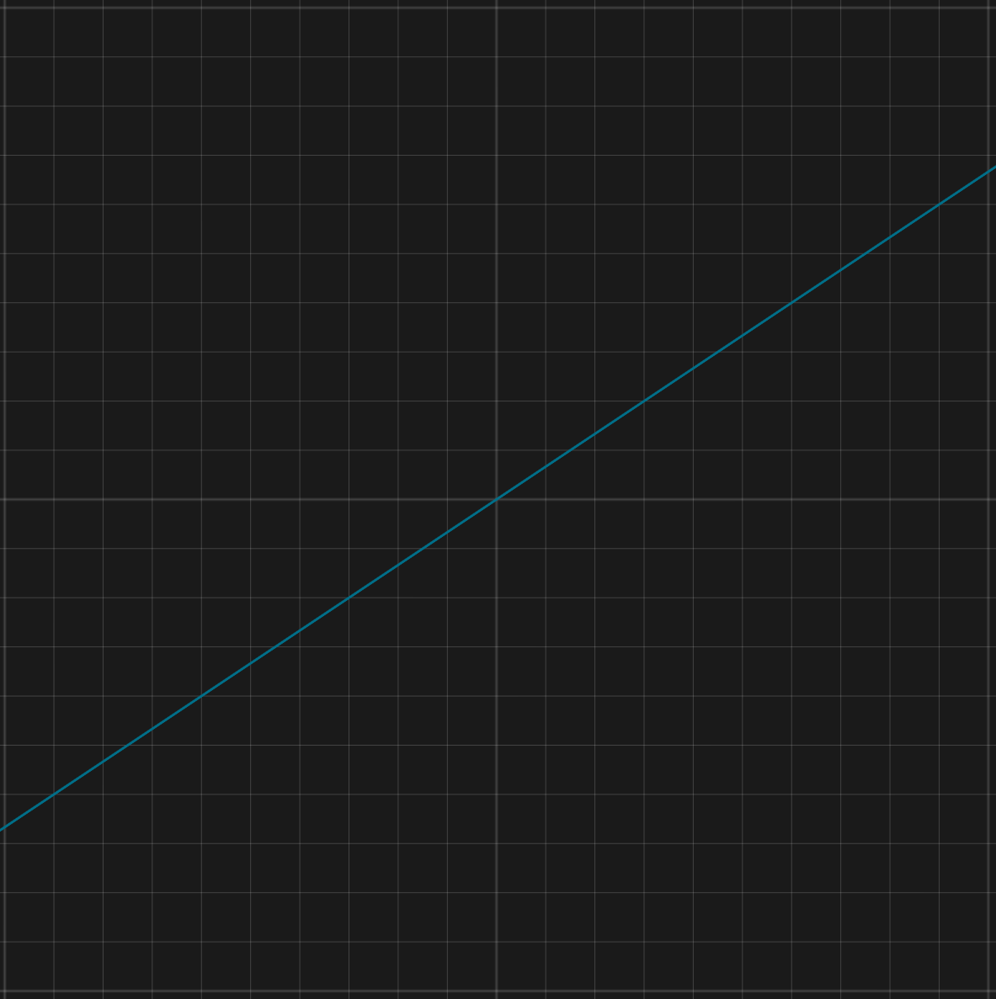

原图：https://cdn.prod.website-files.com/5fcde6f56fdac5414b34eeb3/64185bd69ebf855047406b2a_at0jS2tCX9uZws1JzZ9aT2c7NGZZBg6foMdmOrtF0jf_WIHxJawxCMbrkbWOnPGLvoIkyjtjlsG-A9-hjwCFJxFDBHQ6zKvJIenx1xpX7pkEGyFt3Dw8NDAeNw04MbT3xX3l1SYUZy6MF7Iu26sMGRQ.png

### 图片 2：An edge has an underlying curve closed or bound by two vertices

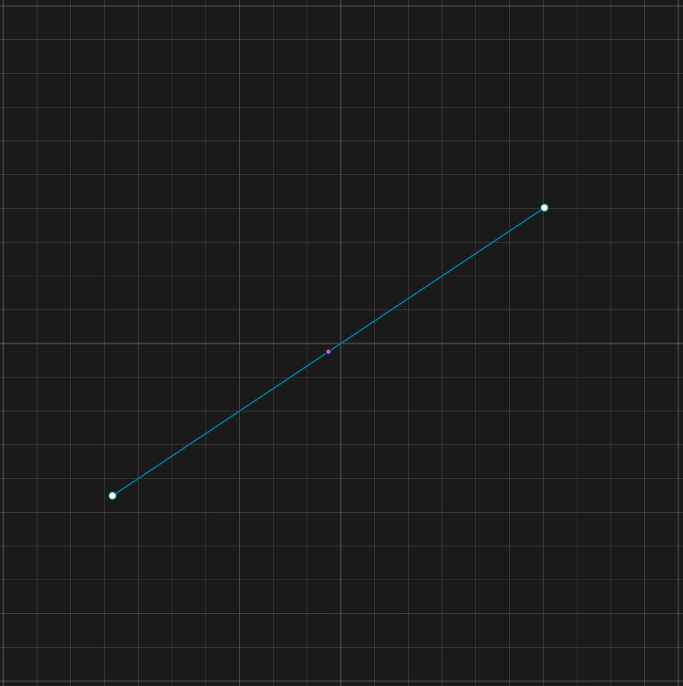

原图：https://cdn.prod.website-files.com/5fcde6f56fdac5414b34eeb3/64185bd506342479b8e02b32_AdD8hXnCWPGE5v5aTycYr37Ann5rSKmIb_QfrZqds5v8Thjvoi23SciuQ9i0X4tQrJTs-Txs3QfHluyjPUi0kWXsxC1adCvYoTYtbCqN0VJVbhIIsnNpVeUUIWBFfM6xEOaItprPnScwJVrfw2ZDBOc.png

### 图片 3：A surface is represented by a parametric equation (eg. a plane is s(u, v) = p0 + u ⋅ d1 + v ⋅ d2). Surfaces can be infinite (like a plane), closed (like a sphere), periodic (like a cylinder), or freeform (like a NURBS surface).

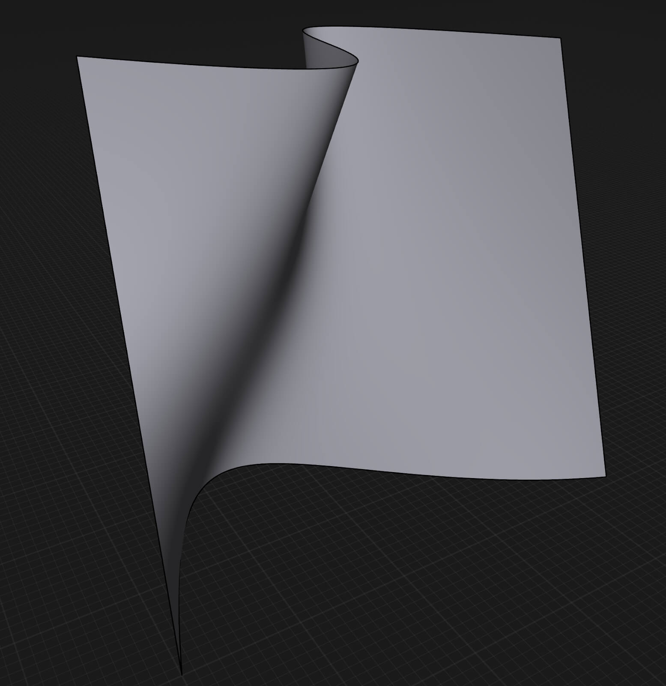

原图：https://cdn.prod.website-files.com/5fcde6f56fdac5414b34eeb3/66d5788459e4e326223d85bd_66758b144afe45538043e51f_blog_what_is_cad-2.jpeg

### 图片 4：A face is a surface trimmed by curves. Outer loops define the boundaries of the face, inner loops define the holes on a surface. The face on picture 3. has the exact same surface as the surface 4., but it is trimmed by outer and internal loops.

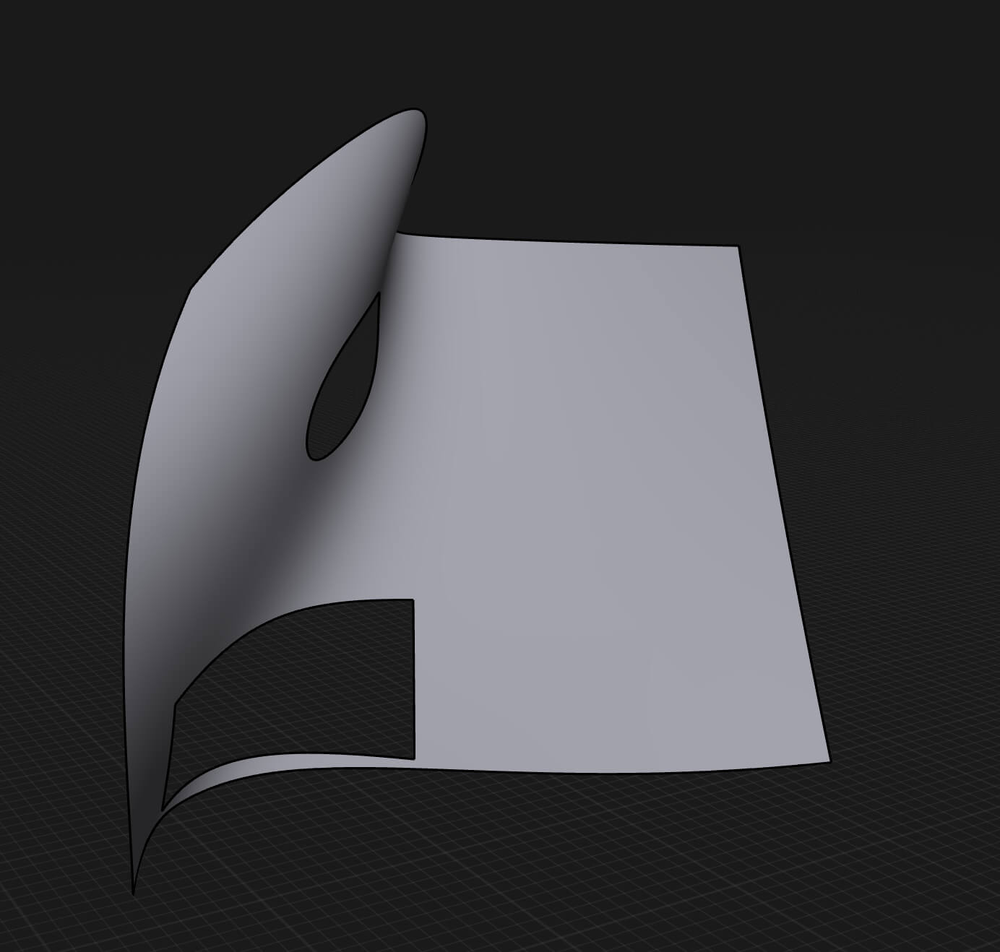

原图：https://cdn.prod.website-files.com/5fcde6f56fdac5414b34eeb3/66d5788359e4e326223d8590_66758b403d82527429880bda_blog_what_is_cad-3.jpeg

### 图片 5：A single surface can define a closed volume if the surface is a closed surface, like a torus or a sphere. The kind of geometries that can be represented by closed surfaces are relatively simple.

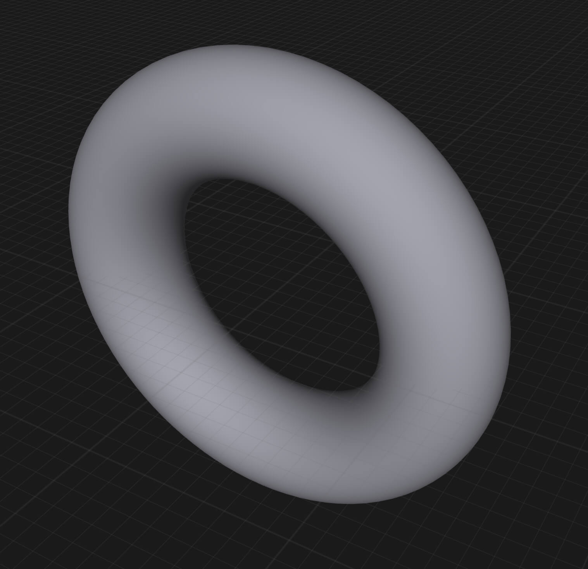

原图：https://cdn.prod.website-files.com/5fcde6f56fdac5414b34eeb3/66d5788459e4e326223d85ba_66758b82a8a504c6db99193a_blog_what_is_cad-4.jpeg

### 图片 6：For example, in a cylinder, the circular edge is defined by the intersection of the infinite planar surface and the infinite cylindrical surface. Both surfaces are trimmed at the intersection.

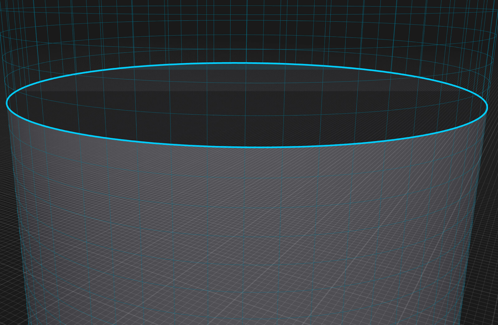

原图：https://cdn.prod.website-files.com/5fcde6f56fdac5414b34eeb3/66d5788459e4e326223d85d7_66758bfa07266e5abba682da_blog_what_is_cad-5.jpeg

### 图片 7：7. A solid body is a set of connected and closed faces that define a closed volume. The faces define the boundaries of the closed volume. If the faces are connected but not closed it’s called a sheet body.

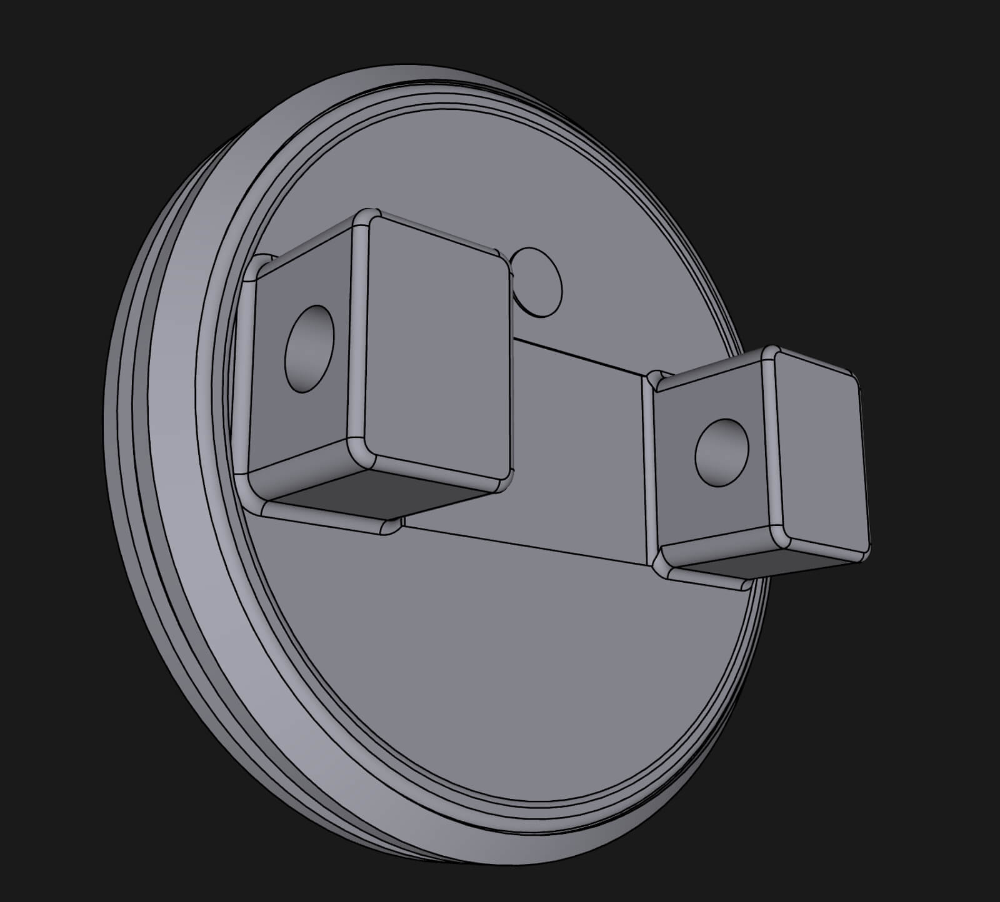

原图：https://cdn.prod.website-files.com/5fcde6f56fdac5414b34eeb3/66d5788459e4e326223d85b0_66758c3d991e4f7d4430a217_blog_what_is_cad-6.jpeg

### 图片 8：Solid mesh body

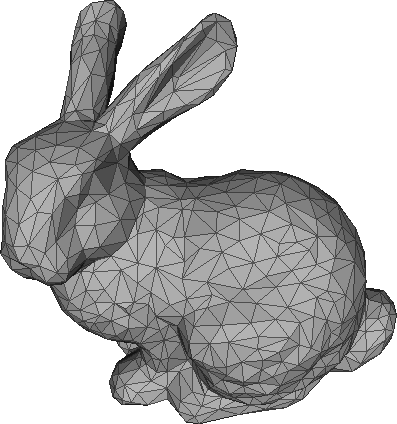

原图：https://cdn.prod.website-files.com/5fcde6f56fdac5414b34eeb3/64185bd6494f1632a5f7cca4_t2ELTbcO6DRRfnUttMQsOXHGjTV2CyRVUeLipuX4rly5b4z_3XQTcu2HeusjQerSsn7M8EYykzz5EXaxq4w-j2ewH3JzOk1cgHFw0j0KRVYucCBuQLS_EZezTVuSSo6r8IDqOKO8zWfJgd4olGzzzhc.png

### 图片 9：Sheet mesh

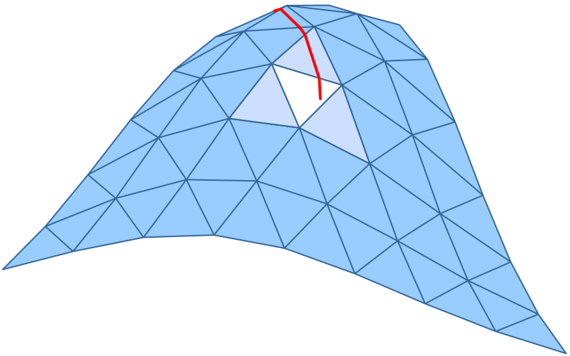

原图：https://cdn.prod.website-files.com/5fcde6f56fdac5414b34eeb3/64185bd670ef9ea4a4ab4e25_dbzPajxtKTX2IltH2k4VVMEATchvMkkOIvyhOCZYBsEWuxcYWifBgkXzFhC7UPjDC8nMH7gxiBinxj7i2QeGcMvGDxpUzDGiq8WHlvh1gQutnrhvyLb8GhmbrnTVME7A7MjYo6cPVrYQsq2GQhGB7WM.png

### 图片 10：Mesh data from 3D scanning

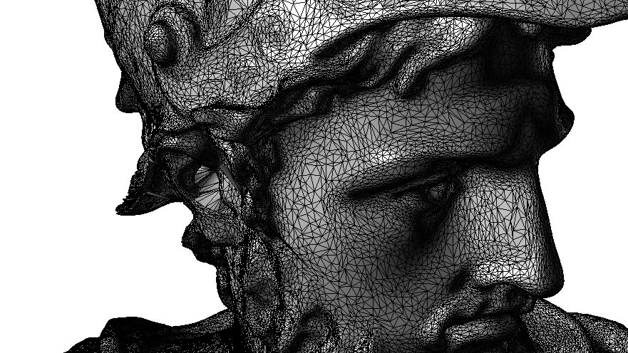

原图：https://cdn.prod.website-files.com/5fcde6f56fdac5414b34eeb3/66d5788459e4e326223d85c8_66758cae4ea16b6827376384_blog_what_is_cad-7.jpeg

### 图片 11：Displaying the geometry

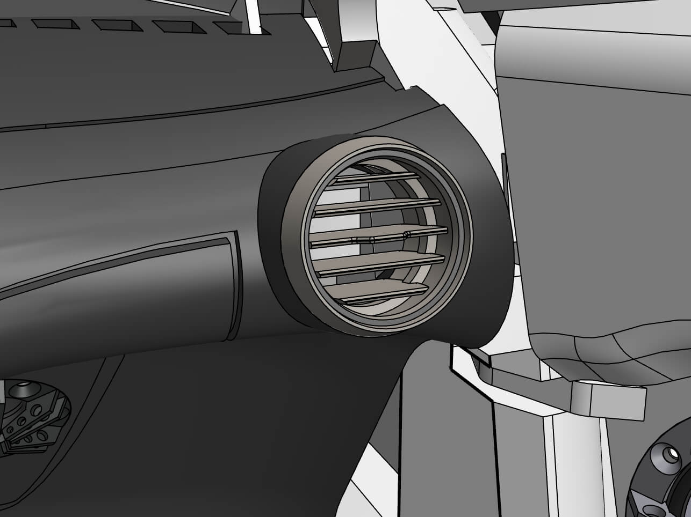

原图：https://cdn.prod.website-files.com/5fcde6f56fdac5414b34eeb3/66d5788459e4e326223d85a6_66758cfee3422fd369b82fad_blog_what_is_cad-8.jpeg

### 图片 12：Displaying the geometry

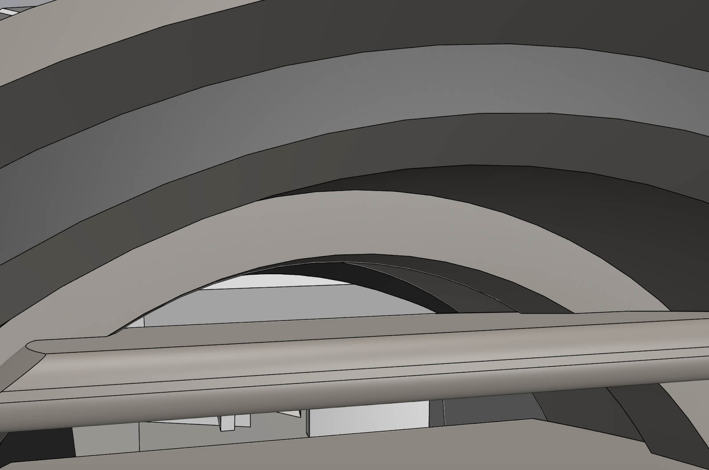

原图：https://cdn.prod.website-files.com/5fcde6f56fdac5414b34eeb3/66d5788459e4e326223d85ad_66758d6e95092d2ca9c1d1db_blog_what_is_cad-9.jpeg

## 抓取记录

- 页面标题：What is CAD: the technological foundations of CAD software
- 抓取状态：ok
- 成功下载图片：12
- 图片失败：0
- 处理耗时：9.4 秒