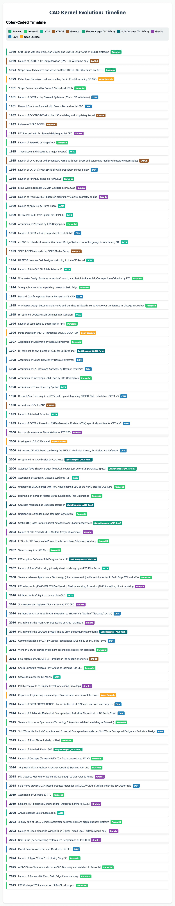
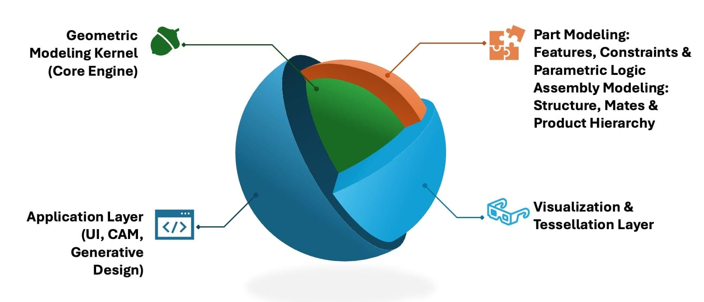
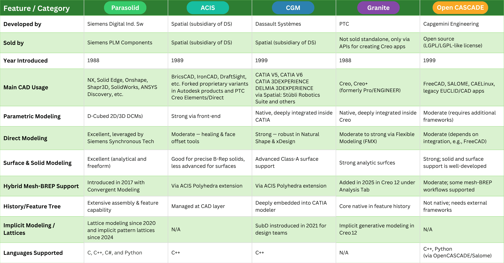
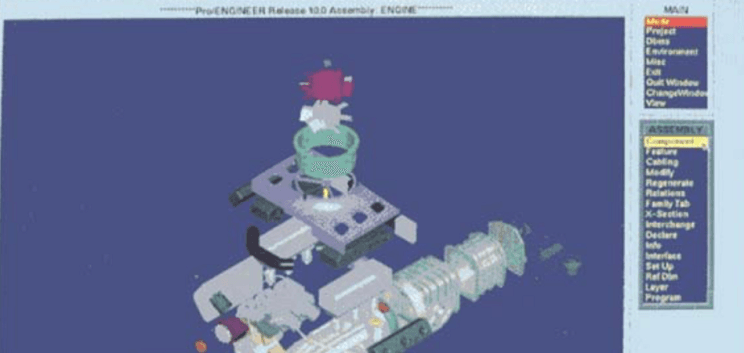

# Chapter 15 - The Kernel Wars: A Modern Perspective

> 原始素材条目：The Kernel Wars: A Modern Perspective（DemystifyingPLM Ch.15）

> 原文链接：https://www.demystifyingplm.com/chapter-15-the-kernel-wars-a-modern-perspective

> 摘要：The Kernel Wars: A Modern Perspective Today's CAD landscape is defined by a complex ecosystem of geometric kernels and constraint solvers, each representing different strategic approaches. To better understand it, let's first look at the history of the various platforms: Fun fact: I was born in 19

## 正文

Chapter 14 - Cross-Kernel Synergies: The Integration Imperative

## KEY TAKEAWAYS

- Parasolid dominates high-end MCAD applications

- ACIS still holds market share in B2C CAD solutions

- Dassault and PTC use multiple graphics kernels

- SpaceClaim switches to Parasolid from ACIS

- CGM kernel powers Dassault's CATIA with strong market presence

🎧 AUDIO VERSION

Listen to "Chapter 15 - The Kernel Wars: A Modern Perspective"

More audio articles at DemystifyingPLM/listen

SHORT ANSWER

The modern CAD landscape is shaped by diverse geometric kernels and constraint solvers that reflect different strategic approaches. These tools enable precise modeling but also introduce interoperability challenges.

- Geometric kernels are core to CAD systems, affecting model accuracy and performance

- Constraint solvers enhance design flexibility and automation capabilities

- Interoperability issues arise due to the proprietary nature of these technologies

- PLM practitioners must navigate these differences for seamless data exchange and process integration

Why it matters: Understanding kernel differences is crucial for selecting compatible systems and ensuring efficient data flow in PLM processes.

## The Kernel Wars: A Modern Perspective

Today's CAD landscape is defined by a complex ecosystem of geometric kernels and constraint solvers, each representing different strategic approaches. The mathematical foundation under most of them is B-rep (Boundary Representation), and the CAD kernel sits between that representation and every operation a CAD user performs. To better understand the landscape, let's first look at the history of the various platforms:

Timeline of events related to the history of MCAD and its geometric engines and

Fun fact: I was born in 1969 at the same time as BUILD :-)

Now, let's look at some characteristics of the primary graphics engines:

Characteristics of the primary graphics kernels in use today

Notes:

- Parametric: Controls geometry using parameters and constraints that can be edited later.

- Direct: Allows users to push, pull, or drag geometry without relying on a history tree.

- Surface & Solid Modeling: Engine can manage complex solids and mathematical surfaces

- Hybrid Mesh-BREP Support: Integrates faceted mesh data with solid boundary representation in a unified model.

- History/Feature Tree: Records and organizes modeling steps in a sequential, editable timeline.

In summary,

- Parasolid = Interoperability king, especially for mainstream CAD; licensed externally by Siemens PLM Components

- ACIS = Flexible, easier to license, good for lightweight CAD/CAM; licensed externally by Spatial Technologies (DS)

- CGM = High-end kernel with deep integration in CATIA; licensed externally by Spatial Technologies (DS)

- Granite = Tight coupling with Creo. The APIs for building apps on top of it were made licensable under the newly baptized name "Granite" in 2014 for building apps on top of Creo

The following table illustrates the current state (2025) of this competitive landscape:

Of note in the table above, SpaceClaim was created by Mike Payne after SolidWorks and Spatial and it used ACIS until 2024; ANSYS recently announced that the latest version of SpaceClaim now uses Parasolid instead and was rebranded as ANSYS Discovery in 2025.

We already mentioned the Spatial lawsuit in the Autodesk chapter due to their forking of ShapeManager off of the ACIS source tree. CoCreate also forked their SolidDesigner kernel off of the ACIS source tree at around the same time as the Spatial takeover, but I found no evidence of a lawsuit in this case. That product lives after a few acquisitions as PTC Creo Elements/Direct and as far as I could determine, it still uses this proprietary fork of ACIS code.

This ecosystem reveals several interesting patterns:

- Parasolid dominance: Powers the widest range of applications, from high-end NX to emerging tools like Shapr3D

- ACIS is still hanging on: Particularly for smaller CAD packages that are competing directly in the B2C market with AutoCAD

- Strategic ironies: SolidWorks (Dassault) and Onshape (PTC) both use Siemens Parasolid technology

- Dassault and PTC both use three different graphics kernels in their MCAD portfolios.

Now, let's look at the estimated marketshare at the high-end:

High-end MCAD kernel market analysis

We can see that Dassault's CATIA has a dominant position (~46%) with their powerful CGM kernel, followed by Parasolid, Granite and a few others.

Now, if we look at the mid-market (paid) solutions,

Mid-market MCAD kernel market analysis

We see DS SolidWorks in a commanding position of about 40% market share followed by Autodesk, Siemens and PTC. ACIS has an almost negligible marketshare because of the predominance of the two forked solutions.

Finally, if we just look for the number of seats mixing all markets together and finding a winner, we find:

Overall number of Seats

Parasolid, due to its many adopters. has about a 45% market share, followed by ShapeManager, CGM, and the others.

## Lessons from the Battlefield

The history of all these graphics kernels and software companies offer several enduring lessons for technology companies:

- Geographic clustering drives innovation. The concentration of geometric modeling expertise in Cambridge, UK, stemming from foundational work like the Romulus kernel, created a center of excellence that continues to influence the global CAD industry.

- Kernel decisions have long-term consequences. The early choices about geometric modeling engines continue to influence these products decades later, with the Cambridge-developed foundations still powering much of today's CAD industry.

- Listening to customers can be a game-changer. As we saw in the history of CATIA V5, the tight collaboration between the very exigent Toyota engineers and the DS labs produced one of the most powerful and dominant high-end kernels ever, CGM.

- Distribution can trump technology. Despite comparable technical capabilities, SolidWorks' channel strategy enabled faster market penetration than Solid Edge's approach, while PTC's Pro/JR demonstrated how poor positioning can destroy even established brand advantages.

- Technological sophistication alone doesn’t ensure survival — adaptability, openness, and ecosystem strategy matter more than internal power as illustrated by the history of Computervision, CADDS5, and SGI.

- Openness can be a virtue as exemplified by Parasolid’s dominance in the licensed kernel market while still powering fiercely competitive in-house products like Siemens NX, Solid Edge, and now Siemens NX X.

- Corporate strategy shapes product destiny. Both Solid Edge and SolidWorks succeeded, but within very different strategic contexts, while PTC's mid-market misstep reinforced their high-end focus.

- Timing matters, but execution matters more. Both companies recognized the Windows opportunity simultaneously, but SolidWorks' superior reseller channel execution proved decisive.

## Conclusion

The Kernel Wars have played a pivotal role in shaping the landscape of CAD software. From the early days of Romulus to the development of ACIS, CGM, Granite, and ultimately Parasolid, the choices made by various vendors have had lasting impacts on the industry. The journeys of Solid Edge and SolidWorks, while fascinating, are just two examples of how strategic decisions about geometric kernels can influence product development, market positioning, and competitive dynamics.

The ironies of the Kernel Wars are numerous. Dassault Systèmes, the owner of SolidWorks, pays royalties to Siemens for using Parasolid, while Siemens licenses technology from Dassault for some of their products. PTC also licenses Parasolid for some of their products (Creo Elements and Onshape). These interdependencies highlight the complex and often ironic nature of the CAD industry.

Ultimately, the Kernel Wars underscore the importance of timing, execution, and strategic decision-making in the world of CAD software. The concentration of geometric modeling expertise in Cambridge, the distribution strategies of SolidWorks, and the long-term consequences of early kernel choices all serve as valuable lessons for the industry. As we look to the future, the legacy of the Kernel Wars will continue to shape the evolution of CAD technology and the competitive landscape of the industry.

Chapter 14 - Cross-Kernel Synergies: The Integration Imperative

Looking up PLM terminology? Browse the canonical reference.

CITE THIS ARTICLE

Finocchiaro, Michael. “Chapter 15 - The Kernel Wars: A Modern Perspective.” DemystifyingPLM, June 14, 2025, https://www.demystifyingplm.com/chapter-15-the-kernel-wars-a-modern-perspective

Michael Finocchiaro

PLM industry analyst · 35+ years at IBM, HP, PTC, Dassault Systèmes

Firsthand knowledge of the evolution from early 3D modeling kernels to today's cloud-native platforms and agentic AI — the history, strategy, and future of PLM.

### RELATED ARTICLES

#### Chapter 14 - Cross-Kernel Synergies: The Integration Imperative

Jun 14, 2025 · 1 min read

#### Chapter 11 - CAD Wars

Jun 14, 2025 · 7 min read

#### Chapter 5 - Cautionary Tales in CAD: When Tech Isn’t Enough

Jun 12, 2025 · 5 min read

## 图片

### 图片 1：Timeline of events related to the history of MCAD and its geometric engines and

原图：https://www.demystifyingplm.com/_next/image?url=%2Fimages%2F2025%2F06%2Fscreencapture-file-Users-mfinocchiaro-Dropbox-Private-Articles-Kernel-Wars-cad-kernel-history-html-2025-06-10-16_21_54.png&w=1920&q=75&dpl=dpl_4mMHR2pr9ZBaxVaMjywtbFMH4eZS

### 图片 2：Chapter 14 - Cross-Kernel Synergies: The Integration Imperative

原图：https://www.demystifyingplm.com/_next/image?url=%2Fimages%2F2025%2F06%2Fkerneldiagram.jpg&w=3840&q=75&dpl=dpl_4mMHR2pr9ZBaxVaMjywtbFMH4eZS

### 图片 3：Chapter 11 - CAD Wars

原图：https://www.demystifyingplm.com/_next/image?url=%2Fimages%2F2026%2F05%2Fposts%2Fkernel-dna.png&w=3840&q=75&dpl=dpl_4mMHR2pr9ZBaxVaMjywtbFMH4eZS

### 图片 4：Chapter 5 - Cautionary Tales in CAD: When Tech Isn’t Enough

原图：https://www.demystifyingplm.com/_next/image?url=%2Fimages%2F2025%2F06%2F1748096141468.png&w=3840&q=75&dpl=dpl_4mMHR2pr9ZBaxVaMjywtbFMH4eZS

## 抓取记录

- 页面标题：Chapter 15 - The Kernel Wars: A Modern Perspective
- 抓取状态：ok
- 成功下载图片：4
- 图片失败：0
- 处理耗时：3.4 秒