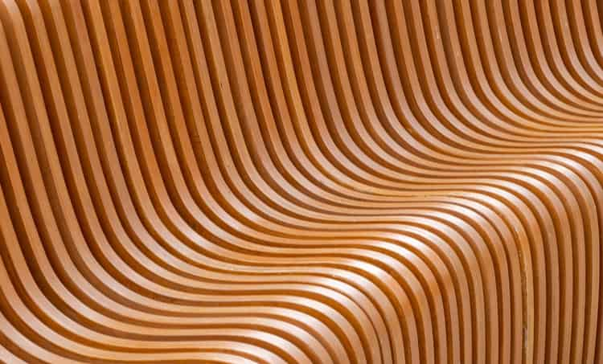
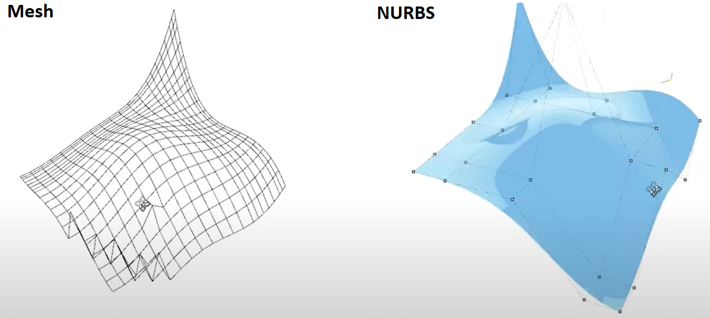

# Using NURBS vs. Mesh: Why Both Are Needed

> 原始素材条目：Using NURBS vs. Mesh: Why Both Are Needed（Cadence）

> 原文链接：https://resources.system-analysis.cadence.com/blog/msa2022-using-nurbs-vs-mesh-why-both-are-needed

> 摘要：Learn the differences between NURBS vs. mesh methods for geometry modeling, including when each is appropriate for different systems.

## 正文

# Using NURBS vs. Mesh: Why Both Are Needed

### Key Takeaways

- Modern CAD software primarily works with and produces B-Rep NURBS geometry models.

Modern CAD software primarily works with and produces B-Rep NURBS geometry models.

- Discrete (faceted) geometry models offer an alternative that is simpler mathematically.

Discrete (faceted) geometry models offer an alternative that is simpler mathematically.

- Meshes can be generated on both types of geometry models and awareness of the complicating factors of each will benefit the user.

Meshes can be generated on both types of geometry models and awareness of the complicating factors of each will benefit the user.

Spline curves like these can be used for geometric modeling in CFD simulations

No matter the area of science or engineering, any numerical simulation that is constructed to describe a complex system must apply discretization to the governing equations and system geometry. In most areas of engineering, the general process can involve multiple steps of geometry simplification followed by discretization, which reduces the complexity of the simulation and decreases computation time. In CFD simulations, the flow characteristics are highly dependent on the geometry of the system, so simulation engineers must ensure system boundaries are accurately modeled.

For simple systems, both in CFD simulations and other areas, a uniform grid of points is usually sufficient to accurately model surfaces and produce accurate simulation results. In more complex systems where boundary surfaces do not resemble simple curves or shapes, some more complex methods for describing the system geometry need to be enforced. In CFD, designers need to choose between NURBS vs. mesh to define system curvature, as these methods are generally used in commercial CFD applications. In this article, we’ll explore NURBS vs. mesh methods for geometry modeling, including when each is appropriate for different systems.

## How CFD Applications Model Geometry

CFD simulation designers have multiple methods they can use to model system geometry and describe flow behavior along the boundary of an object in a system. This is important for accurately describing fluid flow behavior and the forces a fluid will exert on another object during flow. The geometry model that is applied in a system must closely match the real geometry that is being represented in a CAD application while eliminating unnecessary geometric elements that do not participate in or determine fluid flow behavior.

The front-end development of a system mesh will determine the overall simulation time and results. CFD simulation applications generally use two methods to model the geometry of flow boundary surfaces:

### Meshing

This set of techniques involves defining arrays of points that represent the boundary to be modeled in the simulated system. In general, any arrangement of structured or unstructured polygonal meshes can be used to represent the surface and inner volume of a simulation system. CFD applications use a specific set of mesh types to represent arbitrarily-shaped objects in a simulation (unstructured, structured, or hybrid). The best applications can produce a mesh dynamically, known as adaptive meshing, a technique that can reduce total simulation time by adjusting the required mesh density to accommodate regions with high flow rate gradients.

What information does a mesh contain? This is basically a set of points in 3D space and time as well as the various flow characteristics we want to simulate. This then defines edges and faces along the surface of the system boundary.

### Non-Uniform Rational B-Spline Surfaces (NURBS)

NURBS uses a set of curves defined by some parametric function to describe a curve that joins two points in a system. In 3D, this just extends to a surface that connects a set of points. In a CFD simulation, this gives a continuous set of points (a curve) that is used to define the shape of the system being simulated, where the curves are drawn along the flow boundaries in the system. CFD simulations can use this information to very accurately track fluid flow very close to a curved surface, including for very complex curves that do not have analytic functions describing their curvature.

Because general curves are not always described using the set of analytic functions, these curves are typically parametric with some general basis function. These curves are called basis splines, or b-splines. The challenge in defining a b-spline is to determine the general form of the basis function that describes the curvature of the surface being modeled. The basis function is generally a high degree polynomial, and some procedure is needed to determine the coefficients in the polynomial function for the spline. Various methods for defining these curves include:

- Interpolation to the polynomial of lowest possible degree that passes through the points defining the curve in question.

- Taylor series approximation, assuming some very fine set of data is used to define the relevant curve.

- Error-minimization strategies based on random or directed search (heuristics).

NURBS curves work with a network of points, but the generated surface exists in 3D to define a continuous set of points along a surface.

Comparison of a structured mesh used to define a smooth surface (left) and NURBS (right)

## Choosing NURBS vs. Mesh for Geometric Modeling

So, which of these should be used to model the geometry of a system in a CFD simulation—NURBS or mesh? NURBS tends to be the best option for smooth surfaces, as its simulation complexity depends more on polynomial order being used, which can be minimized to fit the surface curvature. For rough surfaces or surfaces that might match a standard coordinate system used in CFD (radial, elliptic, etc.), discrete meshing may be the best choice, as it does not rely on an interpolation step to produce an accurate representation of a surface.

The end goal in applying an appropriate discretization scheme is to ensure that a CFD package can produce accurate simulation results. Designers should select a CFD simulation suite that gives them the flexibility they need to apply the best geometry for their particular system. There’s no need to apply complicated B-splines to a system that can be reasonably accurately described with a simple geometry (circular, cylindrical), as this increases the overall simulation time and complexity. Conversely, enforcing a discrete geometry (tetrahedra, hexahedra, etc.) may create excess complexity where it isn’t needed, and this would increase simulation complexity. Judicious use of adaptive meshing and interpolation can aid geometry modeling for even the most complex curves.

If you’re deciding between software that uses NURBS vs. mesh generation, you can now access a flexible option with the meshing tools in Pointwise and the Hexpress module in the Omnis 3D Solver from Cadence. These applications support a variety of mesh constructions, including high-order meshing and spline interpolation in complex geometries without a significant increase in computational complexity.

Subscribe to our newsletter for the latest CFD updates or browse Cadence’s suite of CFD software, including Omnis and Pointwise, to learn more about how Cadence has the solution for you.

CFD Software Subscribe to Our Newsletter

## 图片

### 图片 1：Geometry modeling CFD

原图：https://content.cdntwrk.com/files/aHViPTExODYyNSZjbWQ9aXRlbWVkaXRvcmltYWdlJmZpbGVuYW1lPWl0ZW1lZGl0b3JpbWFnZV82MWVlNjY1OGQzNTk4LmpwZyZ2ZXJzaW9uPTAwMDAmc2lnPTRlNWI4OGM4ODA1MjAzNTg5YWYwMTE4MWU0N2IxYjE2

### 图片 2：NURBS vs. mesh

原图：https://content.cdntwrk.com/files/aHViPTExODYyNSZjbWQ9aXRlbWVkaXRvcmltYWdlJmZpbGVuYW1lPWl0ZW1lZGl0b3JpbWFnZV82MWVlNjZhYTZhNWRmLnBuZyZ2ZXJzaW9uPTAwMDAmc2lnPTZmOWIzMTcyZDU4NzQ4MzJkNDc0YjU0OTJiYmIwOWFk

## 抓取记录

- 页面标题：Using NURBS vs. Mesh: Why Both Are Needed
- 抓取状态：ok
- 成功下载图片：2
- 图片失败：0
- 处理耗时：8.7 秒