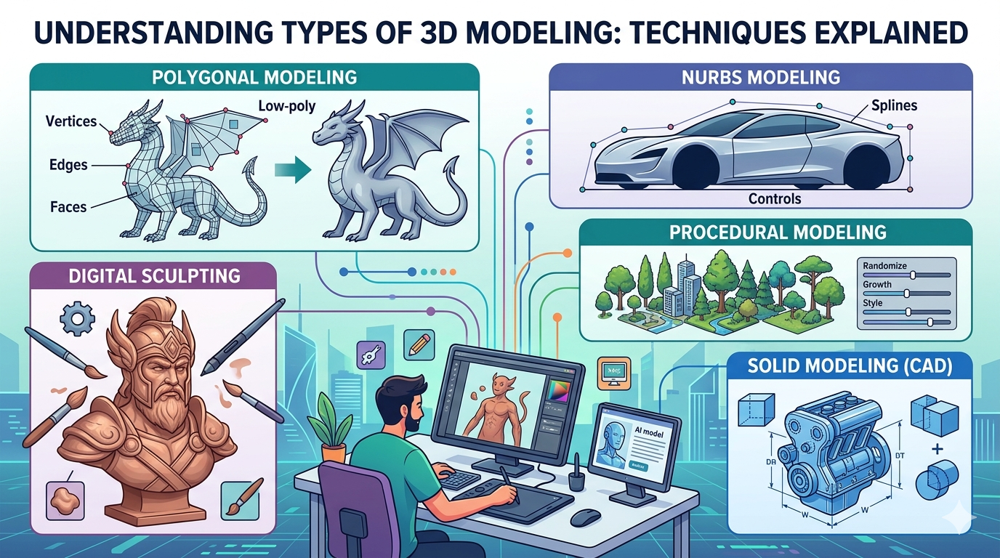
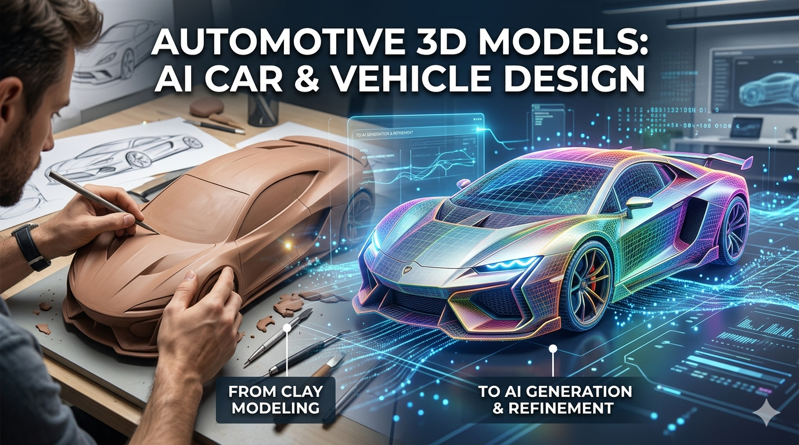
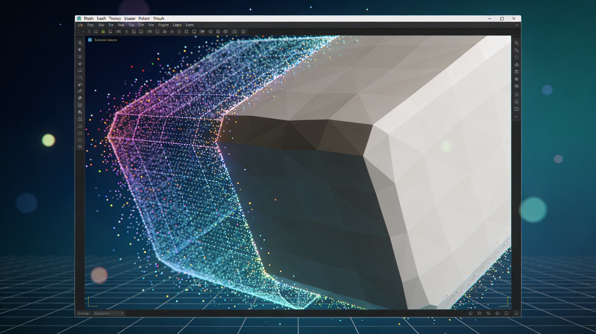
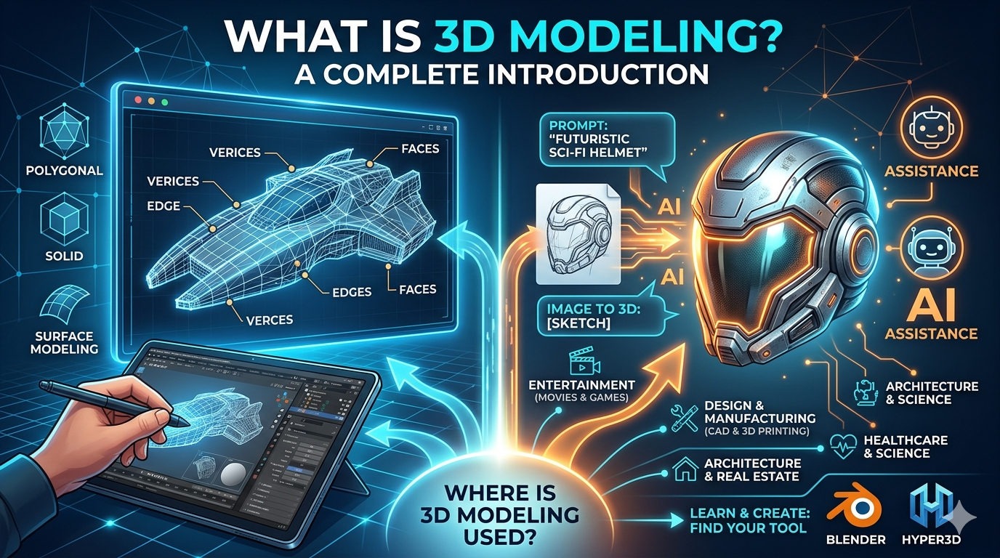

# 3Dモデリングの種類：7つの主要テクニックを解説（2026）

> 原始素材条目：3D モデリングの種類：7 つの主要テクニック（Hyper3D）

> 原文链接：https://hyper3d.ai/ja/blog/types-of-3d-modeling-ja

> 摘要：ポリゴンモデリングからスカルプティング、CADまで、3Dモデリングの中核となる種類を紹介します。プロジェクトに最適な手法を学びましょう。

## 正文

# 3Dモデリングの種類：7つの主要テクニックを解説（2026）

ポリゴンモデリングからスカルプティング、CADまで、3Dモデリングの中核となる種類を紹介します。プロジェクトに最適な手法を学びましょう。

### このページ

- 概要

- 3Dモデリングの種類：テクニックを解説

- 主要な3Dモデリング技法

- ポリゴンモデリング

- NURBSモデリング

- デジタルスカルプティング

- その他の重要なモデリング手法

- プロシージャルモデリング

- ソリッドモデリング

- 3Dモデリングツールに関する私の実体験

- 3Dモデリングソフトウェアの客観的比較

- よくある質問（FAQ）

- 最も学びやすい3Dモデリングの種類は何ですか？

- 1つのプロジェクトで複数の3Dモデリング手法を使えますか？

- 3Dプリントに最適な3Dモデリング手法はどれですか？

- AIは3Dモデリングの種類をどのように変えていますか？

- 3Dモデリングが上手くなるには、絵が上手である必要がありますか？

## 3Dモデリングの種類：テクニックを解説

3Dモデリングは、私たちが日々触れているデジタル世界の多くを支える基盤です。お気に入りのビデオゲームに登場するキャラクターから、未来の建築物を生き生きと見せる建築ビジュアライゼーションまで、すべては3Dモデルから始まります。しかし、すべてのモデルが同じように作られるわけではなく、その制作プロセスも大きく異なります。プロジェクトごとに求められる要件は異なるため、3Dモデリングの種類 も数多く存在し、それぞれに強みと最適な用途があります。Blenderのような定番ソフトウェアを使う場合でも、AI 3D model generator を試してみる場合でも、こうした中核的なテクニックを理解することが重要です。

## 主要な3Dモデリング技法

3D制作の中心には、数十年にわたって発展し洗練されてきた、いくつかの基本的なアプローチがあります。これらは、精巧なキャラクターデザインから高精度な工業部品まで、ほとんどの3D制作の土台となる手法です。

### ポリゴンモデリング

ポリゴンモデリングは、おそらく 3Dモデリングの種類 の中でも最も一般的で広く理解されている手法です。3Dオブジェクトの「ワイヤーフレーム」表示を見たことがあるなら、すでにポリゴンモデリングを目にしていることになります。この手法では、頂点（vertices）と呼ばれる3D空間上の点をつなぎ合わせて、3Dの表面、つまり「メッシュ」を作成します。これらの接続はエッジを形成し、閉じたエッジの輪がポリゴン、または「面（face）」になります。こうしたポリゴンを作成・操作することで、アーティストは想像できるあらゆる形状を構築できます。

この技法は、ビデオゲーム、アニメーション、映画といった業界の中核を担っています。その汎用性により、リアルタイムレンダリングに適した軽量なローポリモデルから、映画品質のディテールを持つハイポリモデルまで作成できます。最大の利点は、直接的で細かな制御ができることです。頂点を1つずつ動かして、狙った形状を正確に作れます。一方で、滑らかで有機的な表面を作るのは難しく、多くの場合は大量のポリゴンが必要になるため、モデルが「重く」なり、扱いにくくなることがあります。

### NURBSモデリング

NURBSは Non-Uniform Rational B-Splines の略です。少し長い名前ですが、考え方はシンプルです。点と点を直線で結ぶ代わりに、NURBSモデリングでは数式を使って完全に滑らかな曲線や曲面を作成します。このアプローチは、点をつなぐというより、柔軟なシート状の素材を成形する感覚に近いものです。

その高い精度から、NURBSは工業デザイン、自動車工学、建築などの分野で標準的に使われています。現実世界で製造可能な、完全に滑らかで連続した曲線を持つ自動車のボディパネルや製品の外装を作る必要があるなら、NURBSが最適です。NURBSで作られる曲面は数学的に純粋であるため、ディテールを失うことなく任意のサイズに拡大・縮小できます。その反面、ポリゴンモデリングやデジタルスカルプティングと比べると、芸術的または有機的な形状の制作にはあまり直感的ではありません。

### デジタルスカルプティング

デジタルスカルプティングは、主要なモデリング技法の中でも最もアーティスティックな手法です。名前の通り、現実世界の粘土彫刻を模したデジタルツールを使います。アーティストはベースとなる形状（球や立方体など）から始め、ブラシを使って表面を押し出したり、引っ張ったり、つまんだり、滑らかにしたり、ディテールを加えたりします。この方法は非常に高い自由度を持ち、キャラクター、クリーチャー、自然風景のような高精細で有機的なモデルの制作に最適です。

ZBrushやMudboxのようなツールは、この分野に特化しています。伝統的なアートの背景を持つ人にとっては、とても自然に感じられるプロセスです。主な課題は、非常に高密度なポリゴンモデル（数百万ポリゴン）になりやすく、そのままではリアルタイム用途に適さないことです。そのため通常は「retopology」と呼ばれる工程を行い、詳細なスカルプトの上に、よりシンプルで最適化されたメッシュを作成します。

## その他の重要なモデリング手法

三大手法以外にも、都市生成の自動化から工学的精度の確保まで、特定の目的に応える専門的な 3Dモデリングの種類 がいくつか存在します。

### プロシージャルモデリング

プロシージャルモデリングは、オブジェクトを手作業で成形するのではなく、そのオブジェクトを生成するためのルールやパラメータのセットを定義する手法です。言い換えれば、コンピュータに「どう作るか」を教えるようなものです。建物の高さ、木の密度、植物の枝分かれパターンといったパラメータを変更することで、モデルの無数のバリエーションを素早く作成できます。

この技法は、映画やゲームにおける大規模で複雑な環境制作で非常に役立ちます。アーティストが都市全体、森林、あるいは銀河までも、すべてのオブジェクトを手作業で配置することなく生成できるのは、この手法のおかげです。その強みは非破壊的なワークフローにあり、いつでもルールに戻って調整できます。学習コストは高めで、ノードベースまたはスクリプトベースのインターフェースを扱うことが多いですが、その成果は非常に強力です。

### ソリッドモデリング

ソリッドモデリングは、主にCAD（computer-aided design）や工学分野で使われます。オブジェクトの表面だけを定義するポリゴンモデリングやサーフェスモデリングとは異なり、ソリッドモデリングではオブジェクトを完全な立体体積として定義します。つまり、モデルは重量、質量、密度といった特性を持ちます。これは、基本形状（立方体、円柱、球体）をブーリアン演算（加算、減算、交差）で組み合わせて構築されます。

この手法は、製品設計や製造に不可欠です。モデルがソリッドで寸法的にも正確であるため、工学シミュレーション、応力試験、3Dプリントに利用できます。硬直性があるため芸術的な制作にはあまり向きませんが、精度が重要なあらゆる用途においては、間違いなく最有力の手法です。

## 3Dモデリングツールに関する私の実体験

私はさまざまな3Dツールを長く使ってきましたが、そのアプローチは年々変化してきました。最初はBlenderで伝統的なポリゴンモデリングから始め、何時間もかけて頂点を押したり引いたりしながら、ちょうどよい形を追い込んでいました。その経験を通じて、トポロジーや形状の基礎を学びました。個人プロジェクトでは、詳細なキャラクターを作るためにデジタルスカルプティングにも挑戦しましたが、その芸術的な自由度には驚かされました。工学というより、絵を描くことに近い感覚でした。

最近では、私のワークフローにAIも組み込まれています。Hyper3Dのツールセットをかなり活用しています。素早いアセット制作には、text to 3D model 機能が非常に便利で、シンプルなプロンプトからベースメッシュを生成できます。私はそこから始めて、その後OmniCraftに持ち込み、クリーンアップや変換を行うことがよくあります。また、image to 3D ツールも、コンセプトスケッチをしっかりした出発点へ変換するのに驚くほど効果的だと感じています。モデルを素早く生成し、その後で従来型のエディタで仕上げたり、あるいは生成されたメッシュをそのまま使ったりできることで、私の制作スピードは大幅に向上しました。これは 3Dモデリングの種類 を捉える新しい考え方であり、生成とブラッシュアップが密接に結びついています。

## 3Dモデリングソフトウェアの客観的比較

適切なツール選びは、完全に目的次第です。唯一の「最高の」3Dモデリングソフトウェアというものはなく、ある特定の作業に最適なものがあるだけです。素早く結果を得たい場合は、3D format converter も試せます。

| Tool | Primary Technique | Best For | Pros | Cons |\n| --- | --- | --- | --- | --- |\n| Blender | Polygonal, Sculpting | General Purpose, Indie Devs | Free, incredibly versatile, huge community | Steep learning curve, can be overwhelming |
| ZBrush | Digital Sculpting | High-Detail Characters & Organics | Industry standard for sculpting, powerful tools | Subscription cost, specialized workflow |
| Fusion 360 | Solid, NURBS | Product Design, Engineering | Precise, cloud-based, great for manufacturing | Not ideal for artistic work, subscription-based |
| Hyper3D | AI Generation | Rapid Prototyping, Concepting | Extremely fast generation, multiple export formats (GLB, USDZ), easy to use | Less manual control, dependent on prompts |

詳細なキャラクターを作りたいアーティストなら、ZBrushは素晴らしい選択肢です。機械部品を設計するエンジニアなら、Fusion 360が最適です。無料で強力なオールインワン環境を必要とするホビイストやインディー開発者にとっては、Blenderに匹敵するものはありません。そして、テキストや画像から素早く3Dアセットを作りたいデザイナーにとっては、Hyper3Dの OmniCraft mesh ツールが、新しく効率的な道を提供してくれます。

## よくある質問（FAQ）

### 最も学びやすい3Dモデリングの種類は何ですか？

多くの初心者にとって、最もわかりやすい出発点はポリゴンモデリングです。非常に広く使われているため、チュートリアルや学習リソースも豊富にあります。シンプルなソフトから始めて、頂点、エッジ、面の操作を学ぶことで、強固な基礎を築けます。

### 1つのプロジェクトで複数の3Dモデリング手法を使えますか？

もちろんです。実際、それは非常によくあることです。プロのワークフローでは、AIジェネレーターでベースメッシュを作成し、スカルプト用ソフトで高周波ディテールを加え、ポリゴンツールでゲーム向けのローポリメッシュを作り、最後にスカルプトのディテールをローポリモデルへベイクする、といった流れが一般的です。

### 3Dプリントに最適な3Dモデリング手法はどれですか？

一般的には、特に機能部品においてはソリッドモデリングが3Dプリントに最適です。これは、確実にソリッドで印刷可能な「watertight」モデルを作成できるためです。ただし、ポリゴンモデルやスカルプトモデルも3Dプリントは可能であり、マニフォールド（閉じた体積）であることを確認するために、適切な準備とエラーチェックが必要です。

### AIは3Dモデリングの種類をどのように変えていますか？

AIは、生成型モデリングという新しいカテゴリをもたらしています。テキストや画像からモデルを作るツールは、強力なアシスタントになりつつあります。これらは従来のスキルを置き換えるのではなく補完し、アーティストやデザイナーがアイデアをはるかに速く試行錯誤できるようにします。制作の初期段階にある、時間のかかりがちなブロックアウト工程を自動化してくれるのです。

### 3Dモデリングが上手くなるには、絵が上手である必要がありますか？

役立ちはしますが、必須ではありません。特にハードサーフェスモデリングでは、伝統的な描画スキルよりも、形状、フォルム、比率への理解のほうが重要です。ただし、デジタルスカルプティングでは芸術的な能力がより大きな助けになります。というのも、そのプロセスは現実世界の彫刻やドローイングに非常に近いからです。

## この記事は役に立ちましたか？

### Try Hyper3D for free

Click below to get 50% off your first month subscription and extra 20 credits.

### 共有

## 続きを読む

### 自動車向け3DデザインにおけるAI：より速い車・ビークルモデル制作

AIを活用した自動車3Dデザインについて学びましょう。AIツールが、これまで以上に車のデザインを高速かつ創造的にしている様子をご覧ください。今すぐ試してみましょう！

### PLYファイルとは？ポイントクラウド形式を解説

PLYファイルとは何かを解説します。PLYファイルとは何か気になっている方に向けて、この3Dポイントクラウド形式の概要、3Dスキャンでの用途、そしてSTLやOとの違いをわかりやすく紹介します。

### 3D Modelingとは？ 仕組みと重要性を解説（2026年）

3D modelingとは何か気になりますか？ デジタルスカルプティングの基本と、AIがどのようにゲームを変えているのかを紹介します。BlenderやHyper3Dのようなツールについても学べます。

## Imagine It. Shape It.

## 图片

### 图片 1：types-of-3d-modeling

原图：https://storage.deemos.dev/blog/%E2%81%A0blog_206_types-of-3d-modeling.md.png

### 图片 2：automotive-3d-design

原图：https://storage.deemos.dev/blog/blog_223_automotive-3d-design.md.png

### 图片 3：what-is-ply-file

原图：https://storage.deemos.dev/blog/blog_68_what-is-ply-file.md.png

### 图片 4：what-is-3d-modeling

原图：https://storage.deemos.dev/blog/blog_212_what-is-3d-modeling.md.png

## 抓取记录

- 页面标题：3Dモデリングの種類：7つの主要テクニックを解説（2026）
- 抓取状态：ok
- 成功下载图片：4
- 图片失败：0
- 处理耗时：6.8 秒