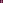

# ■ ３ＤＣＧ モデラーの特徴を知って自分に適した製品 選び方

> 原始素材条目：3DCG モデラーのタイプと特徴

> 原文链接：http://3dcg.homeip.net/3d_process/3d_Modeler_Type.php

> 摘要：3DCG モデラーの種類と特徴を知ることで自分に適した3D グラフィックソフトを選ぶヒントが得られます。

## 正文

# ■ ３ＤＣＧ モデラーの特徴を知って自分に適した製品 選び方

## 3DCG ことはじめ

- はじめに （3D全般）

### はじめに （3D全般）

- 3DCG の 制作工程

### 3DCG の 制作工程

- モデラの種類 / 特徴

### モデラの種類 / 特徴

- CG スクールで学ぶ

### CG スクールで学ぶ

## 3DCG Workstation

3DCG-WSに関する説明

## 取り扱いショップ

- 主要 ３ＤＣＧ ソフト

### 主要 ３ＤＣＧ ソフト

- PC パソコン（BTO）

### PC パソコン（BTO）

- ワークステーション

### ワークステーション

- ビデオカード / パーツ

### ビデオカード / パーツ

- Windows XP お早めに

### Windows XP お早めに

## ３ＤＣＧ モデラーのタイプ（種類）と特徴について

３ＤＣＧ 制作プロセス（工程）と習得のポイント で説明したとおり、3D グラフィックソフトにおける制作工程はどの統合型 3ＤＣＧソフトウェアも共通します。ただし、製品の中にはプロセスごとにプログラムが独立している製品や、プロセスごとに製品化されているものもあります。詳しくは以下のページで解説しています。

参照 => 3D グラフィックソフトのタイプについて ～ 3D グラフィックソフトの選び方

ここでは、形状作成（モデリング）を行うモデラーの特徴について説明します。はじめての方が 3D グラフィックソフト を選ぶ上で非常に重要な事になります。（特に統合型エントリークラスの製品）

### モデラーの特徴（特性）を理解しておかなければならない理由

モデラーには、複数のタイプがあり、それぞれ向き、不向きがあるからです。どちらが優れているかという話ではありませんので誤解のないよう注意して下さい。

特に、これから3D グラフィックソフトの購入を検討されている方の場合、それぞれの特徴（特性）を理解した上で自信の制作テーマにあったモデラーを有する製品を選ぶと挫折する事も少なく、また、遠回りすることなく目的を達成する事が出来ます。そのためのアドバイスとなっています。

プロは目的（作成する形状）に合わせて、それぞれに適した異なるモデラーを使い分けます。一つのモデラーを使いこなし、どのような形状でも作成できるようになるには、操作の習得後、更に経験が必要となります。3ＤＣＧを生業とするプロでさえ、自分の得意とするモデラーで全てを作ってしまう人が多い事からも習得の大変さが伺えます。

### モデラーのタイプ（種類）

3DCG ソフトウェアによって機能面での違いはありますが、コンピューターで行うモデリングにはサーフェイス属性によって大きく三つのタイプに大別する事が出来ます。

- ポリゴン モデラー ポリゴン単位（面単位）で編集を行うモデラー

- ポリゴン単位（面単位）で編集を行うモデラー

- スプライン モデラー ベジェ、NURBUSなどベクトル編集を行うモデラー

- ベジェ、NURBUSなどベクトル編集を行うモデラー

- メタボールなどソリッド系モデラー これはタイプというより、サーフェイスの属性と考えた方がよい

- これはタイプというより、サーフェイスの属性と考えた方がよい

一般的な 3DCG ソフトウェアでは、ポリゴンベース か スプラインベース の何れか、または両方がメインのモデラーとなります。

安価なソフトウェアは、いずれかしかサポートしない、または、片方は実用レベルに達しない製品が多く、それぞれの特徴を理解し自分の目的にあった製品を選ぶ必要があるという事です。

#### ポリゴンベースのモデラー

ポリゴンとは、コンピューター上で表示される面のことで、最小単位は3つの頂点で表現できる三角形となります。この頂点を編集し面を作成していくことで形状を作成します。このポリゴンベースのモデラーにはスプラインベースのメリットを取り入れたサブディビジョン系（呼称はまちまち）が存在します。（詳細は後述）

#### スプラインベースのモデラー

3次元に交差するスプラインカーブによりサーフェイス（面）を自動で描画します。このため少ないコントロールポイントでサーフェイス（面）を表現できます。

2Ｄグラフィックスソフトウェアの経験がある方であれば、Phoshop などのビットマップを扱うピクセルドロー系とイラストレーターなどのポストスクリプトベースのアプリケーションの関係といった方がピンと来るかもしれません。

それぞれの特徴については、次のページから順に解説します。

### ３ＤＣＧモデラーの種類と特徴

- モデラーのタイプ（種類） ポリゴン系３Ｄモデラ 特徴 スプライン系 ３Ｄモデラ特徴 ポリゴン vs スプライン

- ポリゴン系３Ｄモデラ 特徴

- スプライン系 ３Ｄモデラ特徴

- ポリゴン vs スプライン

- ソリッドとサーフェイス

- サーフェイス作成機能

- 3Dモデラ基準の製品選び 工業 と 建築デザイン

- 工業 と 建築デザイン

#### 関連ドキュメント

モデリング習得 アドバイス

3DCG ソフトの種類について

面の分割率と計算コスト

顔の 3Dモデリング 考察

NURBS 自動車モデリング

#### 3DCG ワークステーション

3DCG/CAD制作に特化したお勧めのワークステーション

ドスパラBTO パソコン 説

Quadro搭載パソコン 説

#### 主要 統合型 3DCGソフト

書籍の出版数は人気のバロメーター。価格帯も分かります。

ドスパラBTO パソコン 説

Quadro搭載パソコン 説

#### 独学・学習の手引き

書籍 DVD ソフト ハード

教本選びのポイント

3D 制作工程別 洋

3Dグラフィックス 理論・概論

3Ｄモデリング 参考書 洋

└ おすすめ参考書 洋

3DCG ソフトウェア別 解説書

3DCG 教本 （作業工程別）

基礎体力 / 基礎学習

#### CG 制作資料室

建築 人・動物 メカ 自然

#### フィギュア・模型 SHOP

可動フィギュア・デッサン人形等、モデリング、テクスチャ、造形のヒント

## 图片

- 图片下载失败：http://www.korogi.homeip.net/cgi-bin/acc2/acclog.cgi?referrer=&width=1440&height=960&color=24（image response 403 text/html; charset=iso-8859-1）

### 图片 2

原图：https://a.imgvc.com/i/bf.png?v=1

## 抓取记录

- 页面标题：■ ３ＤＣＧ モデラーの特徴を知って自分に適した製品 選び方
- 抓取状态：ok
- 成功下载图片：1
- 图片失败：1
- 处理耗时：7.6 秒