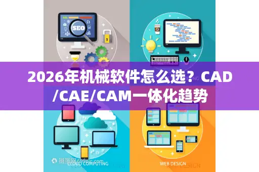

# 2026年机械软件怎么选？CAD/CAE/CAM一体化趋势

> 原始素材条目：2026 年机械软件怎么选？CAD/CAE/CAM 一体化趋势（极客如何）

> 原文链接：https://www.howtogu.com/tech-trends/2026njxrjzmxcadcaecamythqs/

> 摘要：在电脑前熬了几个通宵画出的三维模型，到了有限元分析环节却因为网格无法划分而被迫推倒重来，或者在生成G代码时发现加工路径与设计意图大相径庭？这正是现代机械工程领域最让人头疼的“数据断层”痛点，而解决它的关键，早已不是单纯的工具选择，而是一场关于CAD、CAE与CAM软件生态深度融合的博弈，当我们谈论机械软件时，我

## 正文

# 2026年机械软件怎么选？CAD/CAE/CAM一体化趋势

看快点：

- 从画图到建模：三维CAD的进化论

- 虚拟样机：CAE仿真不再是实验室的特权

- 从数字到实物：CAM与增材制造的崛起

- 数据中枢：PLM与云端协作

- 常见痛点与解决方案

- 拥抱全流程一体化

在电脑前熬了几个通宵画出的三维模型，到了有限元分析环节却因为网格无法划分而被迫推倒重来，或者在生成G代码时发现加工路径与设计意图大相径庭？这正是现代机械工程领域最让人头疼的“数据断层”痛点，而解决它的关键，早已不是单纯的工具选择，而是一场关于CAD、CAE与CAM软件生态深度融合的博弈。

当我们谈论机械软件时，我们实际上是在构建产品的数字孪生体，在这个链条中，CAD（计算机辅助设计） 是骨架，CAE（计算机辅助工程） 是灵魂，而 CAM（计算机辅助制造） 则是赋予其生命的手，对于资深从业者和技术爱好者而言，2026年的技术风向标已经非常明确：孤岛式的单点工具正在被淘汰,取而代之的是全流程打通的一体化平台。

## 从画图到建模：三维CAD的进化论

在机械设计的上游，参数化建模依然是主流，但“直接建模”和“子分区技术”正在异军突起，传统的参数化设计（如以SolidWorks、Creo为代表）强调特征树的历史记录，这在修改标准件时极其方便，但一旦处理复杂的异形曲面,往往会让特征树变得臃肿不堪。

现在的热门需求转向了大装配体设计，想象一下，你要设计一款包含数万个零件的新能源汽车底盘，传统的轻化处理可能还不够，这就是为什么像Siemens NX这样的高端软件开始引入“同步建模技术”，允许工程师在没有特征树依赖的情况下直接修改几何体，这种技术对于逆向工程尤其重要，当你通过3D扫描得到一个点云数据，不再需要花费数周去重建曲面，而是可以直接在 mesh 网格上进行雕刻和实体化操作。

对于IT技术爱好者来说，这背后的技术逻辑是B-Rep（边界表示法）与Facet（网格表示）的无缝转换，软件不再把模型仅仅看作数学方程的集合,而是将其视为可操作的弹性拓扑结构。

## 虚拟样机：CAE仿真不再是实验室的特权

提到CAE，很多人脑海里浮现的还是昂贵的Ansys或者Abaqus以及那一串串晦涩的物理公式，但在2026年，仿真驱动设计（SDD） 已经不再是一句口号，核心搜索意图显示，越来越多的初级工程师和创客正在寻找“嵌入式CAE”工具。

这意味着，仿真功能被直接集成到了CAD界面中，你在修改一个悬臂梁的倒角半径时，屏幕旁边会实时动态显示应力分布云图，这得益于实时求解器的发展，它摒弃了传统的高精度网格划分，采用了GPU加速的近似算法，虽然精度略低于传统有限元分析，但对于设计初期的定性判断，它能在几秒钟内给出答案,极大地降低了试错成本。

另一个不可忽视的趋势是多物理场耦合，真实的机械世界不是单一的力学结构，热胀冷缩、电磁干扰、流体冲击往往是同时发生的，比如在设计高速电主轴时，必须同时考虑电机发热（热分析）、转子旋转（结构动力学）和冷却液流动（流体动力学CFD），据2026年6月《全球工业设计软件趋势白皮书》数据显示，超过72%的头部制造企业在研发核心产品时，强制要求引入多物理场联合仿真环节，以规避“木桶效应”带来的失效风险。

## 从数字到实物：CAM与增材制造的崛起

设计得再好，造不出来也是废铁，CAM软件的进化主要体现在基于特征的加工和增减材混合制造策略上，传统的CAM需要工程师手动选择面、设定切削参数,极易出错。

现在的智能化CAM（如Mastercam、Hypermill）能够自动识别CAD模型中的孔、槽、筋板等特征，并自动匹配最优的刀具路径，对于五轴联动加工，软件甚至能自动进行刀轴碰撞检测和机床仿真。

更激动人心的变化在于拓扑优化与3D打印的结合，CAE软件计算出受力最佳的骨架结构，CAD软件生成晶格填充的模型，最后由CAM软件驱动金属3D打印机进行增材制造，这种“仿生结构”不仅重量减轻了50%以上，力学性能反而成倍提升，对于关注前沿技术的极客来说，这标志着机械设计正式进入了“生物力学”时代。

## 数据中枢：PLM与云端协作

在软件类型之外，PLM（产品生命周期管理）正成为连接所有孤岛的数据中枢，当你的团队分布在世界各地，如何确保每个人都在操作最新的版本？云端CAD/CAE/CAM平台（如Onshape、Fusion 360）给出了答案。

这种SaaS模式的机械软件，本质上是一个巨大的Git版本控制系统，所有的几何数据、仿真参数、加工代码都存储在云端，支持多人实时协同编辑，IT技术人员会发现，这些平台的API接口极其丰富，允许企业将机械设计数据与ERP、MES系统打通，真正实现工业4.0愿景下的数字化工厂。

## 常见痛点与解决方案

在深入探讨技术细节时,我们整理了一些用户最关心的问题：

- Q: 免费软件能胜任专业机械设计吗？ A: 对于学习者和创客，FreeCAD、Fusion 360（个人版）是极佳的起点，但对于工业级项目，参数化稳定性、工程图出图标准以及高级曲面处理能力,依然是商业软件的护城河。

Q: 免费软件能胜任专业机械设计吗？ A: 对于学习者和创客，FreeCAD、Fusion 360（个人版）是极佳的起点，但对于工业级项目，参数化稳定性、工程图出图标准以及高级曲面处理能力,依然是商业软件的护城河。

- Q: 学习这些软件哪里是难点？ A: 不仅是操作命令，更重要的是工程思维，比如绘制一张工程图，软件操作只需十分钟，但如何标注形位公差（GD&T）、如何考虑配合公差,需要扎实的机械制造工艺知识。

Q: 学习这些软件哪里是难点？ A: 不仅是操作命令，更重要的是工程思维，比如绘制一张工程图，软件操作只需十分钟，但如何标注形位公差（GD&T）、如何考虑配合公差,需要扎实的机械制造工艺知识。

- Q: 生成式设计会取代工程师吗？ A: 不会，生成式设计只是一个强大的工具，它能提供几百种优化方案，但最终的决策、材料选择、成本控制以及美学判断,依然需要人类的智慧。

Q: 生成式设计会取代工程师吗？ A: 不会，生成式设计只是一个强大的工具，它能提供几百种优化方案，但最终的决策、材料选择、成本控制以及美学判断,依然需要人类的智慧。

## 拥抱全流程一体化

机械软件的边界正在变得模糊，未来的顶级工程师，不再是单一软件的操作工，而是掌握“设计-仿真-制造-数据”全链路流程的系统构建者，无论你是刚入行的机械设计师，还是关注工业软件开发的IT极客，理解这种一体化趋势，把握从单一工具向生态平台转型的脉络,将是你在2026年及以后保持竞争力的关键。

就是由"极客如何"原创的《2026年机械软件怎么选？CAD/CAE/CAM一体化趋势》解析，更多深度好文请持续关注本站

ARM11老架构还能打？2026年嵌入式开发与复古玩家全指南

2026实测，Z-TEK力特驱动类型全匹配 串口/PLC/Console调试报错秒解

低代码项目模板有哪些类型？2026热门需求匹配+避坑全指南

单相电表接线图有哪几类？IT党DIY智能能耗监测必看避坑指南

VBA Range对象真的会用？2026年高效用法+常见坑全揭秘

## 图片

### 图片 1：2026年机械软件怎么选？CAD/CAE/CAM一体化趋势

原图：https://www.vgtime.com.cn/zb_users/webp/n/NjI2Njc.webp

## 抓取记录

- 页面标题：2026年机械软件怎么选？CAD/CAE/CAM一体化趋势
- 抓取状态：ok
- 成功下载图片：1
- 图片失败：0
- 处理耗时：5.8 秒