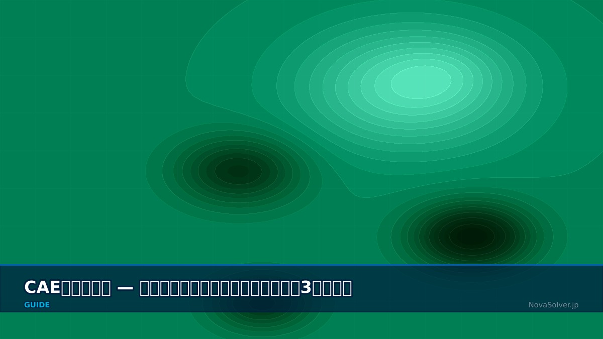

# CAE Analysis Workflow — Pre-processing, Solver, and Post-processing in 3 Steps

> 原始素材条目：CAE 工作流：前处理-求解-后处理（NovaSolver）

> 原文链接：https://novasolver.jp/en/guide/workflow.html

> 摘要：Overall Flow STEP 1: Pre-processing STEP 2: Solver STEP 3: Post-processing Iterative Design Improvement Cycle Workflow Overall Flow — CAE Analysis is Like

## 正文

# CAE Analysis Workflow — Pre-processing, Solver, and Post-processing in 3 Steps

- Overall Flow

- STEP 1: Pre-processing

- STEP 2: Solver

- STEP 3: Post-processing

- Iterative Design Improvement Cycle

Workflow

## Overall Flow — CAE Analysis is Like "Cooking"

Sensei, I opened the CAE software, but I have no idea where to start. There are too many buttons...

Don't worry. CAE work has only three steps. It's like cooking:

- Pre-processing = Preparation: Cut vegetables, measure seasonings. In CAE, cut mesh, set materials and boundary conditions

- Solver = Cooking: Put in pot and heat. In CAE, press "Run" button and let PC calculate

- Post-processing = Tasting: Taste the cooked dish and evaluate. In CAE, look at result contour plots and judge "is this okay?"

The key point: pre-processing (preparation) takes 60-70% of total time. If preparation is sloppy, no matter how powerful the solver is, the results will be garbage.

Wow, preparation takes more time than calculation?

Yes. Experienced CAE engineers spend the most time on pre-processing. Beginners rush to "let's just run it and see". That's where they fail.

## STEP 1: Pre-processing — The Most Critical Phase Determining Analysis Success

Please explain pre-processing specifically. What do we do?

There are four major tasks. Let's go through them one by one.

### 1-1. CAD Model Preparation and Simplification

3D CAD data is rarely used for analysis as-is. Remove small fillets, bolt holes, and chamfers unnecessary for analysis (defeaturing) to reduce computational cost.

Can't I just use the CAD data as-is?

If you do, the mesh becomes millions of elements and calculation never finishes. For example, an engine block CAD has 100 small bolt holes, but for overall deformation analysis you can remove more than half of them. The principle is "remove shapes that don't affect the phenomenon you want to study". But this judgment requires experience.

### 1-2. Mesh Generation

Divide the continuum into a finite number of elements (triangles, tetrahedra, hexahedra, etc.). Mesh quality directly impacts analysis accuracy.

| Element Type | Characteristics | Application |\n| --- | --- | --- |\n| Tetrahedron (Tet) | Easy automatic generation, handles complex geometry | General-purpose. Start here as a beginner |
| Hexahedron (Hex) | High accuracy, converges with fewer elements | Fluid boundary layer, structural thin plates |
| Prism/Wedge | Optimal for boundary layer mesh | CFD wall regions |

### 1-3. Material Properties Definition

Set material properties required for analysis: Young's modulus, Poisson's ratio, density, thermal conductivity, specific heat, etc. Unit system consistency is critical.

### 1-4. Boundary Conditions and Load Setting

Set constraints (fixed, symmetry, periodic boundary) and loads (force, pressure, temperature, velocity). Correctly modeling real physics is where an engineer's skill shines.

## STEP 2: Solver — Computer Solves the Equations

After pre-processing is done, I press the "Run" button. What does the solver do inside?

In simple terms, for each node of the mesh we set up earlier, we establish "force equilibrium" or "flow equations" and solve the resulting system of linear equations. For 100,000 nodes, that's a 300,000 × 300,000 matrix. Engineer intervention is minimal, but there are points to watch:

- Convergence criterion: Residual threshold (typically $10^{-4}$～$10^{-6}$)

- Time step: For unsteady analysis, watch Courant number (CFL condition)

- Parallel computing setup: For large models, optimize MPI partition count

I got an error "Did not converge" and calculation stopped. What's wrong?

Common beginner mistake. In experience, 90% of causes are pre-processing errors. Bad mesh shape, physically contradictory boundary conditions, wrong unit in material properties... usually one of these. Before blaming the solver, question your own setup. Details are in How to Prevent Common Errors.

## STEP 3: Post-processing — How to "Read" the Results

Calculation finished successfully! A pretty colored diagram appeared. Is that it?

Not yet. Beautiful contour plots can be deceiving. The real work is interpreting calculation results correctly from engineering perspective. That's post-processing.

Main visualization methods:

- Contour plot — Display stress, temperature, pressure distribution in color

- Vector plot — Show direction and magnitude of velocity field, magnetic flux

- Streamlines — Draw fluid trajectories

- Deformation plot — Display deformation enlarged (scale factor)

- Graph — Time history at specific points, distribution along a line

Looking at the contour plot, I understand "red area is dangerous", but how do I judge if the numbers are correct?

Good question. "Pretty output = correct" is wrong. Always check:

- Do reaction forces sum to match the applied load?

- Is the result reasonable compared to theoretical solution or experimental data?

- Does result change if mesh is refined? (mesh convergence)

- Is energy balance satisfied?

## Iterative Design Improvement Cycle

CAE analysis is not a one-time activity. Based on results, modify design and analyze again—a repetitive process.

Design → Pre-processing → Solver → Post-processing → Evaluate → Modify Design → ...

Running this cycle fast is CAE's true value. The goal is not one "correct answer" but "convergence to better design".

### Related Articles

- What is CAE? — Definition, Benefits, Use Cases

- Know Your Analysis Types — 5 Major Fields

- How to Prevent Common Beginner Errors

- Glossary: Preprocessor

#### Related Topics

## 图片

### 图片 1：CAE visualization for workflow - technical simulation diagram

原图：https://novasolver.jp/assets/images/guide/workflow-hero.jpg

## 抓取记录

- 页面标题：CAE Analysis Workflow — Pre-processing, Solver, and Post-processing in 3 Steps
- 抓取状态：ok
- 成功下载图片：1
- 图片失败：0
- 处理耗时：9.3 秒