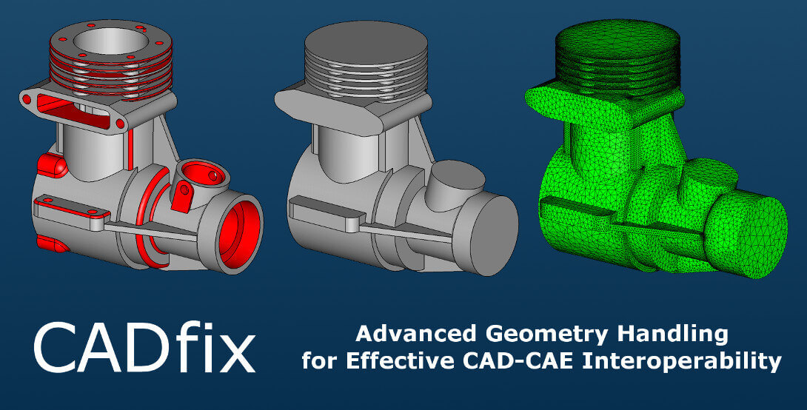

# CADfix CAE: prepare your CAD models for numerical simulation

> 原始素材条目：CADfix CAE: CAD Model Preparation for Simulation（CAD Interop）

> 原文链接：https://cadinterop.com/en/our-products/cadfix/cad-reuse-for-cae.html

> 摘要：software for CAE prepare supporting CATIA, NX, Pro Engineer, CADDS, Solidworks, Inventor, ACIS, Parasolid, IGES, STL, VDAFS, STEP and others

## 正文

# CADfix CAE: prepare your CAD models for numerical simulation

Mesh-oriented automatic defeaturing, complex-zone parameterization, Crossfield quadratic splitting and Hex-Skin partitioning: CADfix CAE turns design geometries into models ready for ANSYS, Abaqus, Nastran, LS-DYNA, with a success rate up to 95%.

CADfix CAE is the applicative variant of the CADfix DX engine developed by ITI, dedicated to preparing CAD models for numerical simulation. It targets simulation design offices, FEA/CFD teams and computing centers that must mesh complex multi-CAD geometries (CATIA V5, NX, Creo, SolidWorks) for industry-standard solvers. A single pipeline — diagnosis → repair → defeaturing → partitioning → meshing — exports directly to ABAQUS, ANSYS, Nastran and LS-DYNA, without native installation of the source systems.

#### On this page

- CAD → CAE challenges

- Simulation features

- Supported CAD formats and solvers

- Industrial use cases

- Customer feedback

- Needs covered

- Other solutions in the range

- Frequently asked questions

## CAD-to-simulation preparation challenges

A geometry coming from CATIA V5, NX, Creo or SolidWorks is designed for manufacturing, not for simulation. It contains fillets, drill holes, engravings, internal housings and assembly clearances that cause meshing to fail or distort FEA and CFD results. Without rigorous preparation, simulation engineers spend up to 80% of their time handling geometry before even launching a computation (Dr Tim McDonald, EMA).

CADfix CAE — the applicative variant of the CADfix DX engine dedicated to simulation workflows — automates this preparation: geometric diagnosis, mesh-oriented defeaturing, zone parameterization, quadratic splitting and generation of hybrid TE10/TR6 meshes directly usable by structural, thermal, electromagnetic, CFD and casting solvers.

## Simulation preparation features

CADfix CAE is built on four capabilities specifically geared to simulation, all available in automated Wizard, interactive or scriptable batch mode for overnight FEA/CFD campaigns.

### Simulation-oriented automatic defeaturing

Automatic removal of holes, fillets, chamfers, ribs and internal housings that are not relevant to the mesh. Criteria tunable by dimensional threshold, with selective preservation of functional areas of interest (contacts, stress zones).

### Complex-zone parameterization

Defines geometric tolerance zones where the mesh crosses faces without being constrained to individual edges. Solves cases where edges fail to meet or surfaces overlap — frequent defects in multi-source IGES models.

### Crossfield quadratic splitting

Generates high-quality quadrilateral meshes on complex geometries (wings, propellers, double-curvature surfaces). Crossfield-based algorithm: avoids singularities and distortions of traditional structured meshing, improving solver convergence.

### Hex-Skin partitioning and hybrid meshing

Hexahedral skin layer, tetrahedral core: geometric singularities are absorbed within the boundary layer instead of propagating into the volume. Direct TE10 / TR6 export to ABAQUS, ANSYS, Nastran and LS-DYNA (Meshing license required).

## CAD formats and solvers supported by CADfix CAE

CADfix CAE inherits the full input matrix of CADfix DX (over 30 formats) and adds direct export to the major CAE solvers on the output side. For the full cross-matrix (5 categories), refer to the CADfix hub.

### Native CAD formats 7 formats

| Format | Read | Write | Versions |\n| --- | --- | --- | --- |\n| CATIA V5 |  |  | V5-6 R2025 |
| CATIA V4 |  |  | archives |
| NX (Unigraphics) |  |  | export via Parasolid |
| Creo / Pro-E |  |  | Granite |
| SolidWorks |  |  | export via Parasolid |
| Solid Edge |  |  | export via Parasolid |
| Inventor |  |  | export via ACIS |

### Neutral formats & ISO standards 5 formats

| Format | Read | Write | Versions |\n| --- | --- | --- | --- |\n| STEP |  |  | AP203 / AP214 / AP242 |
| IGES |  |  | 5.3 multi-source |
| JT |  |  | B-Rep + facet |
| Parasolid |  |  | XT / XB 37.0 |
| ACIS |  |  | SAT / SAB 2025 |

### Simulation & meshing solvers 4 solvers

| Solver | Export | Elements | Versions |\n| --- | --- | --- | --- |\n| ABAQUS |  | TE10, TR6 | .inp — Meshing license |
| ANSYS |  | TE10, TR6 | .ans — Meshing license |
| Nastran |  | TE10, TR6 | .nas / .bdf MSC / NX |
| LS-DYNA |  | TE10, TR6 | .k |

Official CADfix 13 SP2 DX / CAE matrix — Windows. Source: ITI — CADfix Interfaces 13 SP2. Please consult ITI support for the Linux matrix.

## Industrial simulation use cases

CADfix CAE supports the full range of industrial CAD → CAE workflows, from preparing composite structures for aerospace certification to meshing molds for casting simulation. Three sectors concentrate the documented deployments.

### Aerospace and defense — FEA, CFD and electromagnetics

Preparation of composite structures for ABAQUS, Nastran and MSC Sabre-EHL solvers, hybrid meshes for lightning, RCS and electromagnetic-compatibility analyses. CADfix CAE sits at the heart of the GEMS solver (Ericsson Saab Avionics) and of the high-fidelity CFD pipelines GHandI and BLOODHOUND SSC.

- Aerospace repair success rate up to 95% vs 20-25% without CADfix

- Up to 70% reduction in certification preparation time

- Hybrid meshes combining finite differences, surface triangles and solid tetrahedra

### Automotive and transport — CFD, crash and EMC

CFD aerodynamic preparation (full body), LS-DYNA structural crash simulation, engine and turbocharger flow analysis. Deployed at Holset (Cummins), Glacier Vandervell, Federal-Mogul, Lotus, MIRA and Millbrook to secure multi-OEM CAD → FEA/CFD workflows.

- Data rework cut from one day to one hour (Holset, −85%)

- Up to 90% reduction in model rework (Glacier Vandervell)

- Zoom sub-models built in minutes instead of days (Lotus)

### Casting, processes and food industry

Dedicated mesh generation for Magmasoft, Moldflow and EMA3D for casting, plastic injection, space plasma and coupled thermal simulation. Deployed at Petroni (aluminum/magnesium molds), DuPont (engineering polymers) and ProEng (microwaveable packaging).

- IGES engine-block repair (85 MB): 3 days → under 2 hours (Petroni)

- Clean solid generated quickly in 95% of cases (DuPont)

- CADfix macros generating oven + product geometric variations (ProEng)

## CADfix CAE in video

Official ITI demonstration of the simulation-oriented CAD defeaturing pipeline in CADfix DX 13 (engine shared with CADfix CAE): geometric diagnosis, automatic removal of drill holes, fillets and internal details, partitioning and mesh preparation ready for ANSYS, Abaqus, Nastran and LS-DYNA. Videos are in French with CAD Interop voice-over.

CADfix DX 13: CAD Model Defeaturing for CAE — ITI, International TechneGroup (a Wipro Company) — duration 20 min 53 s.

## Customer feedback on numerical simulation

Over 15 documented CADfix CAE deployments cover aerospace, defense, automotive, casting, food processing and research. All share the same promise: turning CAD → CAE preparation from a bottleneck into a controlled, quantified and reproducible workflow.

### Holset Engineering (Cummins) — diesel turbocharger FEA/CFD

A Cummins Engines subsidiary based in Huddersfield (United Kingdom), Holset produces 750,000 turbochargers per year for $200M revenue, with intensive FEA/CFD workflows on Pro/ENGINEER and ANSYS. Mesh preparation could take a full day per model before analysis. CADfix CAE is now central to CFD airways — shapes narrowing to zero, traditionally hard to mesh — and directly contributes to the development of VGT (variable geometry turbocharger) technology.

"We needed a hybrid mesh combining finite differences, surface triangular and solid tetrahedral elements — a capability unavailable elsewhere. CADfix is at the core of the GEMS solver development, applied to lightning analysis on the SAAB 95 and to the JAS 39 Gripen radar."

"Evaluating microwaveable packaging combining consumer appeal and efficient reheat: CADfix macros generate the oven + product geometric variations, and coupled EM + thermal meshes are produced automatically. CADfix is rated essential to our simulation capability."

"Mesh preparation on IGES models ahead of EHL analysis was very time-consuming. We save 4 man-days per project, cut rework by up to 90%, and CAE model setup time by up to 50%. Up to 80% of an engineering project used to be wasted on rework — no longer."

### Other documented deployments

#### Petroni S.p.A. — aluminum foundry

Bologna, Italy. 85 MB IGES engine-block repair: 3 days → under 2 h. Interactive defeaturing in 30 min, accelerated Magmasoft workflow.

#### BLOODHOUND SSC — supersonic vehicle

1,000 mph project (Swansea / Noble). FLITE CFD via CADfix API. Preparation 1 week → a few hours per iteration, 20-30 suspension simulations delivered on time.

#### GHandI project — UK aerospace CFD

3-year R&D, ATI-funded. Partners: Airbus, BAE Systems, Rolls-Royce, MBDA, Altran, ARA. Medial Object technology and high-quality hybrid CFD meshing.

#### Imperial College London — high-order CFD

Racecar Elemental RP1 (500 bhp/ton). NekMesh via CADfix API: 2,500 → 1,500 surfaces (−40%), cleanup from several days to a few hours.

#### Dana Corporation — commercial vehicles

Defeaturing ahead of engine-component FEA meshing. Geometries that used to take weeks to mesh are now completed in days. CADfix rated "indispensable".

#### DuPont Engineering Polymers — ANSYS / Moldflow

IGES healing ahead of Tier 1/2 polymer FEA. About 95% of cases produce clean solids quickly. Complete elimination of internal solid remodeling.

Further documented deployments: Boeing (AGPS), EMA Denver (FAA lightning/HIRF certification), MIRA (automotive EMC), Millbrook Group (multi-OEM JT), Lotus Engineering (CAD → CAE hub), Federal-Mogul Powertrain (ProE / ABAQUS pistons), GKN Aerospace (Simufact Additive, CAD morphing). All our references

## Needs covered by CADfix CAE

CADfix CAE addresses four strategic simulation-oriented CAD interoperability needs. Each need has a dedicated page detailing business challenges, typical workflows and complementary solutions.

### CAD to CAE

Automated CAD → CAE preparation: defeaturing, partitioning, solver-ready hybrid meshing.

### CAD Validation

Automatic geometric diagnosis catching up to 98% of potential issues upstream of simulation.

### CAD Repair

Multi-source STEP / IGES healing: gap closure, face reconstruction, watertight solids ready for meshing.

### Analyze CAD models

Topological inspection, feature detection, geometric audit ahead of simulation preparation.

## Other solutions in the CADfix range

CADfix CAE shares the CADfix DX engine. Depending on your upstream workflows (multi-CAD conversion) or parallel workflows (heavy-assembly simplification), two complementary modules in the range extend its capabilities.

### CADfix DX

Conversion-repair foundation: 40+ formats, automatic diagnosis and healing. Runs upstream of the CAE workflow when source geometry comes from heterogeneous multi-CAD chains.

### CADfix PPS

Automated simplification of large assemblies: up to 98% size reduction while preserving functional characteristics. Ideal upstream of global CFD and plant-process simulations.

## Frequently asked questions about CADfix CAE

##### Why prepare a CAD model before CAE simulation?

##### Does CADfix CAE support hybrid Hex-Skin meshing?

##### How does CADfix CAE optimize models for CFD?

##### Does CADfix CAE export to ANSYS, Abaqus, Nastran and LS-DYNA?

##### What is the typical time saving with CADfix CAE in simulation preparation?

## They use CADfix CAE

CADfix CAE users span aerospace (Boeing, BAE Systems, GKN, Ericsson Saab), automotive and transport (Lotus, Holset, MIRA, Millbrook, Dana, Federal-Mogul, Glacier Vandervell), casting and plastics (Petroni, DuPont) and research (Imperial College London, EMA).

See all our customer references

### Kick off your CADfix CAE project

Whether you mesh for ANSYS, Abaqus, Nastran, LS-DYNA, Magmasoft or EMA3D, CADfix CAE turns design geometries into clean simulation models — success rate up to 95% and preparation cut by up to 70%. Let's discuss your CAD → CAE workflow.

## 图片

### 图片 1：Advanced geometry preparation for efficient CAD-to-CAE interoperability

原图：https://cadinterop.com/images/CADInterop/Products/CADfix/cadfix11SP1-for-CAD-CAE-interoperability.jpg

## 抓取记录

- 页面标题：CADfix CAE: prepare your CAD models for numerical simulation
- 抓取状态：ok
- 成功下载图片：1
- 图片失败：0
- 处理耗时：7.7 秒