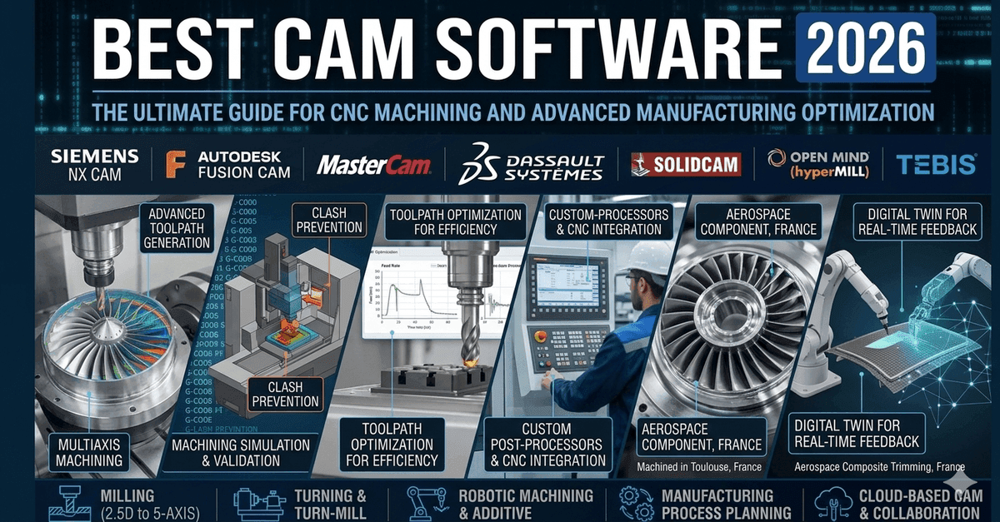
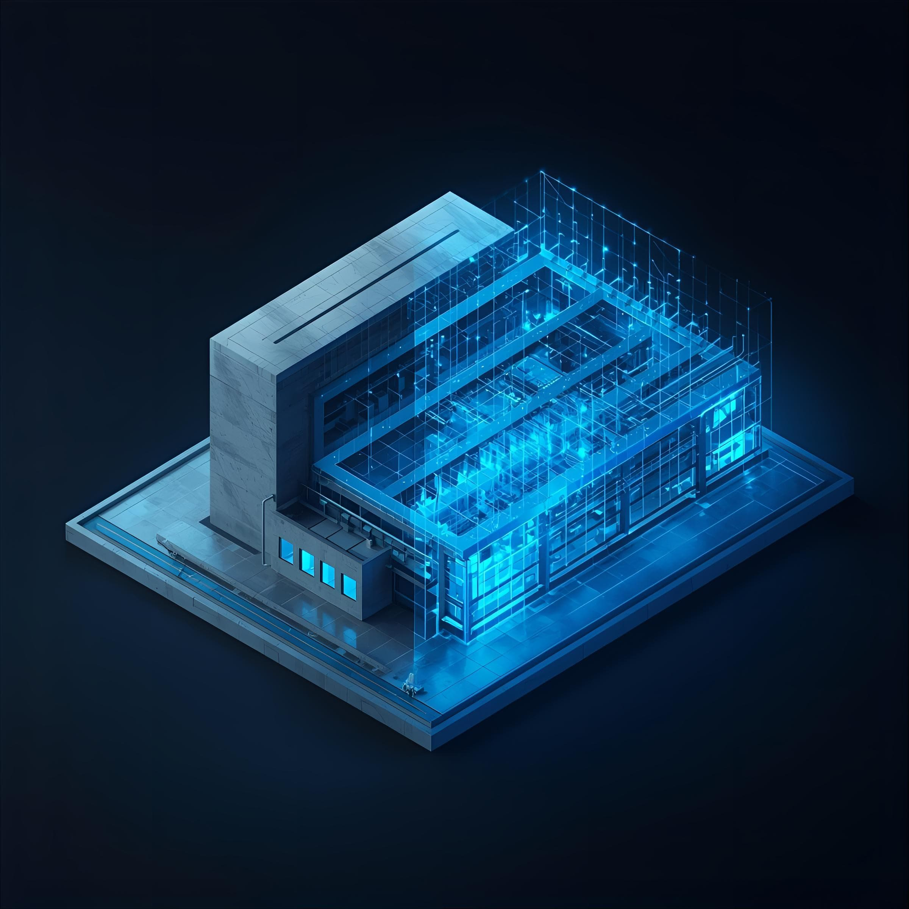
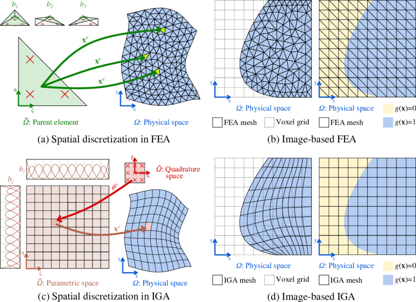

# CAD vs CAM: Decoding Design and Manufacturing

> 原始素材条目：CAD vs CAM: What's the Difference and Why You Need Both（DemystifyingPLM）

> 原文链接：https://www.demystifyingplm.com/cad-vs-cam

> 摘要：CAD designs parts in the digital realm. CAM converts those designs into CNC machine code. Learn how they work together in modern manufacturing and why the boundary between them matters.

## 正文

## KEY TAKEAWAYS

- CAD (Computer-Aided Design) is the upstream digital-design tool where geometry gets created, validated, and refined. It outputs models.

- CAM (Computer-Aided Manufacturing) is the downstream production-code tool that translates geometry into toolpaths and G-code for CNC machines. It outputs instructions.

- CAD and CAM are not the same tool performing one job — they are different tools performing sequential jobs. CAD doesn't know how to machine; CAM doesn't care about the artistic design.

- The handoff between CAD and CAM is where manufacturability meets ambition. A beautiful design that can't be manufactured with available tooling is just expensive artwork.

- Most enterprises integrate CAD and CAM at the data level (both reading the same CAD file) but keep them operationally separate — different teams, different software, different workflows.

SHORT ANSWER

CAD (Computer-Aided Design) is software for creating and refining 2D and 3D designs of physical products before manufacturing. CAM (Computer-Aided Manufacturing) is software that takes those finished designs and generates the toolpaths and machine code that tells CNC machines how to cut and shape material into the finished part. CAD is upstream (design), CAM is downstream (production). Both are essential to precision manufacturing; confusing the two is how you end up with unmachinable designs or parts that don't match the intent.

- CAD outputs geometry; CAM outputs instructions (G-code, toolpaths).

- CAD happens before manufacturing decisions; CAM happens after design is locked.

- A design is not manufacturableuntil CAM has proven it can be machined within tolerance and budget.

- The integration between CAD and CAM is where the product lifecycle actually gets governed.

Why it matters: In manufacturing, the boundary between design ambition and manufacturing reality is the CAD-to-CAM handoff. A beautiful design that can't be machined with available tools, within tolerance, or within budget is not a solution — it is a problem. Knowing where that boundary is, and respecting it during design, is the difference between products that ship and products that get stuck in indefinite rework cycles. Most manufacturing failures trace back to either: (1) CAD designers who don't understand CAM constraints, or (2) CAM engineers who don't understand the design intent. The tools are separate, but the accountability has to be joint.

## The One-Sentence Answer

CAD creates designs; CAM turns those designs into machine code. Both are essential, and the boundary between them is where manufacturing meets reality.

## What CAD Is

Computer-Aided Design is upstream software for creating and refining the geometry of a part or assembly. It's where engineers spend their time sketching, modeling, analyzing structural properties, and iterating on the design until it meets functional requirements. CAD outputs a 3D model, 2D drawings, and specifications. It does not output instructions for machines.

A CAD system gives you:

- Digital geometry — precise 2D sketches and 3D models that can be viewed from any angle

- Parametric control — change one dimension and dependent geometry updates automatically

- Analysis hooks — integrate with CAE tools to simulate structural, thermal, and fluid behavior before committing to manufacturing

- Drawing generation — derive manufacturing drawings, BOMs, and assembly instructions from the 3D model automatically

- Design intent capture — annotations, tolerances, material callouts, and manufacturing notes that downstream teams need

CAD is not concerned with how you'll machine it. A CAD designer can (and often does) create a geometrically perfect design that's impossible to manufacture with the tools you actually have. That's where the handoff to CAM matters.

## What CAM Is

Computer-Aided Manufacturing is downstream software that takes a finished CAD design and generates the toolpaths and machine code (G-code) that tell a CNC machine how to cut, shape, and finish material into the desired part. It's where engineers spend their time worrying about tool availability, spindle speed, feed rates, coolant strategy, and the cost per part. CAM outputs G-code, which is machine-executable.

A CAM system gives you:

- Toolpath generation — converts CAD geometry into linear (G01) and circular (G02/G03) moves that the machine can execute

- Tool management — knows which tools you have available, their cutting speeds and feed rates, and when to change them

- Simulation — visualizes the toolpath and catches collisions between the tool, spindle, and workpiece before you run the program

- Post-processing — translates the generic toolpath into the specific G-code dialect that your machine understands

- Cost modeling — estimates cycle time, tool usage, and the cost per part based on the proposed machining strategy

CAM is not concerned with how pretty the design is or whether it matches the original vision. A CAM engineer's job is to find the fastest, cheapest way to machine a design within the required tolerance.

## How They Connect in the Product Lifecycle

The workflow is linear: design first (CAD), then manufacture (CAM).

In CAD, you create geometry that meets functional requirements: strength, fit, finish, and aesthetics. You may run simulations (CAE) to validate that the geometry can withstand the intended loads and environment. You capture the design intent in the model and in the drawing annotations.

At the handoff, the CAD design goes to CAM. This is where manufacturability gets tested. A CAM engineer asks: "Can I machine this with available tools? Can I hold the required tolerance? What's the cost per part? Are there risk points where the tool might break or the part might chatter?"

If the answer is no, the design gets kicked back to CAD. The cycle repeats: CAD revises the geometry (fillet that sharp corner, add clearance for the tool, reduce the tolerance where it doesn't matter), and CAM re-evaluates.

In CAM, once the design is approved for manufacturing, you generate the toolpaths. The CAM software reads the CAD model, applies rules about available tools and spindle capabilities, and outputs G-code. The G-code is then loaded into the CNC machine, the machine operator loads the material and tools, and the part gets cut.

In production, every time the G-code runs, the same toolpath executes the same way (assuming the machine is properly maintained and the operator sets up correctly). The part should come out identical, within the tolerance specified by CAD.

## Why the Boundary Matters

Most organizations keep CAD and CAM operationally separate — different teams, different software vendors, different workflows. This separation exists for a reason: the skill sets and the problems are different.

A CAD designer thinks about: stress concentration, fatigue, thermal expansion, assembly, serviceability, cost of materials, aesthetic appeal.

A CAM engineer thinks about: tool engagement, spindle speed, feed rate, tool life, surface finish, scrap rate, cycle time, cost per part.

These are different optimization problems. Forcing one person to do both well is usually a failure. But forcing them to collaborate is essential.

The most common cause of manufacturing failure is a CAD designer who doesn't understand CAM constraints, or a CAM engineer who doesn't understand the design intent. The result is either an unmachinable design or a machined part that doesn't meet the functional requirements.

## Why You Need Both

You need CAD because designing by hand (drawing on paper, building physical prototypes) is slow, inflexible, and makes it hard to validate that a design will work.

You need CAM because turning a digital design into a physical part requires automation. Manual G-code programming is slow, error-prone, and expensive.

You need both together because neither one is sufficient alone. CAD without CAM is a beautiful design that you can't manufacture cheaply or at scale. CAM without CAD is expensive, manual labor without any assurance the part will work.

In 2026, no serious manufacturing operation runs without both. The only variance is in integration: some teams run CAD and CAM from the same vendor (Siemens NX, PTC Creo) for tighter integration; others use separate tools (AutoCAD + Fusion 360 CAM) and manage the handoff manually. The tools vary, but the workflow is always the same: design, validate, optimize for manufacturing, then machine.

The takeaway: CAD and CAM are not the same tool doing one job. They are different tools, owned by different expertise, solving different problems in sequence. Understanding that difference — and respecting it during design and manufacturing — is the foundation of precision manufacturing.

Want to listen instead of read? 56 DemystifyingPLM articles are available as audio.

Looking up PLM terminology? Browse the canonical reference.

CITE THIS ARTICLE

Finocchiaro, Michael. “CAD vs CAM: Decoding Design and Manufacturing.” DemystifyingPLM, September 5, 2023, https://www.demystifyingplm.com/cad-vs-cam

Michael Finocchiaro

PLM industry analyst · 35+ years at IBM, HP, PTC, Dassault Systèmes

Firsthand knowledge of the evolution from early 3D modeling kernels to today's cloud-native platforms and agentic AI — the history, strategy, and future of PLM.

### RELATED ARTICLES

#### Best CAM Software 2026: The Machinist's Independent Guide

May 30, 2026 · 22 min read

#### The 80/20 Rule for AI in Manufacturing: Which Tasks AI Owns and Which Humans Keep

May 23, 2026 · 8 min read

#### CAM vs CAE: When You Validate Before Manufacturing

Oct 2, 2023 · 7 min read

## 图片

### 图片 1：Best CAM Software 2026: The Machinist's Independent Guide

原图：https://www.demystifyingplm.com/_next/image?url=%2Fimages%2Fbuyer-guides%2Fbest-cam-software-2026.png&w=3840&q=75&dpl=dpl_4mMHR2pr9ZBaxVaMjywtbFMH4eZS

### 图片 2：The 80/20 Rule for AI in Manufacturing: Which Tasks AI Owns and Which Humans Keep

原图：https://www.demystifyingplm.com/_next/image?url=%2Fimages%2F2026%2F05%2Fposts%2Fpodcast-companion-ai-manufacturing-8020.jpg&w=3840&q=75&dpl=dpl_4mMHR2pr9ZBaxVaMjywtbFMH4eZS

### 图片 3：CAM vs CAE: When You Validate Before Manufacturing

原图：https://www.demystifyingplm.com/_next/image?url=%2Fimages%2F2026%2F05%2Fposts%2Ffinite-element-analysis-fea.png&w=3840&q=75&dpl=dpl_4mMHR2pr9ZBaxVaMjywtbFMH4eZS

## 抓取记录

- 页面标题：CAD vs CAM: Decoding Design and Manufacturing
- 抓取状态：ok
- 成功下载图片：3
- 图片失败：0
- 处理耗时：4.4 秒