# 建筑信息模型（BIM）三维建模软件的应用比较

> 原始素材条目：建筑信息模型（BIM）三维建模软件的应用比较（期刊论文）

> 原文链接：http://tmjzgcxxjs.manuscripts.cn/cn/article/id/e2ba281a-f1f9-44cd-ad2f-79472e49a193

## 正文

- 登录 Login

- 注册 Register

- English

- 退出 Sign out

- English

- ISSN: 1674-7461

- CN: 11-5823/TU

- 主管：中国科学技术协会

- 主办：中国图学学会

- 承办：中国建筑科学研究院有限公司

### 大型工业园区BIM技术应用研究（P130）

#### Research on the Application of BIM Technology in Large-scale Industrial Parks

Research on the Application of BIM Technology in Large-scale Industrial Parks

### 基于BIM技术的绿色建筑设计研究与应用 ——重庆市广阳岛项目(P76)

#### Application of BIM Technology Based on the Whole Life Cycle of Green Building Research

Application of BIM Technology Based on the Whole Life Cycle of Green Building Research

### 大型海水化淡工程全过程BIM正向设计的探索与应用（P64）

#### Exploration and Application of BIM Forward Design in the Whole Process of Large-scale Seawater Desalination Project

### 智能建造技术在装配式项目建造中的应用实践（P48）

#### Application and Practice of Intelligent Construction Technology in Prefabricated Project Construction

### BIM集成技术在2022年杭州亚运会曲棍球场馆数字化建造中的应用（P91）

#### Digital Construction of Table Tennis Arena, 2022 Hangzhou Asian Games Based on BIM Integration Technology

### 建筑专业正向设计的综合应用与研究——以横琴科学城创新中心为例（P62）

#### Comprehensive Application and Research of Forward Design in Architecture Specialty——Take Hengqin Science City Innovation Center as An Example

- 首页

- 期刊简介

- 关于本刊 点击查看关于本刊

- 编辑委员会 点击查看编辑委员会

- 期刊理事会单位

- 在线期刊

- 当期目录 点击查看当期目录

- 过刊浏览 点击查看过刊浏览

- 文章检索 点击查看文章检索

- 下载排行 点击查看下载排行

- 阅读排行 点击查看阅读排行

- 排版格式

- 期刊征订

- 会议系统

- 学会在线

- 新闻中心

- 联系方式

- 首页

- 期刊简介 关于本刊 编辑委员会 期刊理事会单位

- 关于本刊

- 编辑委员会

- 期刊理事会单位

- 在线期刊 当期目录 过刊浏览 文章检索 下载排行 阅读排行

- 当期目录

- 过刊浏览

- 文章检索

- 下载排行

- 阅读排行

- 排版格式

- 期刊征订

- 会议系统

- 学会在线

- 新闻中心

- 联系方式

- English

建筑信息模型（BIM）三维建模软件的应用比较

尚春静, 张智成, 张立杰, 陈佳, 郭思瑶, 秦培成

| 引用本文: | 尚春静, 张智成, 张立杰, 陈佳, 郭思瑶, 秦培成. 建筑信息模型（BIM）三维建模软件的应用比较[J]. 土木建筑工程信息技术, 2025, 17(5): 54-61. DOI: 10.16670/j.cnki.cn11-5823/tu.2025.05.10 |\n| --- | --- |\n

| Citation: | Shang Chunjing, Zhang Zhicheng, Zhang Lijie, Chen Jia, Guo Siyao, Qin Peicheng. Comparison of Applications of Building Information Modelling (BIM) 3D Modeling Software[J]. Journal of Information Technologyin Civil Engineering and Architecture, 2025, 17(5): 54-61. DOI: 10.16670/j.cnki.cn11-5823/tu.2025.05.10 |\n| --- | --- |\n

## 建筑信息模型（BIM）三维建模软件的应用比较

- 尚春静1, 2,

- 张智成1, 3,

- 张立杰3, ,

- 陈佳1,

- 郭思瑶2,

- 秦培成4

- 1. 防灾科技学院，廊坊 065201

防灾科技学院，廊坊 065201

- 2. 海南大学信息与通信工程学院，海口 570228

海南大学信息与通信工程学院，海口 570228

- 3. 深圳市斯维尔科技股份有限公司，深圳 518057

深圳市斯维尔科技股份有限公司，深圳 518057

- 4. 海南大学土木与建筑工程学院，海口 570228

海南大学土木与建筑工程学院，海口 570228

深圳市科技计划项目（技术攻关重点项目） JSGG20220831104401002

###### 作者简介: 尚春静（1971-），女，教授，硕士生导师，主要研究方向：智能建造

尚春静（1971-），女，教授，硕士生导师，主要研究方向：智能建造

###### 通讯作者: 张立杰（1974-），男，高级工程师，主要研究方向：软件工程

张立杰（1974-），男，高级工程师，主要研究方向：软件工程

- 中图分类号: TU17

中图分类号: TU17

- 计量 文章访问数: 0 HTML全文浏览量: 0 PDF下载量: 0 出版历程 网络出版日期: 2025-11-24 刊出日期: 2025-10-20

##### 计量

- 文章访问数: 0

- HTML全文浏览量: 0

- PDF下载量: 0

##### 出版历程

- 网络出版日期: 2025-11-24

- 刊出日期: 2025-10-20

## Comparison of Applications of Building Information Modelling (BIM) 3D Modeling Software

- Shang Chunjing1, 2,

- Zhang Zhicheng1, 3,

- Zhang Lijie3, ,

- Chen Jia1,

- Guo Siyao2,

- Qin Peicheng4

- 1. Institute of Disaster Prevention, Langfang 065201, China

Institute of Disaster Prevention, Langfang 065201, China

- 2. School of Information and Communication, Hainan University, Haikou 570228, China

School of Information and Communication, Hainan University, Haikou 570228, China

- 3. Shenzhen Thsware Hi-Tech Co., Ltd., Shenzhen 518057, China

Shenzhen Thsware Hi-Tech Co., Ltd., Shenzhen 518057, China

- 4. School of Civil and Architectural Engineering, Hainan University, Haikou 570228, China

School of Civil and Architectural Engineering, Hainan University, Haikou 570228, China

- 摘要

- HTML全文

- 图(13) 表(4)

- 参考文献(15)

- 相关文章

- 施引文献

- 资源附件(0)

- 摘要: BIM技术是建设行业实现数字化、智能建造的重要工具之一，“族”是BIM模型创建的基础。为探寻我国近几年发布的国产BIM软件参数化设计功能与当前国际相关主流软件间的差异，选取了Revit、MicroStation CONNECT Edition(MSCE)，与广联达数维构件设计(Paramodel)、斯维尔ueBIM进行比较，分析了各软件在“族”的造型设计、约束条件、参数设置等功能的覆盖情况以及各软件所支持使用的运算符、函数、条件语句和相关规则。结果表明：MSCE擅长于基础设施领域模型设计，在非线性如曲面的“族”参数设计功能突出; 更多地用于房建工程领域的ueBIM和Paramodel，在族参数化上除了覆盖Revit功能之外已有的优化和创新，如Paramodel支持“快速形状”的布置，还增添了“相切”“智能尺寸”等约束; ueBIM除了优化族文件的管理，还增加了“求和”“求均”等函数。 关键词: BIM 技术 / 参数化 / 三维设计 / 软件 / 族 Abstract: BIM technology is one of the important tools for the construction industry to realize digitalization and intelligent construction. "Family" is the basis for the creation of BIM models. In order to explore the differences between the parametric design functions of domestic BIM software released in my country in recent years and the current international mainstream software, Revit, MicroStation CONNECT Edition (MSCE), Glodon Digital Component Design (Paramodel), and Thsware ueBIM were selected Comparison was made, and the coverage of each software in the "family" of modeling design, constraints, parameter settings and other functions was analyzed, as well as the operators, functions, conditional statements and related rules supported by each software. The results show that MSCE is good at model design in the field of infrastructure, and has outstanding functions in nonlinear parametric design such as curved surfaces; ueBIM and Paramodel, which are more used in the field of housing construction engineering, have been optimized and innovated in parametric design in addition to covering Revit functions, such as Paramodel supports the layout of "quick shapes" and adds constraints such as "tangent" and "intelligent size"; ueBIM optimizes the management of family files and adds functions such as "sum" and "average". Keywords: BIM Technology / Parameterization / 3D Design / Software / Family

BIM技术是建设行业实现数字化、智能建造的重要工具之一，“族”是BIM模型创建的基础。为探寻我国近几年发布的国产BIM软件参数化设计功能与当前国际相关主流软件间的差异，选取了Revit、MicroStation CONNECT Edition(MSCE)，与广联达数维构件设计(Paramodel)、斯维尔ueBIM进行比较，分析了各软件在“族”的造型设计、约束条件、参数设置等功能的覆盖情况以及各软件所支持使用的运算符、函数、条件语句和相关规则。结果表明：MSCE擅长于基础设施领域模型设计，在非线性如曲面的“族”参数设计功能突出; 更多地用于房建工程领域的ueBIM和Paramodel，在族参数化上除了覆盖Revit功能之外已有的优化和创新，如Paramodel支持“快速形状”的布置，还增添了“相切”“智能尺寸”等约束; ueBIM除了优化族文件的管理，还增加了“求和”“求均”等函数。

- BIM 技术 /

- 参数化 /

- 三维设计 /

- 软件 /

- 族

BIM technology is one of the important tools for the construction industry to realize digitalization and intelligent construction. "Family" is the basis for the creation of BIM models. In order to explore the differences between the parametric design functions of domestic BIM software released in my country in recent years and the current international mainstream software, Revit, MicroStation CONNECT Edition (MSCE), Glodon Digital Component Design (Paramodel), and Thsware ueBIM were selected Comparison was made, and the coverage of each software in the "family" of modeling design, constraints, parameter settings and other functions was analyzed, as well as the operators, functions, conditional statements and related rules supported by each software. The results show that MSCE is good at model design in the field of infrastructure, and has outstanding functions in nonlinear parametric design such as curved surfaces; ueBIM and Paramodel, which are more used in the field of housing construction engineering, have been optimized and innovated in parametric design in addition to covering Revit functions, such as Paramodel supports the layout of "quick shapes" and adds constraints such as "tangent" and "intelligent size"; ueBIM optimizes the management of family files and adds functions such as "sum" and "average".

- BIM Technology /

- Parameterization /

- 3D Design /

- Software /

- Family

- 图 1 安全阀 下载: 全尺寸图片 幻灯片 图 2 Paramodel与Revit“族”文件管理界面 下载: 全尺寸图片 幻灯片 图 3 ueBIM“族”文件管理界面 下载: 全尺寸图片 幻灯片 图 4 四款建模软件创建实体的比较 下载: 全尺寸图片 幻灯片 图 5 Revit圆角 下载: 全尺寸图片 幻灯片 图 6 MSCE曲面增厚 下载: 全尺寸图片 幻灯片 图 7 Paramodel按键表盘 下载: 全尺寸图片 幻灯片 图 8 ueBIM脱壳 下载: 全尺寸图片 幻灯片 图 9 四款软件各自具备的约束条件 下载: 全尺寸图片 幻灯片 图 10 Revit相切约束 下载: 全尺寸图片 幻灯片 图 11 MSCE三维垂直约束 下载: 全尺寸图片 幻灯片 图 12 Paramodel智能尺寸约束 下载: 全尺寸图片 幻灯片 图 13 Revit对齐与ueBIM对象点 下载: 全尺寸图片 幻灯片 表 1 四款软件的比较 对比项 Revit MSCE Paramodel ueBIM 发布日 2002 2015 2022 2022 国别 美国 美国 中国 中国 公司 Autodesk Bentley 广联达 斯维尔 使用版本 Revit 2023 MSCE 2021 Paramodel 2024 ueBIM 2024 安装包大小 8.28GB 5.45GB 0.69GB 291.2MB 软件特色 内置丰富的族模板 二三维设计集成 软件使用接近Revit 支持导入Revit族 软件适用范围 房建(设计)、族(设计) 基建（设计） 族(设计) 房建(设计)、族(设计) 下载: 导出CSV 表 2 四款软件各自支持的函数 函数 Revit MSCE Paramodel ueBIM 正弦 √ √ √ √ 余弦 √ √ √ √ 正切 √ √ √ √ 反正弦 √ √ √ √ 反余弦 √ √ √ √ 反正切 √ √ √ √ 双曲正弦 × × × √ 双曲余弦 × × × √ 双曲正切 × × × √ 绝对值 √ √ × √ 开平方 √ √ √ √ 指数 √ √ × √ 幂 √ √ √ √ 对数 √ √ × √ 求和 × × × √ 求平均 × × × √ 取最大 × √ × √ 取最小 × √ × √ 四舍五入取整 √ √ √Round() √round() 向上取整 √roundup() √ √ √ceil() 向下取整 √ √ √ √ if √ √ √ √ odd × √ × × limit × √ × × sign × √ × × trunc × √ × × 注：表中“√”表示软件已支持，“×”表示软件暂未支持，并通过举例说明不同软件间函数表达式的使用规则具有差异。 下载: 导出CSV 表 3 四款软件各自支持的运算符 运算符 Revit MSCE Paramodel ueBIM 算术运算符 +（加） √ √ √ √ -（减） √ √ √ √ *（乘） √ √ √ √ /（除） √ √ √ √ %（取余） × √ √ √ 关系运算符 > （大于） √ √ √ √ < （小于） √ √ √ √ > =（大于等于） × √ √ √ < =（小于等于） × √ √ √ ==（等于） √ √ √ √ !=（不等于） × √ × √ 逻辑运算符 and（与） √ √ √ ○ or（或） √ √ √ ○ not（非） √ √ √ ○ 注：表中“√”表示软件直接支持，“×”表示软件未支持，“○”表示其他方式支持。 下载: 导出CSV 表 4 四款软件条件语句各自的使用规则与书写格式 条件语句 举例说明 Revit MSCE Paramodel ueBIM 简单的if语句 新建参数当Length < 3000时, 结果为200, 否则为300。 =if (Length < 3000, 200, 300) =Length < 3000?200:300 =if (Length < 3000, 200, 300) =Length < 3000?200:300 带有文字的if语句 新建参数当Length > 35时, 结果为String1, 否则为String2。 =if (Length > 35, "String1", "String2") =Length > 35?String1:String2 =if (Length > 35, String1, String2) =Length > 35? < < String1 > > : < < String2 > > 带有and的if语句 新建参数当x=1且y=2时, 结果为8, 否则为3。 =if (and (x = 1, y = 2), 8, 3) =x==1 & & y==2?8:3 =if(and (x = 1, y = 2), 8, 3) =(x==1?1:0)+(y==2?1:0)==2?8:3 带有or的if语句 新建参数当A=1或B=3时, 结果为8, 否则为3。 =if (or (A = 1, B = 3), 8, 3) =A==1||B==3?8:3 =if (or (A = 1, B = 3), 8, 3) =(A==1?1:0)+(B==3?1:0) > =1?8:3 带有not的if语句 新建参数当a≠66时, 结果为77, 否则为88。 =if(not(a = 66), 77, 88) =a!= 66? 77 : 88 =if(not(a = 66), 77, 88) =a!= 66? 77 : 88 嵌套的if语句 新建参数当Length < 35时, 结果为26, 当35≤Length＜45时, 结果为30, 当45≤Length＜55, 结果为35, 否则结果为38。 =if(Length < 35, 26, if (Length < 45, 30, if (Length < 55, 35, 38))) =Length < 35?26:(Length < 45?30:(Length < 55?35:38)) =if(Length < 35, 26, if(Length < 45, 30, if (Length < 55, 35, 38))) =Length < 35?26:(Length < 45?30:(Length < 55?35:38)) 注：表中通过举例说明不同软件间条件语句的使用规则与书写格式存在的差异。 下载: 导出CSV

图 1 安全阀

图 2 Paramodel与Revit“族”文件管理界面

图 3 ueBIM“族”文件管理界面

图 4 四款建模软件创建实体的比较

图 5 Revit圆角

图 6 MSCE曲面增厚

图 7 Paramodel按键表盘

图 8 ueBIM脱壳

图 9 四款软件各自具备的约束条件

图 10 Revit相切约束

图 11 MSCE三维垂直约束

图 12 Paramodel智能尺寸约束

图 13 Revit对齐与ueBIM对象点

表 1 四款软件的比较

| 对比项 | Revit | MSCE | Paramodel | ueBIM |\n| --- | --- | --- | --- | --- |\n| 发布日 | 2002 | 2015 | 2022 | 2022 |
| 国别 | 美国 | 美国 | 中国 | 中国 |
| 公司 | Autodesk | Bentley | 广联达 | 斯维尔 |
| 使用版本 | Revit 2023 | MSCE 2021 | Paramodel 2024 | ueBIM 2024 |
| 安装包大小 | 8.28GB | 5.45GB | 0.69GB | 291.2MB |
| 软件特色 | 内置丰富的族模板 | 二三维设计集成 | 软件使用接近Revit | 支持导入Revit族 |
| 软件适用范围 | 房建(设计)、族(设计) | 基建（设计） | 族(设计) | 房建(设计)、族(设计) |

表 2 四款软件各自支持的函数

| 函数 | Revit | MSCE | Paramodel | ueBIM |\n| --- | --- | --- | --- | --- |\n| 正弦 | √ | √ | √ | √ |
| 余弦 | √ | √ | √ | √ |
| 正切 | √ | √ | √ | √ |
| 反正弦 | √ | √ | √ | √ |
| 反余弦 | √ | √ | √ | √ |
| 反正切 | √ | √ | √ | √ |
| 双曲正弦 | × | × | × | √ |
| 双曲余弦 | × | × | × | √ |
| 双曲正切 | × | × | × | √ |
| 绝对值 | √ | √ | × | √ |
| 开平方 | √ | √ | √ | √ |
| 指数 | √ | √ | × | √ |
| 幂 | √ | √ | √ | √ |
| 对数 | √ | √ | × | √ |
| 求和 | × | × | × | √ |
| 求平均 | × | × | × | √ |
| 取最大 | × | √ | × | √ |
| 取最小 | × | √ | × | √ |
| 四舍五入取整 | √ | √ | √Round() | √round() |
| 向上取整 | √roundup() | √ | √ | √ceil() |
| 向下取整 | √ | √ | √ | √ |
| if | √ | √ | √ | √ |
| odd | × | √ | × | × |
| limit | × | √ | × | × |
| sign | × | √ | × | × |
| trunc | × | √ | × | × |
| 注：表中“√”表示软件已支持，“×”表示软件暂未支持，并通过举例说明不同软件间函数表达式的使用规则具有差异。 |

表 3 四款软件各自支持的运算符

| 运算符 | Revit | MSCE | Paramodel | ueBIM |\n| --- | --- | --- | --- | --- |\n| 算术运算符 | +（加） | √ | √ | √ | √ |
| -（减） | √ | √ | √ | √ |
| *（乘） | √ | √ | √ | √ |
| /（除） | √ | √ | √ | √ |
| %（取余） | × | √ | √ | √ |
| 关系运算符 | > （大于） | √ | √ | √ | √ |
| < （小于） | √ | √ | √ | √ |
| > =（大于等于） | × | √ | √ | √ |
| < =（小于等于） | × | √ | √ | √ |
| ==（等于） | √ | √ | √ | √ |
| !=（不等于） | × | √ | × | √ |
| 逻辑运算符 | and（与） | √ | √ | √ | ○ |
| or（或） | √ | √ | √ | ○ |
| not（非） | √ | √ | √ | ○ |
| 注：表中“√”表示软件直接支持，“×”表示软件未支持，“○”表示其他方式支持。 |

表 4 四款软件条件语句各自的使用规则与书写格式

| 条件语句 | 举例说明 | Revit | MSCE | Paramodel | ueBIM |\n| --- | --- | --- | --- | --- | --- |\n| 简单的if语句 | 新建参数当Length < 3000时, 结果为200, 否则为300。 | =if (Length < 3000, 200, 300) | =Length < 3000?200:300 | =if (Length < 3000, 200, 300) | =Length < 3000?200:300 |
| 带有文字的if语句 | 新建参数当Length > 35时, 结果为String1, 否则为String2。 | =if (Length > 35, "String1", "String2") | =Length > 35?String1:String2 | =if (Length > 35, String1, String2) | =Length > 35? < < String1 > > : < < String2 > > |
| 带有and的if语句 | 新建参数当x=1且y=2时, 结果为8, 否则为3。 | =if (and (x = 1, y = 2), 8, 3) | =x==1 & & y==2?8:3 | =if(and (x = 1, y = 2), 8, 3) | =(x==1?1:0)+(y==2?1:0)==2?8:3 |
| 带有or的if语句 | 新建参数当A=1或B=3时, 结果为8, 否则为3。 | =if (or (A = 1, B = 3), 8, 3) | =A==1\|\|B==3?8:3 | =if (or (A = 1, B = 3), 8, 3) | =(A==1?1:0)+(B==3?1:0) > =1?8:3 |
| 带有not的if语句 | 新建参数当a≠66时, 结果为77, 否则为88。 | =if(not(a = 66), 77, 88) | =a!= 66? 77 : 88 | =if(not(a = 66), 77, 88) | =a!= 66? 77 : 88 |
| 嵌套的if语句 | 新建参数当Length < 35时, 结果为26, 当35≤Length＜45时, 结果为30, 当45≤Length＜55, 结果为35, 否则结果为38。 | =if(Length < 35, 26, if (Length < 45, 30, if (Length < 55, 35, 38))) | =Length < 35?26:(Length < 45?30:(Length < 55?35:38)) | =if(Length < 35, 26, if(Length < 45, 30, if (Length < 55, 35, 38))) | =Length < 35?26:(Length < 45?30:(Length < 55?35:38)) |
| 注：表中通过举例说明不同软件间条件语句的使用规则与书写格式存在的差异。 |

- [1] Wang Y, Zhao B, Nie Y, et al. Challenge for Chinese BIM software extension comparison with international BIM development[J]. Buildings, 2024, 14(7): 2239. DOI: 10.3390/buildings14072239 [2] Wang Y, Zhu J, Wei B. Domestic and international mainstream BIM software application and comparison study[C]//Journal of Physics: Conference Series. IOP Publishing, 2022, 2185(1): 012088. [3] Patel T, Bapat H, Patel D, et al. Identification of critical success factors (CSFs) of BIM software selection: A combined approach of FCM and Fuzzy DEMATEL[J]. Buildings, 2021, 11(7): 311. DOI: 10.3390/buildings11070311 [4] Waas L, Enjellina. Review of BIM-Based software in architectural design: Graphisoft Archicad VS Autodesk Revit[J]. Journal of Artificial Intelligence in Architecture, 2022, 1(2): 14-22. DOI: 10.24002/jarina.v1i2.6016 [5] 李云贵, 何关培, 邱奎宁建筑工程施工BIM应用指南建筑工程施BIM应用指南(第2版) [M]. 北京: 中国建筑工业出版社, 2017. [6] SHAH J, MÄNTYLÄ M. Parametric and feature-based CAD/CAM: concepts, techniques, and applications[EB/OL]. (1995-10-01)[2025-01-16]. https://www.researchgate.net/publication/44371716_Parametric_and_feature_based_CADCAM_concepts_techniques_and_applications_Jami_J_shah_Martti_Mantyla. [7] 李红豫, 李恒, 吴悦, 等. 基于BIM的东洲湘江大桥参数化设计应用研究[J]. 公路, 2020, 65(11): 173-178. [8] 闫泽文, 王子庠, 闫伟文, 等. 基于BIM技术的古建筑典型构件参数化建模方法研究[J]. 武汉大学学报(工学版), 2020, 53(S1): 323-329. [9] 张海佳, 廖德华, 王丽丽. 基于Revit的地铁出入口爬升段参数化设计[J]. 现代隧道技术, 2021, 58(S2): 38-46. [10] 赵歧林, 王章琼, 徐晓雅, 等. 基于BIMBase的人行拱桥参数化建模研究[J]. 土木建筑工程信息技术, 2023, 15(3): 33-38. DOI: 10.16670/j.cnki.cn11-5823/tu.2023.03.06 [11] 陈致淳. 基于国产图形平台的桥梁参数化建模研究[J]. 铁道技术标准(中英文), 2024, 6(03): 21-26+46. [12] BIMBOX中国BIM发展报告2024[EB/OL]. (2024-01-10)[2024-11-10]. https://bimbox.top/12485.html. [13] 何关培. BIM和BIM相关软件[J]. 土木建筑工程信息技术, 2010, 2(4): 110-117. [14] 广联达数维构件设计[EB/OL]. (2024-03-28)[2024-11-10]. https://design.glodon.com/#/productDetails/paramodel. [15] 邹强. 浅谈实体建模: 历史、现状与未来[J]. 图学学报, 2022, 43(06): 987-1001.

| [1] | Wang Y, Zhao B, Nie Y, et al. Challenge for Chinese BIM software extension comparison with international BIM development[J]. Buildings, 2024, 14(7): 2239. DOI: 10.3390/buildings14072239 |\n| --- | --- |\n| [2] | Wang Y, Zhu J, Wei B. Domestic and international mainstream BIM software application and comparison study[C]//Journal of Physics: Conference Series. IOP Publishing, 2022, 2185(1): 012088. |
| [3] | Patel T, Bapat H, Patel D, et al. Identification of critical success factors (CSFs) of BIM software selection: A combined approach of FCM and Fuzzy DEMATEL[J]. Buildings, 2021, 11(7): 311. DOI: 10.3390/buildings11070311 |
| [4] | Waas L, Enjellina. Review of BIM-Based software in architectural design: Graphisoft Archicad VS Autodesk Revit[J]. Journal of Artificial Intelligence in Architecture, 2022, 1(2): 14-22. DOI: 10.24002/jarina.v1i2.6016 |
| [5] | 李云贵, 何关培, 邱奎宁建筑工程施工BIM应用指南建筑工程施BIM应用指南(第2版) [M]. 北京: 中国建筑工业出版社, 2017. |
| [6] | SHAH J, MÄNTYLÄ M. Parametric and feature-based CAD/CAM: concepts, techniques, and applications[EB/OL]. (1995-10-01)[2025-01-16]. https://www.researchgate.net/publication/44371716_Parametric_and_feature_based_CADCAM_concepts_techniques_and_applications_Jami_J_shah_Martti_Mantyla. |
| [7] | 李红豫, 李恒, 吴悦, 等. 基于BIM的东洲湘江大桥参数化设计应用研究[J]. 公路, 2020, 65(11): 173-178. |
| [8] | 闫泽文, 王子庠, 闫伟文, 等. 基于BIM技术的古建筑典型构件参数化建模方法研究[J]. 武汉大学学报(工学版), 2020, 53(S1): 323-329. |
| [9] | 张海佳, 廖德华, 王丽丽. 基于Revit的地铁出入口爬升段参数化设计[J]. 现代隧道技术, 2021, 58(S2): 38-46. |
| [10] | 赵歧林, 王章琼, 徐晓雅, 等. 基于BIMBase的人行拱桥参数化建模研究[J]. 土木建筑工程信息技术, 2023, 15(3): 33-38. DOI: 10.16670/j.cnki.cn11-5823/tu.2023.03.06 |
| [11] | 陈致淳. 基于国产图形平台的桥梁参数化建模研究[J]. 铁道技术标准(中英文), 2024, 6(03): 21-26+46. |
| [12] | BIMBOX中国BIM发展报告2024[EB/OL]. (2024-01-10)[2024-11-10]. https://bimbox.top/12485.html. |
| [13] | 何关培. BIM和BIM相关软件[J]. 土木建筑工程信息技术, 2010, 2(4): 110-117. |
| [14] | 广联达数维构件设计[EB/OL]. (2024-03-28)[2024-11-10]. https://design.glodon.com/#/productDetails/paramodel. |
| [15] | 邹强. 浅谈实体建模: 历史、现状与未来[J]. 图学学报, 2022, 43(06): 987-1001. |

Wang Y, Zhao B, Nie Y, et al. Challenge for Chinese BIM software extension comparison with international BIM development[J]. Buildings, 2024, 14(7): 2239. DOI: 10.3390/buildings14072239

Wang Y, Zhu J, Wei B. Domestic and international mainstream BIM software application and comparison study[C]//Journal of Physics: Conference Series. IOP Publishing, 2022, 2185(1): 012088.

Patel T, Bapat H, Patel D, et al. Identification of critical success factors (CSFs) of BIM software selection: A combined approach of FCM and Fuzzy DEMATEL[J]. Buildings, 2021, 11(7): 311. DOI: 10.3390/buildings11070311

Waas L, Enjellina. Review of BIM-Based software in architectural design: Graphisoft Archicad VS Autodesk Revit[J]. Journal of Artificial Intelligence in Architecture, 2022, 1(2): 14-22. DOI: 10.24002/jarina.v1i2.6016

SHAH J, MÄNTYLÄ M. Parametric and feature-based CAD/CAM: concepts, techniques, and applications[EB/OL]. (1995-10-01)[2025-01-16]. https://www.researchgate.net/publication/44371716_Parametric_and_feature_based_CADCAM_concepts_techniques_and_applications_Jami_J_shah_Martti_Mantyla.

##### 计量

- 文章访问数: 0

- HTML全文浏览量: 0

- PDF下载量: 0

- 被引次数: 0

##### 出版历程

- 网络出版日期: 2025-11-24

- 刊出日期: 2025-10-20

### 目录

/

- 分享

用微信扫码二维码

分享至好友和朋友圈

- 版权所有© 《土木建筑工程信息技术》编辑部

- 京ICP备17057008号

- 地址北京市朝阳区兴化路2号院1号楼

- 电话：010-64517910 邮编：100013

- 微信号：tmjzgcxxjs QQ：3676678954 E-mail：tmqk@cgn.net.cn

## 导出文件

#### 文件类别

#### 引用内容

## 引用参考文献格式

## 图片

### 图片 1

原图：http://tmjzgcxxjs.manuscripts.cn/fileTMJZGCXXJS/news/tmjzgcxxjs/db0a6ace-f3bf-4098-9984-e4c569aa0794.jpg

### 图片 2

原图：http://tmjzgcxxjs.manuscripts.cn/fileTMJZGCXXJS/cms/news/info/b6cb04ae-8b39-44a7-9410-8d861edbdd91.jpg

### 图片 3

原图：http://tmjzgcxxjs.manuscripts.cn/fileTMJZGCXXJS/cms/news/info/6a3f6f78-0c97-4d5d-9959-71b9b54adb68.jpg

### 图片 4

原图：http://tmjzgcxxjs.manuscripts.cn/fileTMJZGCXXJS/cms/news/info/175c70d1-f85a-44c5-89ec-8d4a70e40768.jpg

### 图片 5

原图：http://tmjzgcxxjs.manuscripts.cn/fileTMJZGCXXJS/cms/news/info/71293bb4-7980-4dfa-97f6-735b98941108.jpg

### 图片 6

原图：http://tmjzgcxxjs.manuscripts.cn/fileTMJZGCXXJS/cms/news/info/e746a160-a70b-4416-9a2c-377abb6fba9f.jpg

### 图片 7

原图：http://tmjzgcxxjs.manuscripts.cn/style/images/public/selet-arrow_app.png

### 图片 8

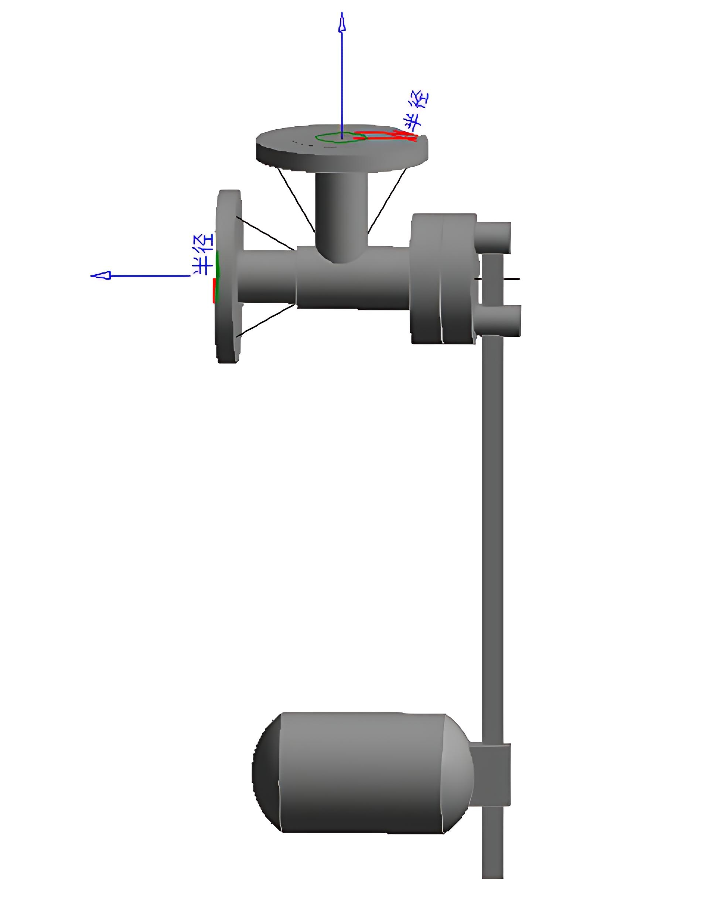

原图：http://tmjzgcxxjs.manuscripts.cn/fileTMJZGCXXJS/journal/article/tmjzgcxxjs/2025/5/tmjzgcxxjs-17-5-54-1.jpg

### 图片 9

原图：http://tmjzgcxxjs.manuscripts.cn/style/images/public/download.png

### 图片 10

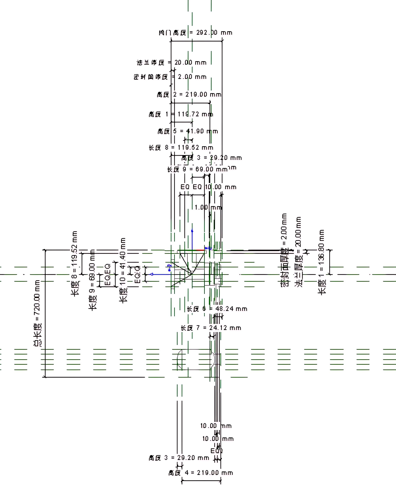

原图：http://tmjzgcxxjs.manuscripts.cn/fileTMJZGCXXJS/journal/article/tmjzgcxxjs/2025/5/tmjzgcxxjs-17-5-54-2.jpg

### 图片 11

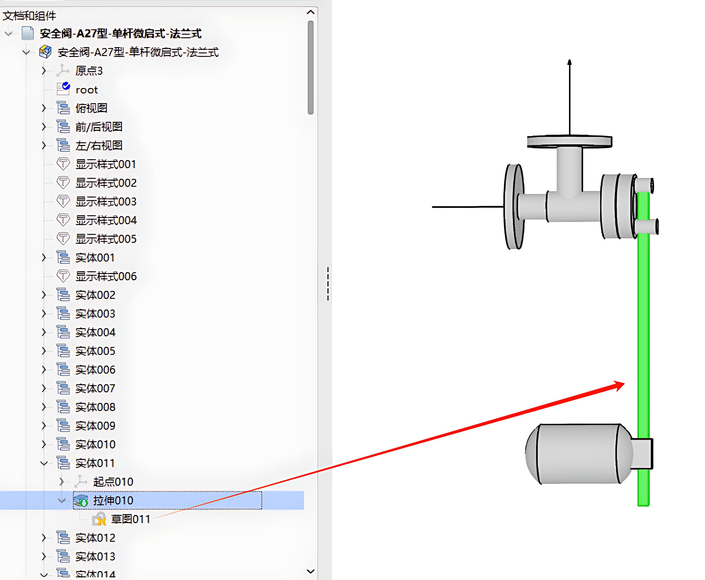

原图：http://tmjzgcxxjs.manuscripts.cn/fileTMJZGCXXJS/journal/article/tmjzgcxxjs/2025/5/tmjzgcxxjs-17-5-54-3.jpg

### 图片 12

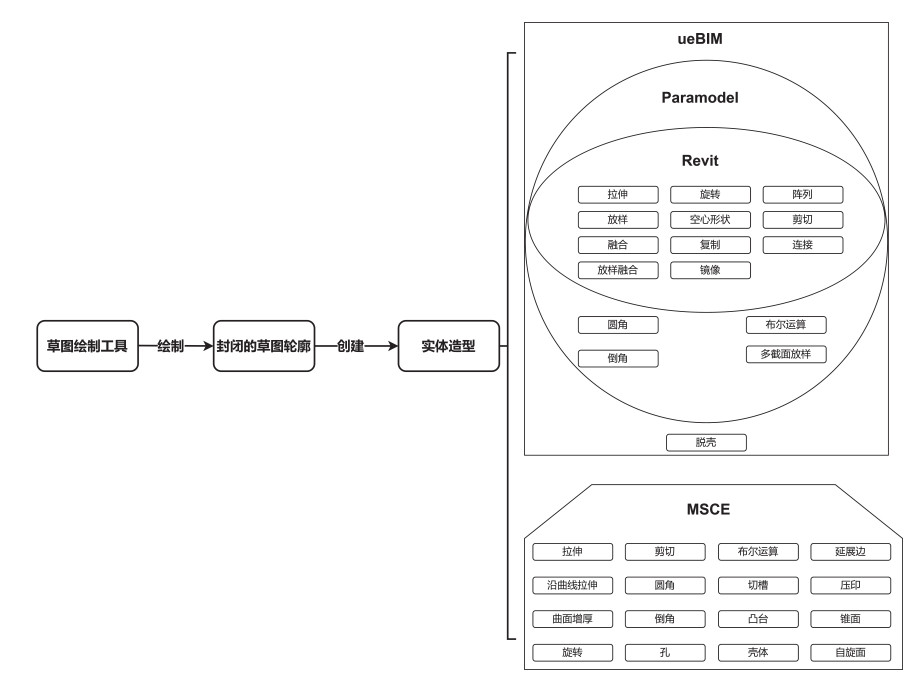

原图：http://tmjzgcxxjs.manuscripts.cn/fileTMJZGCXXJS/journal/article/tmjzgcxxjs/2025/5/tmjzgcxxjs-17-5-54-4.jpg

### 图片 13

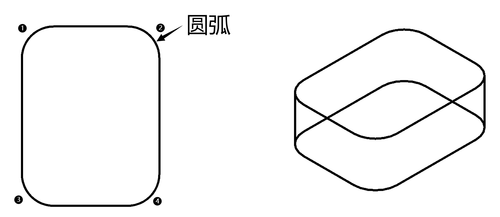

原图：http://tmjzgcxxjs.manuscripts.cn/fileTMJZGCXXJS/journal/article/tmjzgcxxjs/2025/5/tmjzgcxxjs-17-5-54-5.jpg

### 图片 14

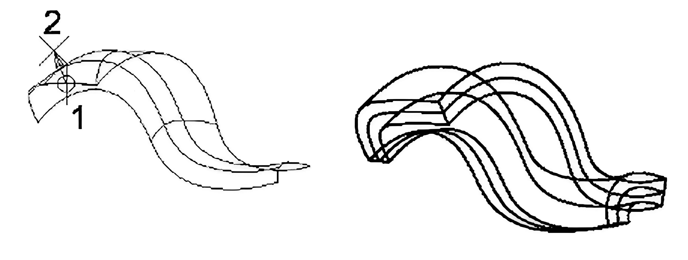

原图：http://tmjzgcxxjs.manuscripts.cn/fileTMJZGCXXJS/journal/article/tmjzgcxxjs/2025/5/tmjzgcxxjs-17-5-54-6.jpg

### 图片 15

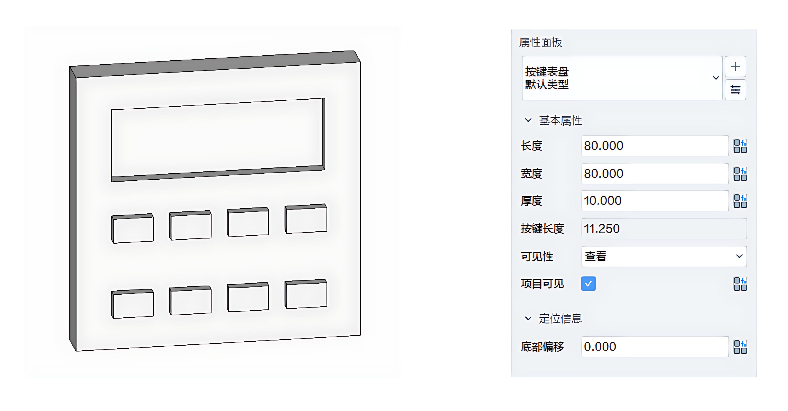

原图：http://tmjzgcxxjs.manuscripts.cn/fileTMJZGCXXJS/journal/article/tmjzgcxxjs/2025/5/tmjzgcxxjs-17-5-54-7.jpg

### 图片 16

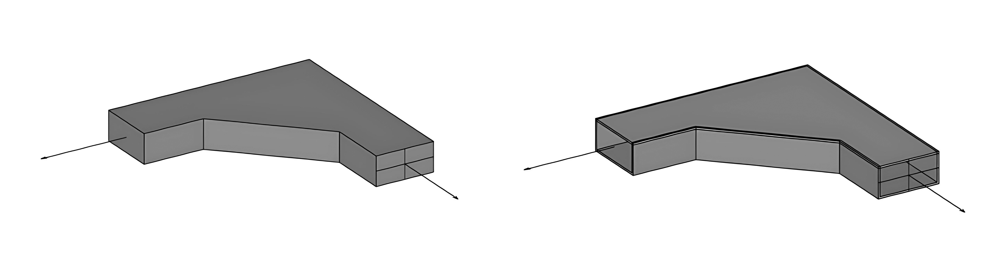

原图：http://tmjzgcxxjs.manuscripts.cn/fileTMJZGCXXJS/journal/article/tmjzgcxxjs/2025/5/tmjzgcxxjs-17-5-54-8.jpg

### 图片 17

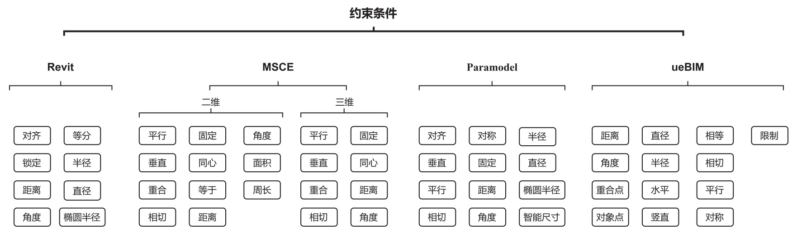

原图：http://tmjzgcxxjs.manuscripts.cn/fileTMJZGCXXJS/journal/article/tmjzgcxxjs/2025/5/tmjzgcxxjs-17-5-54-9.jpg

### 图片 18

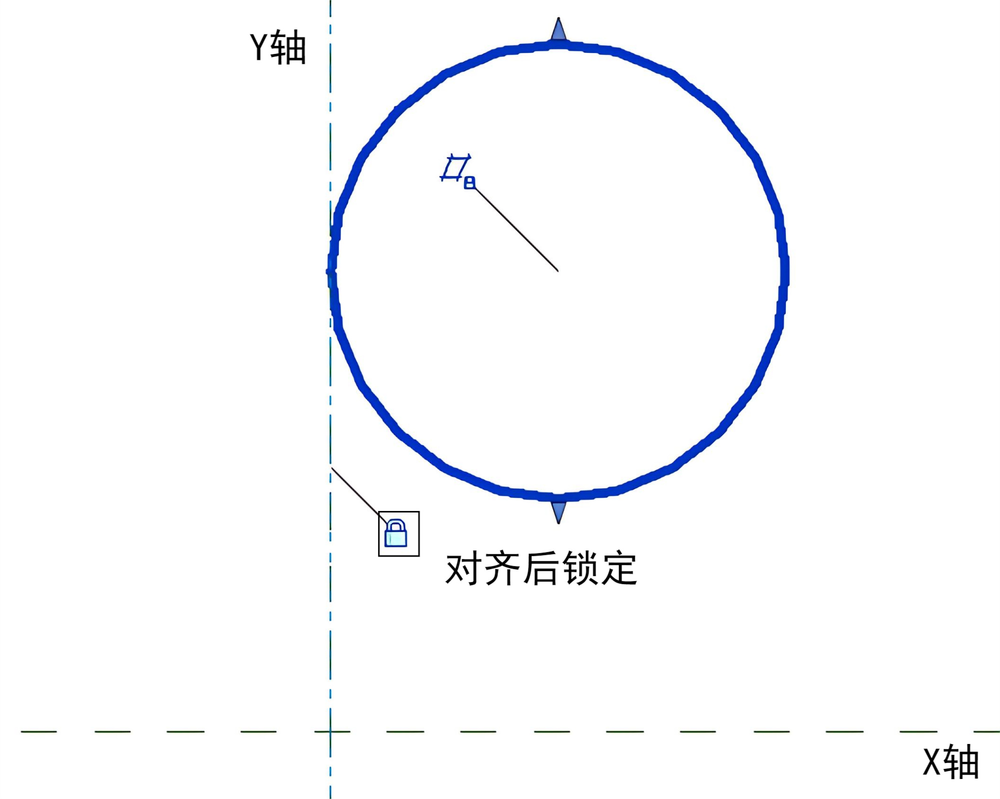

原图：http://tmjzgcxxjs.manuscripts.cn/fileTMJZGCXXJS/journal/article/tmjzgcxxjs/2025/5/tmjzgcxxjs-17-5-54-10.jpg

### 图片 19

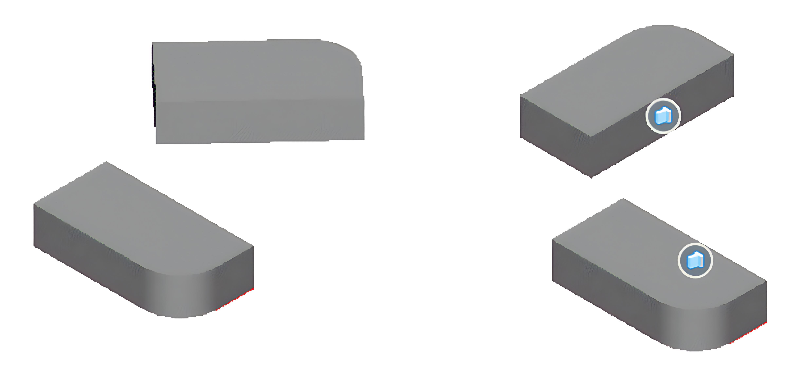

原图：http://tmjzgcxxjs.manuscripts.cn/fileTMJZGCXXJS/journal/article/tmjzgcxxjs/2025/5/tmjzgcxxjs-17-5-54-11.jpg

### 图片 20

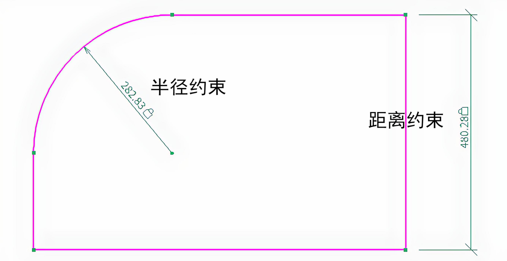

原图：http://tmjzgcxxjs.manuscripts.cn/fileTMJZGCXXJS/journal/article/tmjzgcxxjs/2025/5/tmjzgcxxjs-17-5-54-12.jpg

### 图片 21

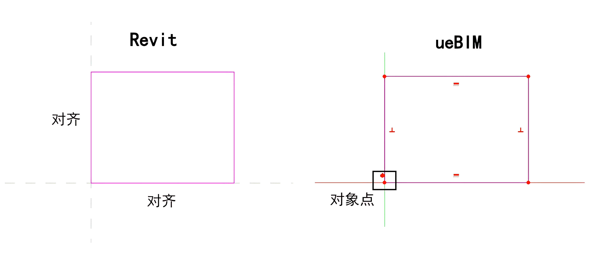

原图：http://tmjzgcxxjs.manuscripts.cn/fileTMJZGCXXJS/journal/article/tmjzgcxxjs/2025/5/tmjzgcxxjs-17-5-54-13.jpg

### 图片 22：WeChat

原图：http://tmjzgcxxjs.manuscripts.cn/cn/article/qrcode/10.16670/j.cnki.cn11-5823/tu.2025.05.10.jpg

### 图片 23

原图：http://tmjzgcxxjs.manuscripts.cn/style/images/custom/code2.png

## 抓取记录

- 页面标题：建筑信息模型（BIM）三维建模软件的应用比较
- 抓取状态：ok
- 成功下载图片：23
- 图片失败：0
- 处理耗时：41.7 秒