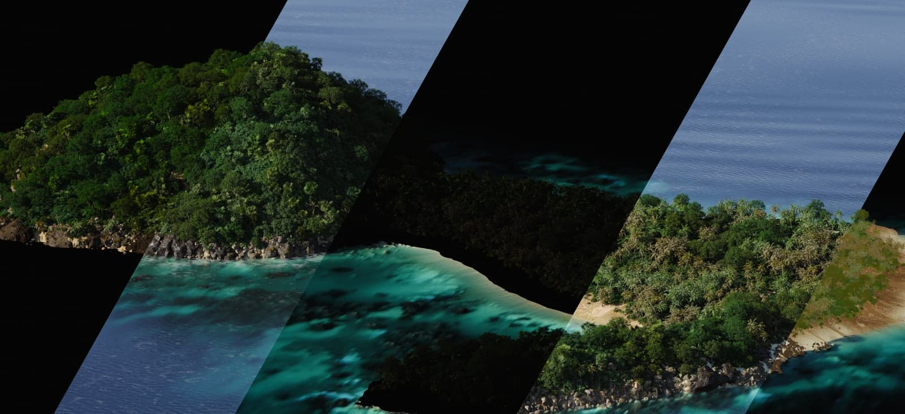
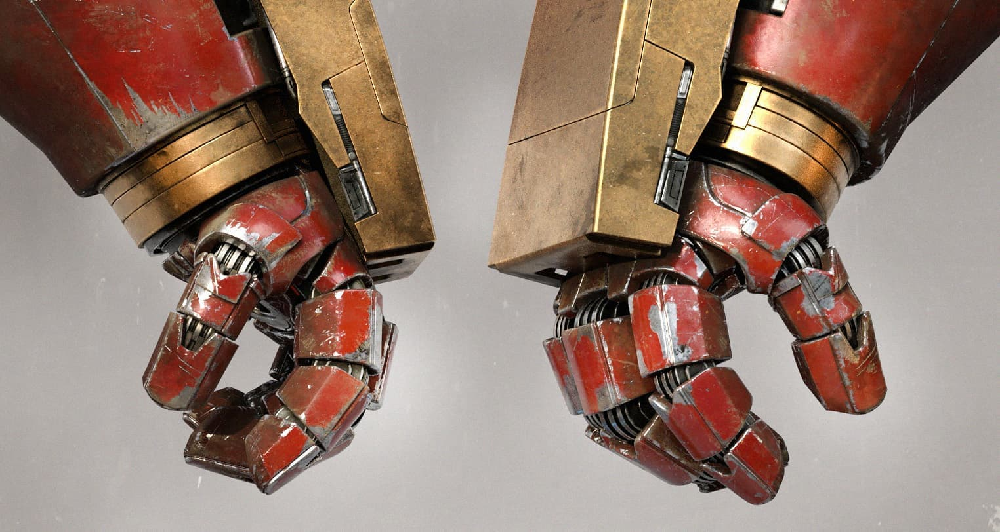
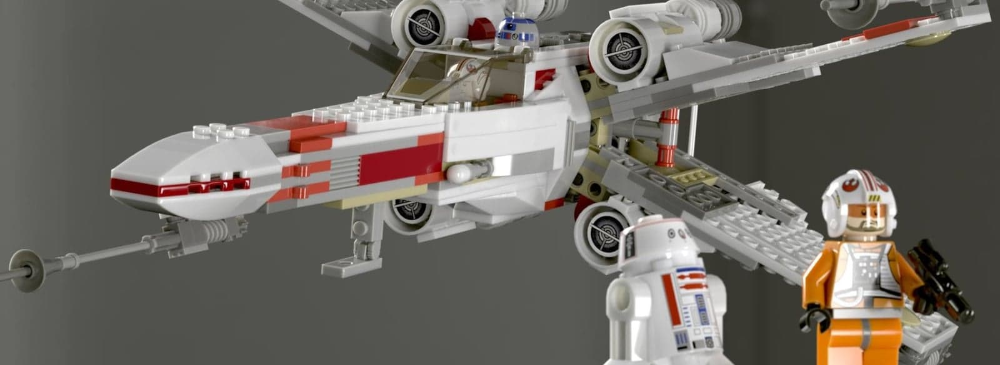
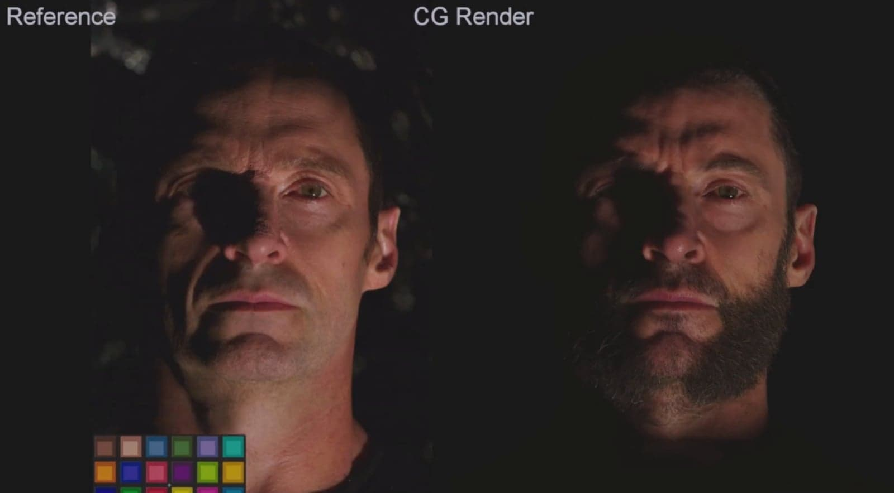
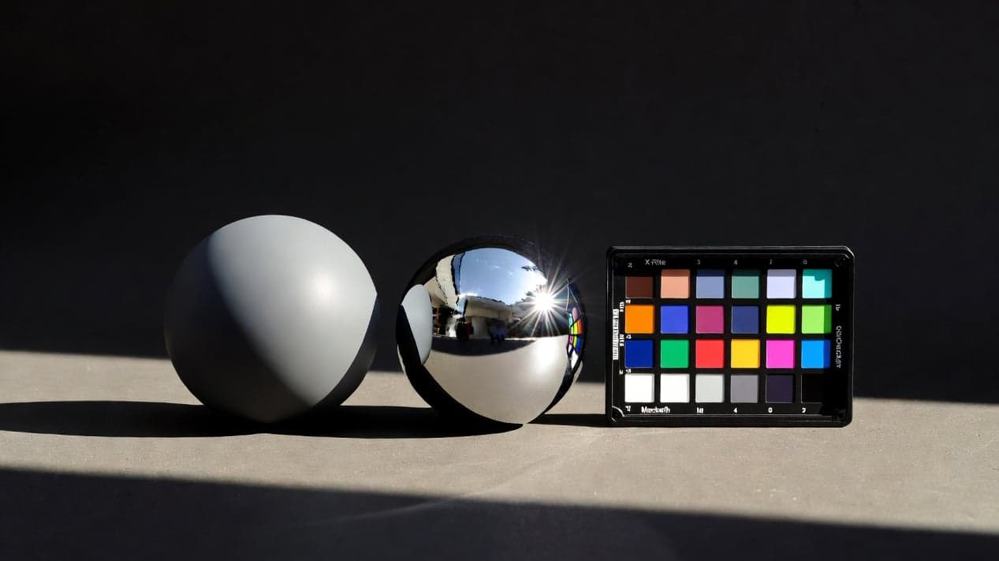

# VFX Software in 2026: The Honest Map of Every DCC Tool

> 原始素材条目：VFX Software in 2026: The Honest Map of Every DCC Tool（CG Lounge）

> 原文链接：https://cglounge.studio/journal/the-honest-map-to-dcc-software

> 摘要：Maya, Houdini, Nuke, Substance, ZBrush, USD. What every studio tool actually does, who uses it, and where it fits. From a working VFX supervisor.

## 正文

Every forum, every Reddit thread, every YouTube comment section: "Should I learn Maya or Blender?" "Is Houdini worth it?" "What's the industry standard?"

Wrong questions.

In December 2025 , the Alliance for OpenUSD published the first formal Core Specification. Fifty member organizations (Pixar, Adobe, Apple, Autodesk, NVIDIA, and others) are aligned on a common scene description format. The technical barrier to moving work between tools is lower than it has ever been. Netflix is funding Blender development at EUR 240,000 per year. DNEG migrated their lighting pipeline from Clarisse to Houdini Solaris between seasons of The Last of Us. Autodesk shipped Maya 2027 in March 2026, and the headline feature is an AI-generated horse.

The ground shifts constantly. The artists who survive these transitions are not the ones who picked the "right" tool. They're the ones who understand light, color, composition, and movement, and then pick whichever tool serves the task in front of them.

DCC stands for Digital Content Creation: the industry term for any software used to create, manipulate, or render 3D content. Maya is a DCC. Houdini is a DCC. Blender is a DCC. The term exists because "3D software" doesn't capture the full scope. These tools handle modeling, animation, simulation, lighting, texturing, rendering, and compositing, often several at once.

This article is the honest map. No vendor marketing. No affiliate links. What each tool actually does, who uses it, and when it's the right choice. My bias is toward look dev, lighting, and compositing, and I'll be upfront about that.

AT A GLANCE

## The Bigger Picture

Before individual tools, here's how a VFX shot moves through a studio. Every tool lives somewhere in this chain.

Concept and Previs. The shot starts with concept art and previs. Artists block out cameras, timing, and composition before anything gets built at full resolution.

Modeling. 3D artists build the geometry: characters, environments, props, vehicles. Maya and Blender dominate this stage.

Texturing. Texture artists paint the surfaces: color, roughness, metalness, displacement, subsurface maps. Substance 3D and Mari live here.

Look Development. Look dev artists take the textured model and make it look real under light. They build shaders, tune material properties, and test the asset under reference lighting. Katana, Houdini Solaris, and Gaffer handle this.

Lighting. Lighters place the asset in the actual shot environment and light it to match the plate (the live-action footage). Same tools as look dev, different context: now you're matching specific on-set conditions.

FX. Fire, water, destruction, crowds, cloth, hair simulation. In practice this runs in parallel with lighting, not strictly after it. Houdini's kingdom.

Rendering. The 3D scene gets converted to 2D images. Render engines (Arnold, RenderMan, V-Ray, Redshift, Karma) turn the lit scene into pixel data, broken into individual passes (AOVs) that compositors can control.

Compositing. The compositor takes every department's output and combines it with the live-action plate into the final frame. Nuke lives here. Every upstream problem that wasn't solved lands on the compositor's desk.

This article focuses on texturing through compositing. That's where I can give you the honest truth about what these tools are and aren't.

## The Context Tools

These are the big DCCs that feed into the look dev/lighting/comp pipeline. You'll interact with them even if they're not your primary tool.

### Maya

Maya is the gravitational center of VFX. If a studio does 3D work for film or television, they almost certainly have Maya licenses. Framestore , Rodeo FX , and most major houses run Maya as their primary modeling, rigging, and animation hub.

What Maya does well: character rigging, animation, modeling, and being the hub that connects to everything else. Every renderer has a Maya plugin. Every pipeline tool has a Maya integration. Every studio has Maya scripts, shelf tools, and custom workflows built up over decades. That ecosystem is Maya's real moat.

What Maya doesn't do well: procedural workflows. Maya is fundamentally a manual tool. You place things, you move things, you keyframe things. If you want procedural generation, you go to Houdini.

Maya 2027 shipped March 26, 2026. The headliners: AI-generated horse locomotion in MotionMaker, an AI documentation assistant (tech preview), and ngSkinTools integration . Smart Bevel and the Sequencer rebuild are genuinely useful. The AI features are marketing. At $2,010/year ($255/month) , the price gap between Maya and free alternatives keeps widening while the feature gap narrows. Maya Creative , a lower-cost tier launched in 2022, runs on pay-as-you-go Flex tokens (about $3/day, $300 minimum) for lighter workloads.

Should you learn it? If you want to work in film or TV VFX, yes. Not because Maya is the best at any single thing, but because it's everywhere. Even as a lighter or compositor, you'll occasionally need to open a Maya scene to check an asset or debug a cache.

### Houdini

Houdini is a different philosophy. Where Maya is "place and adjust," Houdini is "describe and generate." Everything is a node graph. Every parameter can be driven by an expression. You don't model a rock field: you describe the rules for how rocks scatter across terrain, and Houdini generates them.

For FX work (explosions, fluids, destruction, crowds), Houdini has no real competitor. That's been true for over a decade and it's still true today. ILM rewrote their creature pipeline to bring everything into Houdini for Jurassic World Rebirth. But Houdini has expanded far beyond FX. Solaris, its USD-based lighting and scene assembly environment, is changing how studios approach lighting and look dev. More on that in its own section below.

Pricing: Perpetual and rental options at the studio level. Houdini Indie is affordable for individuals earning under $100K/year. Houdini Apprentice is free but watermarked and non-commercial.

Should you learn it? Yes. Even if you're not going into FX. The procedural mindset transfers to every other tool, and Solaris means Houdini is now directly relevant to lighting and look dev artists.

### Blender

Blender is free. Genuinely, completely free. No revenue thresholds, no tiers, no watermarks. GPL licensed. That alone makes it remarkable in an industry where annual software costs can hit five figures per seat.

Blender's story has changed. In January 2026 , Netflix Animation Studios joined the Blender Development Fund, donating EUR 240,000 per year as Corporate Patron. Netflix acquired Animal Logic (which has used Blender for workflows like previs and matte painting) and is putting real money behind the tool. Blender 4.5 LTS aligns with the VFX Reference Platform, meaning it can sit alongside Nuke, Houdini, and Maya in the same pipeline. The Blender Foundation launched Blender Lab in November 2025, a parallel experimental development track for features like VR workflows and volume rendering. This is a tool being taken seriously at the production level.

Blender covers modeling, sculpting, rigging, animation, simulation, compositing, and rendering (Cycles for path tracing, EEVEE for real-time). Geometry Nodes brought Houdini-style procedural modeling to Blender.

The honest take: Blender is a real production tool. Excellent for learning, freelancing, and small-to-mid studio work. Tier-1 VFX houses haven't publicly adopted it for their core pipelines. The reason is pipeline inertia: those studios have decades of proprietary tooling built around Maya and Houdini. Switching would mean rewriting thousands of internal tools. That's not a knock on Blender. It's how large pipelines work.

Should you learn it? Absolutely, especially if you're starting out. Zero cost barrier, excellent learning resources, and increasingly legitimate on professional resumes.

### 3ds Max

Here's one most people get wrong: 3ds Max is not just an arch viz tool.

Yes, architectural visualization is its biggest market, and it's been the standard there for decades alongside V-Ray. But 3ds Max has a real presence in film VFX, specifically for environment work. ILM generalists use 3ds Max with V-Ray for environments. On Severance Season 2 , ILM used 3ds Max to add snow to environments. On Deadpool & Wolverine , ILM's Vincent Papaix chose 3ds Max and V-Ray for rendering environment work. The combination of 3ds Max, V-Ray, and scattering plugins like Forest Pack makes it a strong environment pipeline that some generalists at major studios prefer over Maya for that particular task.

3ds Max 2027 (March 26, 2026) brought Smart Bevel, a Noise Plus modifier, and Arnold 7.5. Community reaction was mixed: forums are asking why they're paying $2,010/year for features that free Blender add-ons can match.

Should you learn it? If you want to specialize in environments or arch viz, it's worth knowing. For general film VFX work, Maya and Houdini are safer bets.

## The Core: Look Dev, Lighting, and Compositing

This is where I live. These are the tools I've used in production, supervised work in, and have real opinions about.

### Nuke

Nuke is the compositing standard. Every major VFX studio uses it. Framestore, ILM, DNEG, Weta FX, Digital Domain. If a shot is composited for a feature film or high-end episodic show, it was almost certainly done in Nuke.

The reason is the node graph. Nuke's entire philosophy is built around non-destructive, non-linear compositing. Every operation is a node. You can branch, merge, restructure, and adjust anything at any point without destroying work. When you're combining 30+ image sequences per shot and iterating through dozens of versions, this isn't a preference. It's a necessity.

Nuke thinks in channels. Beyond standard RGBA, it handles depth, motion vectors, normals, position data, and arbitrary custom channels from any renderer. This is why AOV-based compositing works: you rebuild the CG beauty from individual render passes and adjust each one at any point in the script.

Pricing: Subscription-only since 2023 (no more new perpetual licenses). Foundry announced all remaining maintenance customers for Nuke, Mari, and Katana will transition to subscription by January 2027. Tiers: Nuke, NukeX, Nuke Studio, plus Nuke Indie and Nuke Non-Commercial (free, resolution-limited, some nodes disabled) for learning.

Alternatives: DaVinci Resolve's Fusion module is node-based, capable, and either free or a one-time perpetual purchase. Legitimate for learning and indie work. No tier-1 studio is hiring Fusion compositors for feature work.

### Compositing in VFX: What a Nuke Compositor Actually Does

What a VFX compositor actually does: keying, CG integration, deep comp, grain, Nuke workflows, and the path from junior compositor to supervisor.

### Katana

Katana is where the big studios light their shots. Developed by Foundry (same company behind Nuke), Katana is a look dev and lighting application designed for one thing: managing massive scenes across hundreds of shots at feature film scale.

The key concept is deferred loading. Katana doesn't load your entire scene into memory at once. It references assets and only loads what you need to see. Scenes with billions of polygons work without your workstation collapsing.

Katana's multi-shot workflow is its killer feature. You build a lighting setup, and it propagates across every shot in a sequence. Adjust the key light once, and it updates across 200 shots. This is how studios hit their shot counts on shows with thousands of VFX shots.

Who uses it: ILM uses Katana for lighting on productions like Ultraman Rising . Rodeo FX used it for look dev on Shang-Chi. It's the established choice at studios running USD-based pipelines at feature film scale.

The honest take: If you're a student or junior artist, you won't be buying Katana. You'll encounter it when you get hired at a studio that uses it. The studio will train you on their specific Katana pipeline, which is always customized. Understanding lighting principles matters infinitely more than knowing Katana's interface.

### What Is a Lighting Artist: The Real Day-to-Day in VFX

The actual daily routine of a VFX lighting artist. Render checks, dailies, pre-comps, eye tricks, and career progression from junior lighter to supervisor.

### Houdini Solaris

Solaris is Houdini's built-in USD scene assembly, look dev, and lighting environment. It's the LOPs (Lighting Operators) context in Houdini, and it's eating into territory that Katana has held for years.

The difference: Solaris is natively USD. Every node authors USD operations directly. You're not working in a proprietary format that exports to USD. You're working in USD. With the OpenUSD Core Specification formally ratified in December 2025 by the Alliance for OpenUSD, a roughly 50-member consortium, that native USD foundation is more valuable than ever. USD is the common language of modern VFX pipelines, and having your lighting tool speak it natively eliminates translation layers.

Solaris includes Karma , SideFX's own production renderer (XPU renders on both CPU and GPU). But Solaris isn't locked to Karma. Its Hydra viewport supports any render delegate: Arnold, RenderMan, V-Ray, whatever your pipeline uses.

Who's adopting it: DNEG migrated from Clarisse to Solaris and RenderMan for The Last of Us Season 2. The adoption curve is steep and accelerating, particularly at studios building new USD pipelines or modernizing existing ones.

Pricing: Included with Houdini at no additional cost. Houdini Indie makes it affordable for individuals. You can actually practice at home, unlike Katana.

The honest take: Solaris is the future for a lot of studios. Not all of them, and not overnight, but the momentum is real. If you're learning lighting and look dev today, learning Solaris is a smart bet. The concepts transfer directly if you end up at a Katana studio.

### USD Explained: Solaris, Maya, Nuke, Gaffer, and the Tech That's Changing VFX Pipelines

What USD actually does for artists at the workstation. Solaris, Maya, Nuke 17, Gaffer, Katana, and how it all connects.

### Gaffer

Gaffer is my daily tool. I use it every day at Image Engine for lighting and look dev across film and episodic productions. We receive textured assets, layouts, models, and animation caches, and Gaffer is where we light shots and run multishot rendering across sequences.

Originally created by John Haddon , Gaffer was adopted and extended at Image Engine (part of the Cinesite group since 2015). It's a node-based application for look dev, lighting, scene assembly, rendering, and pipeline automation. BSD licensed . Free. Open source.

What makes Gaffer work in production: it's lightweight and built to be extended. Because it's open source, pipeline teams can customize it to fit exactly how their studio works. Gaffer's architecture uses a multi-threaded deferred evaluation engine that handles very large data sets. It supports Arnold, Cycles, 3Delight, and RenderMan. Image Engine has used Gaffer on Jurassic World: Fallen Kingdom , Lost in Space, and Game of Thrones. Development is active: Gaffer 1.6 shipped in 2025, with regular user group meetings.

Gaffer is a direct comparison to Katana. Both handle deferred scene evaluation. Both work with USD. Both connect to the same renderers. The core difference: Gaffer is open source and free. Katana has commercial support, a larger user base, and established presence at more studios.

The honest take: Gaffer's adoption outside the Cinesite group is limited. That's the reality. It doesn't have Katana's commercial backing or Solaris's momentum. But it's a production-proven tool, not a proof of concept. And for individuals, it's the only free option for learning production lighting workflows with USD.

### Mari

Mari is where film textures get painted. Developed by Foundry, Mari was built at Weta Digital (now Weta FX) for Avatar because nothing else could handle the texture resolution they needed. Development had roots going back to King Kong, but Avatar's demands drove it into a standalone product. Foundry acquired it in 2010 .

The difference between Mari and Substance Painter is scale. Substance works brilliantly for game assets and most production work. But when you need to paint 200+ UDIM tiles on a hero character at 8K per tile, Substance runs out of headroom. Mari was built for exactly that scenario.

On The Last of Us Season 2, DNEG used Mari for generating curvature and cavity maps on damaged environments. On The Electric State, Digital Domain created nearly 480 assets including 61 robot characters, textured via a new material library built in Mari.

The honest take: You won't start with Mari. It's a specialized tool for a specific scale of work. Start with Substance. When you get to a studio doing hero character work at film resolution, Mari will be there, and the painting fundamentals transfer directly.

### Texturing for Production: Beyond the Tutorial

Tutorial textures look fine on ArtStation. Production textures hold up at 4K under any lighting condition. Here's what separates the two: color pipelines, grunge that tells a story, and lookdev that ties it all together.

### Substance 3D

Substance is the texturing tool you'll actually use first. Adobe Substance 3D includes Painter (painting directly on 3D meshes with smart materials), Designer (node-based procedural material creation), and Sampler (photo-to-material conversion).

Substance Painter has become the default texturing tool across games and increasingly in VFX. Smart materials and smart masks automate surface wear and detail generation. You go from a clean model to a fully textured, weathered asset faster than in any other tool.

Substance Designer is a different beast. Node-based, pure procedural logic. The .sbsar format it exports is supported via the Substance integration in Unreal, Unity, Maya, Houdini, and most renderers. If you've used a pre-made material in any engine, it was probably authored in Designer.

The honest take: Learn Substance. Whether you end up in games, VFX, arch viz, or any other 3D field, Substance skills are expected. The knowledge transfers everywhere.

### Lookdev: What It Actually Means and How Production Does It

The lookdev reference production actually uses: grey ball setups, albedo charts, SSS values, and shader parameters with real numbers from shipped VFX shots.

## The Ones You'll Hear About

ZBrush (Maxon): digital sculpting standard, every character and creature artist uses it. Cinema 4D (Maxon): the motion graphics king, different world from film VFX. Unreal Engine (Epic): real-time rendering and virtual production, ILM's StageCraft runs on it. DaVinci Resolve (Blackmagic): industry-standard color grading with a capable free compositor (Fusion). Render engines deserve their own discussion, and we've already written that.

### Arnold vs V-Ray vs Octane vs Redshift vs Karma Render Guide

Arnold, V-Ray, Redshift, Octane, Karma, RenderMan and Cycles compared on speed, look and pipeline fit. Real production experience, not marketing slides.

## So What Should You Learn?

Depends entirely on what you want to do.

Compositing? Nuke. Start with Nuke Non-Commercial (free) or Nuke Indie. If budget is zero, learn node-based thinking in Fusion, but move to Nuke as soon as you can. Every studio expects it.

Lighting or look dev? Learn Houdini. Solaris gives you a production-grade lighting environment with the Indie license. Understanding USD is becoming non-negotiable. If you end up at a Katana studio, the concepts transfer and the studio will train you.

Generalist? Maya or Houdini. Maya for the broadest compatibility. Houdini for procedural thinking and FX alongside generalist work. Blender if budget is the constraint: it covers everything, and the skills transfer.

Texturing? Substance 3D first. It's affordable, it's everywhere, and the workflows apply to games and VFX equally. Mari comes later at studios doing hero character work at film scale.

Here's what matters more than any specific tool: understand the fundamentals. Light behaves the same way in every renderer. Color theory doesn't change between Nuke and Fusion. Composition principles apply in Katana and Solaris equally.

The tools change. Arnold replaced Mental Ray. Solaris is rising alongside Katana. USD is reshaping pipelines that ran on proprietary formats for decades. The artists who thrive through these transitions are the ones who understand why things look the way they do, not just which buttons to press.

Learn the tool that gets you working. Then learn the principles that make you dangerous in any tool.

### Calibrated Lighting for Lookdev: The Measured Values That Make It Work

Sun intensity in lux, color temperature standards, HDRI calibration methods, grey ball verification. Every value sourced from CIE standards, NASA data, and peer-reviewed photometry.

ABOUT THE AUTHOR

### Arvid Schneider

Lighting Supervisor at Image Engine, Founder of CG Lounge

Emmy-nominated VFX artist. Worked at ILM, MPC, and Image Engine on projects including The Mandalorian, Ready Player One, and Dune: Prophecy. Built CG Lounge because marketplace fees shouldn't eat into what creators earn.

SHARE THIS ARTICLE

## Discussion

## 图片

### 图片 1：Compositing in VFX: What a Nuke Compositor Actually Does

原图：https://cglounge.studio/_next/image?url=https%3A%2F%2Fcglounge-images.b-cdn.net%2Fv0%2Fb%2Fcglounge-2025.firebasestorage.app%2Fo%2Fjournal%252Fcompositing-in-vfx%252F1776738664761_optimized.jpg%3Falt%3Dmedia%26token%3Dc43e8cd6-cecd-45d8-82dc-e5bdccdd1a93&w=1920&q=75

### 图片 2：What Is a Lighting Artist: The Real Day-to-Day in VFX

原图：https://cglounge.studio/_next/image?url=https%3A%2F%2Fcglounge-images.b-cdn.net%2Fv0%2Fb%2Fcglounge-2025.firebasestorage.app%2Fo%2Fjournal%252Fwhat-is-a-lighting-artist%252F1776738681063_optimized.jpg%3Falt%3Dmedia%26token%3D3baafadf-9835-4325-800f-5142f0527a78&w=1920&q=75

### 图片 3：USD Explained: Solaris, Maya, Nuke, Gaffer, and the Tech That's Changing VFX Pipelines

原图：https://cglounge.studio/_next/image?url=https%3A%2F%2Fcglounge-images.b-cdn.net%2Fv0%2Fb%2Fcglounge-2025.firebasestorage.app%2Fo%2Fjournal%252Fusd-explained-for-vfx-artists%252F1776738676900_optimized.jpg%3Falt%3Dmedia%26token%3D0d1170ef-9e79-450f-9b8a-25975f017f6a&w=1920&q=75

### 图片 4：Texturing for Production: Beyond the Tutorial

原图：https://cglounge.studio/_next/image?url=https%3A%2F%2Fcglounge-images.b-cdn.net%2Fv0%2Fb%2Fcglounge-2025.firebasestorage.app%2Fo%2Fjournal%252Ftexturing-for-production-beyond-tutorials%252F1773086514147_url-import.jpeg%3Falt%3Dmedia%26token%3De50d2ec5-3415-42ae-9914-56b2a84d28f3&w=1920&q=75

### 图片 5：Lookdev: What It Actually Means and How Production Does It

原图：https://cglounge.studio/_next/image?url=https%3A%2F%2Fcglounge-images.b-cdn.net%2Fv0%2Fb%2Fcglounge-2025.firebasestorage.app%2Fo%2Fjournal%252Flookdev-the-technical-guide%252F1776738670270_optimized.jpg%3Falt%3Dmedia%26token%3D43bdc0c4-66b6-4317-a63c-9cfc234c3ffc&w=1920&q=75

### 图片 6：Arnold vs V-Ray vs Octane vs Redshift vs Karma Render Guide

原图：https://cglounge.studio/_next/image?url=https%3A%2F%2Fcglounge-images.b-cdn.net%2Fv0%2Fb%2Fcglounge-2025.firebasestorage.app%2Fo%2Fjournal%252Frender-engines-explained%252F1776738672599_optimized.jpg%3Falt%3Dmedia%26token%3D08ac1ef3-243e-4151-8a10-883a81152da8&w=1920&q=75

### 图片 7：Calibrated Lighting for Lookdev: The Measured Values That Make It Work

原图：https://cglounge.studio/_next/image?url=https%3A%2F%2Fcglounge-images.b-cdn.net%2Fv0%2Fb%2Fcglounge-2025.firebasestorage.app%2Fo%2Fjournal%252Fcalibrated-lighting-for-lookdev%252F1776738658203_optimized.jpg%3Falt%3Dmedia%26token%3D67727219-730a-499b-af1f-7bc40a78408b&w=1920&q=75

## 抓取记录

- 页面标题：VFX Software in 2026: The Honest Map of Every DCC Tool
- 抓取状态：ok
- 成功下载图片：7
- 图片失败：0
- 处理耗时：8.3 秒