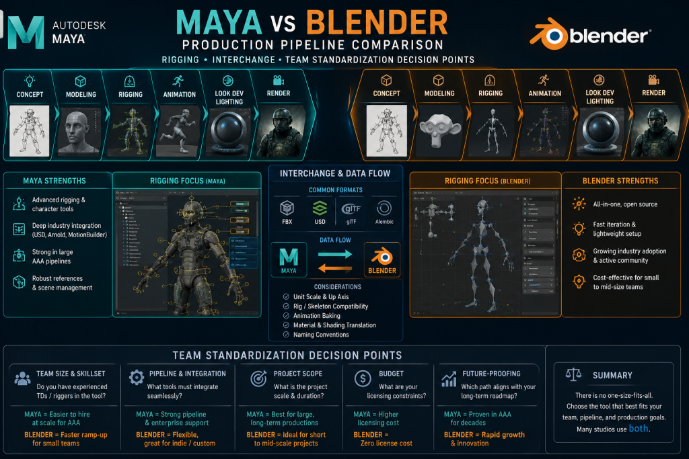
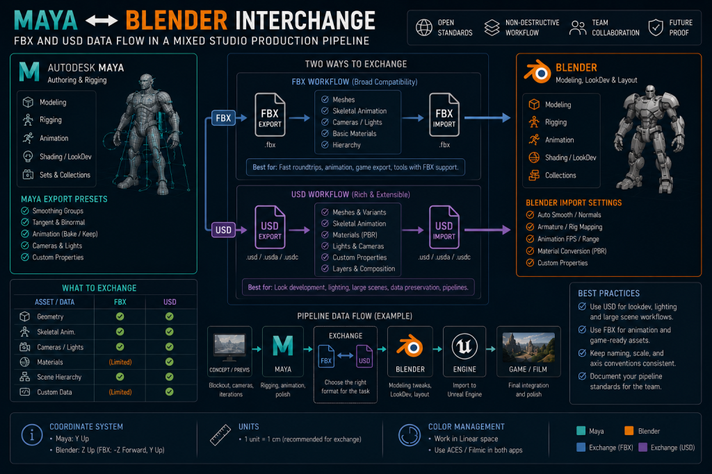
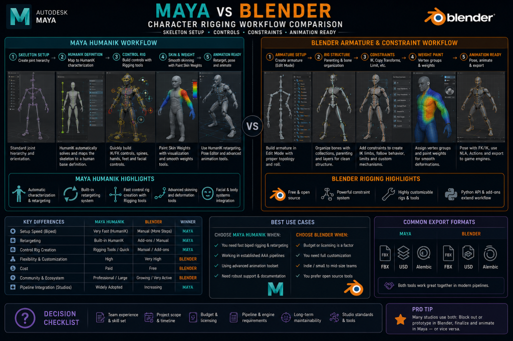
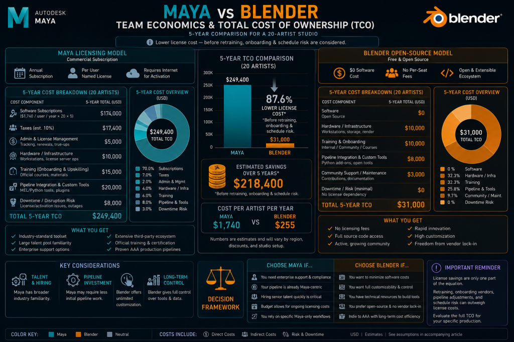
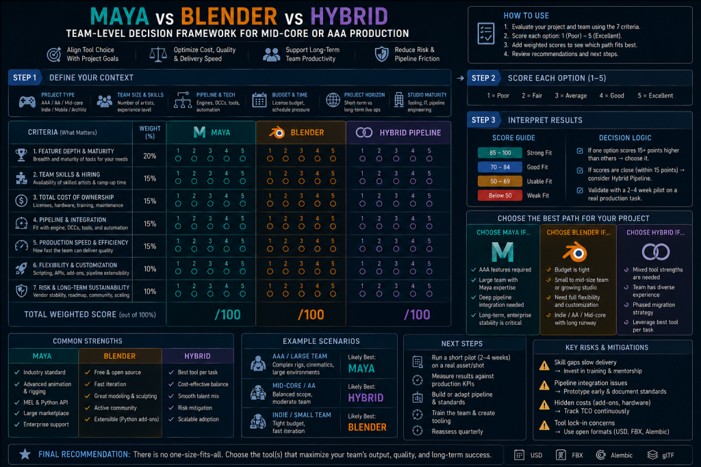

# MAYA VS BLENDER FOR PRODUCTION PIPELINES: A TEAM-LEVEL DECISION

> 原始素材条目：Maya vs Blender for Production Pipelines（NastyRodent）

> 原文链接：https://nastyrodent.com/maya-vs-blender-for-production-pipelines/

> 摘要：Maya vs Blender for production pipelines: FBX and USD interchange, rigging ecosystems, licensing at scale, and when a hybrid workflow makes sense.

## 正文

HomeArticles about enginesMaya vs Blender for Production Pipelines: A Team-Level Decision

# MAYA VS BLENDER FOR PRODUCTION PIPELINES: A TEAM-LEVEL DECISION

- Written by Denys Zadoienyi

Written by Denys Zadoienyi

- Updated on 24.07.2026

Updated on 24.07.2026

- Time to read 16 min

Time to read 16 min

- WHAT THIS COMPARISON IS ACTUALLY ABOUT

- INTERCHANGE RELIABILITY: WHAT FBX AND USD ACTUALLY DO BETWEEN THE TWO

- RIGGING AND ANIMATION: WHERE THE REAL GAP SITS

- TEAM ECONOMICS: WHAT THE LICENSE LINE DOESN’T CAPTURE

- BLENDER’S REAL PRODUCTION CREDIBILITY – AND ITS LIMITS

- MODELING AND PROCEDURAL WORK: WHERE BLENDER CAN OFFER A PRODUCTION ADVANTAGE

- THE HYBRID PIPELINE: WHERE MAYA AND BLENDER ACTUALLY COEXIST

- MAYA VS BLENDER: QUICK COMPARISON

- ONBOARDING A NEW VENDOR OR HIRE INTO AN EXISTING PIPELINE

- A DECISION FRAMEWORK FOR STUDIO LEADS

- HOW WE WORK AT NASTY RODENT

Maya vs Blender for production pipelines gets asked constantly and answered badly, because most comparisons default to a feature checklist – polygon tools here, sculpting there, renderer bake-offs – when the question a studio actually needs answered sits one level up: which tool does your team standardize on, what happens when an asset has to move between departments or between your studio and a vendor’s, and what does that choice cost once you count licensing, retraining, and the friction of a pipeline that doesn’t quite agree with itself.

“Editorial illustration created for visual reference purposes. It does not represent a real project, client work, or official software screenshot unless stated otherwise.”

This guide skips the feature-by-feature tour. It covers what actually determines the decision on a mid-core or AAA production: how reliably a rig and its animation survive the trip between the two applications, what a licensing decision costs at team scale once retraining is priced in, where a hybrid Maya-and-Blender pipeline genuinely works versus where it quietly generates rework, and how to onboard a new hire or vendor into whichever standard your team already runs.

## WHAT THIS COMPARISON IS ACTUALLY ABOUT

Maya and Blender both model, rig, animate, and render. Treating that overlap as the interesting part of the comparison is where most guides go wrong – the overlap is exactly the part that doesn’t drive a studio’s decision, because both tools clear that bar. What drives the decision is what happens after an artist hits export: whether the mesh, the rig, and the animation data survive the handoff to the next person, the next department, or the next studio in the chain without a cleanup pass.

That’s a different question from “which tool is more powerful,” and it’s the reason a solo artist and a twelve-person production team can look at the exact same feature list and land on opposite answers. A solo artist never has to ask whether their rig will open correctly on someone else’s machine. A team does, every single milestone.

## INTERCHANGE RELIABILITY: WHAT FBX AND USD ACTUALLY DO BETWEEN THE TWO

The handoff question comes down to two formats in practice: FBX, which remains one of the most common interchange formats for static meshes, skeletal meshes, and baked animation in game-production pipelines, and USD, because it’s what a growing number of mid-to-large studios use to compose scenes across multiple applications without destructive edits.

“Editorial illustration created for visual reference purposes. It does not represent a real project, client work, or official software screenshot unless stated otherwise.”

FBX between Maya and Blender is functional but not friction-free. Blender uses its own FBX import/export implementation rather than Autodesk’s proprietary FBX SDK, so parity should be validated against the specific skeleton, constraints, animation curves, and engine import path a project actually uses rather than assumed. In practice, a standardized deform skeleton and baked animation tend to interchange more reliably than full control rigs, provided scale, axis, skeleton, root-motion, and baking conventions are standardized and validated – that’s the data most game engines need on import. What doesn’t survive the round trip as reliably is anything closer to a control rig: constraints, drivers, custom rig nodes, bone-orientation conventions, root-motion setup, and application-specific controls should be treated as DCC-native data unless a specifically tested export process confirms otherwise. A studio that assumes a full rig round-trips cleanly discovers the gap mid-production, as a rework cost rather than a warning. Practitioner discussion on this – including a long-running Polycount thread on Blender’s studio adoption – consistently frames FBX pipelines as still Maya-centric in large-studio practice, though that reflects working artists’ accumulated experience rather than a formal, quantified industry survey.

USD changes the picture for studios already composing scenes across multiple applications. Maya is frequently easier to integrate into an established studio USD pipeline mainly because so many of those pipelines already include Maya-specific tooling and conventions built up around it – the advantage is pipeline ecosystem as much as it is anything inherent to Maya’s own USD implementation. Blender’s USD import/export continues to expand with each release, but compatibility is worth evaluating feature by feature – scene composition, variants, instancing, materials, skeleton schemas, and round-trip editing – against the exact software versions a project is running, rather than assumed as a blanket “less mature.”

Texturing and UV interchange sit downstream of both formats and deserve their own mention, because they’re where a clean geometry handoff can still fall apart. Both applications export UV layouts that Substance Painter and Substance Designer read without issue, so texel density and channel-packing conventions transfer regardless of which DCC produced the mesh – that part of the pipeline is genuinely tool-agnostic. Native Maya and Blender shader graphs, by contrast, don’t reliably round-trip one-to-one with each other. Standardized PBR parameters, textures, and format-level material description through USDShade or MaterialX can preserve part of a material definition depending on which applications and versions are involved, but a team moving assets between the two should still treat material ownership as a separate handoff decision from geometry and rigging, not an afterthought that “just comes along” with the FBX or USD file.

## RIGGING AND ANIMATION: WHERE THE REAL GAP SITS

Character rigging and animation is where Maya retains its clearest large-studio advantage – and it’s worth being precise about what kind of advantage that actually is, rather than repeating “Maya is better at animation” as an unexamined industry truism. The difference isn’t that Blender lacks production-capable rigging or animation tools. It’s that Maya has a deeper installed base of senior specialists, more mature studio conventions built up over two decades, extensive proprietary in-house tooling built around it, and established mocap and retargeting workflows that a large share of the existing rigging talent pool already knows.

Maya’s rigging toolset – blend shapes, IK/FK switching, driven keys, a mature constraint system, and full Python/MEL scripting access – reflects that two decades of refinement. HumanIK provides an established characterization and retargeting workflow, particularly useful in pipelines already connected to MotionBuilder or built around standardized humanoid skeletons – it’s one part of Maya’s broader animation ecosystem, not a universal solution for every mocap pipeline, and productions also lean on MotionBuilder, engine-side retargeting (Unreal’s IK Rig and Retargeter, for instance), and proprietary in-house frameworks depending on what the pipeline already runs.

Blender’s animation system is genuinely production-capable, not a toy version of Maya’s: armatures function as Blender’s equivalent to Maya’s joint hierarchy, the constraint system covers comparable conceptual ground, drivers and shape keys handle deformation and secondary motion, and the Non-Linear Animation editor handles clip layering and blending competently. Blender also supports retargeting through constraints, scripts, and add-ons, including Rigify for procedural rig generation and studio-built proprietary systems. Where it trails Maya is less about any single missing capability and more about depth of installed convention at scale – Maya rigging conventions are widely represented in the existing senior talent pool, particularly across established AAA, VFX, and cinematic pipelines, which matters practically when a production needs several riggers coordinating on the same character across a schedule, or when a vendor’s animator needs to open your rig and start working inside your conventions quickly rather than needing to relearn a different one first.

“Editorial illustration created for visual reference purposes. It does not represent a real project, client work, or official software screenshot unless stated otherwise.”

That last point matters more for an outsourcing context than most comparisons acknowledge. A 3D character pipeline that changes rigging tools between internal and external teams doesn’t just risk technical incompatibility – it risks losing the shared professional vocabulary that makes a handoff fast. A rigger who’s spent a career in Maya can read another studio’s Maya rig quickly. The same rigger opening an unfamiliar Blender rig for the first time is starting from a slower baseline, independent of how good either rig actually is.

## TEAM ECONOMICS: WHAT THE LICENSE LINE DOESN’T CAPTURE

Maya is a subscription product from Autodesk; Blender is free and open-source under the GPL, with no license fee at any team size. Priced as a single number, that comparison isn’t close. Priced as a team-scale decision, it’s more complicated, and the complications are exactly where studios get the answer wrong by stopping at the license line.

“Editorial illustration created for visual reference purposes. It does not represent a real project, client work, or official software screenshot unless stated otherwise.”

Blender’s zero licensing cost is real and it compounds at scale – a growing team saves a genuine, recurring line item that a producer would otherwise have to justify every renewal cycle. What that number doesn’t include is retraining cost when senior hires trained on Maya join a Blender-standardized pipeline, the schedule risk of a team relearning muscle memory mid-production rather than between projects, and the harder-to-quantify cost of a vendor or freelancer who has to onboard onto tooling conventions that don’t match what they already know. None of those costs show up on an invoice, which is exactly why they’re the ones that get missed in a pure license-cost comparison.

Maya’s subscription cost is real too, and at team scale it’s a genuine line item – but it buys something specific: a shared set of studio conventions that a large pool of already-trained riggers, animators, and technical artists can step into with a shorter software-learning ramp, although project-specific rigs, tools, naming, and delivery conventions still require onboarding – plus native fit with the USD- and Houdini-adjacent pipelines that are common in many mid-to-large VFX, cinematic, and content-production environments. For a team already inside that ecosystem, the subscription cost is amortized against hiring speed and onboarding time, not just against the software itself.

## BLENDER’S REAL PRODUCTION CREDIBILITY – AND ITS LIMITS

Blender’s studio credibility is genuinely higher than it was even a few years ago, and it’s worth naming specifically rather than gesturing at “Blender has improved.” Ubisoft joined the Blender Development Fund in 2019 and committed to using Blender within Ubisoft Animation Studio’s production – a real, named commitment specific to that animation division, not evidence that Ubisoft standardized Blender across its broader game-production departments. Artists interviewed by 80.lv on Blender’s industry-standard trajectory have cited retraining cost and existing proprietary pipeline tooling – rather than a features gap – as the practical barriers slowing broader AAA adoption. That reflects practitioner perspective gathered through interviews, not a comprehensive, quantified measure of AAA-wide usage, but it’s a more grounded signal than either tool’s marketing material.

That’s the honest shape of where Blender sits in production pipelines today: a legitimate, improving tool with real studio credibility in specific departments – asset creation, look development, procedural and hard-surface work, increasingly lighting and surfacing – and a tool that has not yet achieved the same level of installed-base adoption as Maya in AAA character rigging and animation pipelines, not because it structurally can’t do the work, but because the switching cost for an already-trained pipeline is real and studios weigh it accordingly.

GAME ART SUPPORT BUILT FOR REAL PRODUCTION

From concept to final assets, we help teams build production-ready game visuals.

## MODELING AND PROCEDURAL WORK: WHERE BLENDER CAN OFFER A PRODUCTION ADVANTAGE

The rigging section above is deliberately specific about where Maya’s advantage sits, and fairness cuts the other way too: modeling and procedural work is where Blender is genuinely strong, particularly for teams already fluent in Geometry Nodes and working on modular, parametric, or hard-surface-heavy content.

Geometry nodes give Blender a deeply integrated, artist-facing procedural modeling workflow that’s particularly effective for parametric asset variation, modular kits, and environment kit-bashing. Maya isn’t limited to traditional history-based polygon and NURBS modeling either – Bifrost and MASH both provide node-based procedural workflows, and Bifrost specifically has grown into a capable procedural modeling and simulation graph in its own right. The real difference isn’t “Maya can’t do procedural” – it’s authoring model and everyday accessibility: Geometry Nodes is integrated directly into Blender’s core modeling environment and is readily accessible to asset artists, whereas Bifrost and MASH are more commonly treated as specialized procedural or technical-art workflows owned by dedicated technical artists rather than every asset artist on a team. For a 3D environment pipeline building modular kits at volume, that difference in day-to-day accessibility is the practical advantage, more than any raw capability gap.

The same logic extends into the mesh’s downstream life regardless of which tool produced it. If the modeling stage leaves topology that’s too dense or unsuited to deformation – a common outcome of heavy sculpting or aggressive procedural generation – the asset still needs a retopology pass before rigging. A model built with production-ready topology from the start may not need a separate pass at all; Blender’s iteration speed during blockout changes how quickly a team gets to a clean topology state, it doesn’t remove the requirement when the source topology isn’t already there.

## THE HYBRID PIPELINE: WHERE MAYA AND BLENDER ACTUALLY COEXIST

For some mid-core and growing production teams, the practical answer isn’t “Maya or Blender” – it’s a controlled hybrid pipeline where each tool covers the stage it’s genuinely strongest at, the same asset-class logic that already governs the ZBrush vs Blender sculpting decision on this site, applied one level up at the application-standardization layer instead of the sculpting-tool layer.

One viable hybrid pattern for a growing mid-core studio: modeling and procedural or hard-surface work in Blender, where Geometry Nodes and modifier-based iteration are genuinely fast and non-destructive; rigging and character animation in Maya, where HumanIK and the mature constraint system carry a production’s mocap and cinematic requirements; final scene assembly and rendering wherever the studio’s existing pipeline tooling already lives. This isn’t the only workable split – some studios run entirely in one application, others mix in Houdini or 3ds Max – but this pattern is useful as an example of the underlying principle: pick the tool per stage and per department, the same logic that governs hard-surface vs organic modeling tool choice on this site.

What actually makes a hybrid pipeline viable, rather than a source of constant friction, comes down to one rule: give every asset stage a clearly defined source-of-truth DCC, and minimize how often editable source data – a rig, a procedural setup, an in-progress scene – crosses the application boundary. Round-tripping a finished, validated asset once is manageable. Repeatedly moving an editable rig or a live procedural graph back and forth between Maya and Blender during active production is where a hybrid pipeline actually breaks down. In practice that means agreeing, before production starts, on which application owns the rig once animation begins, what naming and scale conventions both teams commit to so exports come in clean on the first try, and who signs off on a test asset moving through the full round trip before the pipeline is trusted for a production batch.

## MAYA VS BLENDER: QUICK COMPARISON

|  | Maya | Blender |\n| --- | --- | --- |\n| License model | Subscription (Autodesk) | Free, open-source (GPL) |
| Rigging depth | HumanIK, mature constraint system, two decades of production refinement | Production-capable rigging/animation; smaller installed base of AAA-scale conventions and tooling |
| USD support | Strong Maya-USD ecosystem; commonly integrated into established studio USD toolchains | Expanding import/export support; validate required schemas and round-trip workflows by version |
| FBX reliability | Autodesk-maintained FBX integration; still needs tested export presets and engine validation | Own FBX implementation; deform skeletons and baked animation interchange more reliably than full control rigs |
| Team onboarding | Large installed talent pool familiar with Maya; project-specific tools and rigs still require onboarding | Depends heavily on the studio’s training material, internal tools, and available mentors |
| Where it wins today | Character rigging, mocap-oriented animation, established Maya-centric studio pipelines | Modifier-driven modeling, Geometry Nodes workflows, hard-surface and procedural asset creation, license-sensitive teams |

## ONBOARDING A NEW VENDOR OR HIRE INTO AN EXISTING PIPELINE

Interchange reliability and rigging depth stop being abstract the moment a new person – a hire or an external vendor – has to plug into a pipeline someone else already built. This is where a tool-standardization decision either pays off or turns into a recurring tax on every milestone.

A studio bringing on an outsourced 3D team should treat DCC standardization as a first-week technical onboarding item, not an assumption. Which application owns which stage, what the naming and scale conventions are, and how a test asset is expected to round-trip through the full pipeline before production volume starts – these are exactly the kind of details we cover in our vendor onboarding protocol, because a vendor who’s fluent in Maya but receiving Blender-authored rigs (or the reverse) without that being flagged explicitly is a common source of first-milestone friction in a mixed-tooling engagement.

## A DECISION FRAMEWORK FOR STUDIO LEADS

“Editorial illustration created for visual reference purposes. It does not represent a real project, client work, or official software screenshot unless stated otherwise.”

Run these questions before setting a pipeline standard, rather than defaulting to whatever the founding team happened to already know:

- What does character rigging and animation depth actually require? Mocap-heavy cinematics and large rigged casts often favor Maya when the team already relies on HumanIK, MotionBuilder, Maya-based rigs, or established Maya tooling. Simpler rigs on a smaller cast can run comfortably in Blender.

- What’s already downstream in your pipeline? A studio already invested in Houdini, Katana, or USD-composed scene assembly gets more from Maya’s native fit. A studio without that investment isn’t paying for compatibility it won’t use.

- What’s your team’s existing muscle memory, and what’s your hiring pool? A team of ex-AAA riggers already fluent in Maya conventions may incur enough retraining and workflow-transition cost under a Blender-only mandate to outweigh the near-term license savings. A small team building from scratch has more room to standardize on Blender without that tax.

- Where will interchange actually happen? If assets move between internal teams and outsourced vendors regularly, FBX and rig-compatibility reliability matters more than either tool’s feature list – test the actual round trip before committing a production batch to it.

None of these questions resolve to a universal winner, and that’s deliberate – a pipeline decision made once, explicitly, per team and per project shape, holds up better than a blanket policy re-litigated informally every time a new hire brings a preference with them.

## HOW WE WORK AT NASTY RODENT

Nasty Rodent is a mid-core and AAA game art outsourcing studio built around production-ready 3D pipelines. We align asset-delivery requirements with a client’s existing DCC and engine pipeline during technical onboarding – and where both Maya and Blender are present in a project, source-of-truth ownership, exchange formats, scale, naming, and skeleton conventions get agreed on and validated with a test asset before production volume begins, the same discipline we apply to sculpting tool choice, engine-specific asset requirements, and every other pipeline decision that determines whether a handoff is clean or costly.

DENYS ZADOIENYI

- What This Comparison Is Actually About

- Interchange Reliability: What FBX and USD Actually Do Between the Two

- Rigging and Animation: Where the Real Gap Sits

- Team Economics: What the License Line Doesn’t Capture

- Blender’s Real Production Credibility – and Its Limits

- Modeling and Procedural Work: Where Blender Can Offer a Production Advantage

- The Hybrid Pipeline: Where Maya and Blender Actually Coexist

- Maya vs Blender: Quick Comparison

- Onboarding a New Vendor or Hire Into an Existing Pipeline

- A Decision Framework for Studio Leads

- How We Work at Nasty Rodent

HIRE AN UNREAL ENGINE DEVELOPER: A TECHNICAL VETTING PROCESS FOR AAA

A resume that lists Nanite, Lumen, and World Partition tells you almost nothing. Reading about a system and shipping with it under a real performance budget are two different skill levels, and a standard interview rarely tells them apart – it checks whether the candidate knows the vocabulary, not whether they’ve hit the walls that […]

17.08.2026

A PRACTICAL VENDOR RISK REGISTER FOR GAME ART OUTSOURCING

Vendor risk management in game art outsourcing usually gets skipped for the same reason seatbelts get skipped on a five-minute drive: nothing has gone wrong yet, so the extra step feels unnecessary. Then the vendor’s lead artist leaves mid-milestone, or the studio you depend on for every character asset takes on a bigger client and […]

14.08.2026

### RELATED SERVICES

### CONCEPT ART

### 3D PROPS

## FAQ'S

- [ 1 ] IS MAYA BETTER THAN BLENDER FOR GAME DEVELOPMENT? Not universally - it depends on the stage. Maya has a clear ecosystem and installed-base advantage in character rigging and mocap-driven animation, built on two decades of studio convention. Blender is genuinely competitive for modeling, procedural work, and asset creation, and costs nothing at any team size.

### IS MAYA BETTER THAN BLENDER FOR GAME DEVELOPMENT?

Not universally - it depends on the stage. Maya has a clear ecosystem and installed-base advantage in character rigging and mocap-driven animation, built on two decades of studio convention. Blender is genuinely competitive for modeling, procedural work, and asset creation, and costs nothing at any team size.

- [ 2 ] CAN BLENDER FULLY REPLACE MAYA IN AN AAA PIPELINE? For some departments, yes - modeling and hard-surface work in particular. For character rigging and animation at AAA scale, Blender has not yet achieved the same level of installed-base adoption as Maya, largely because of switching cost and existing studio conventions rather than a hard technical ceiling.

### CAN BLENDER FULLY REPLACE MAYA IN AN AAA PIPELINE?

For some departments, yes - modeling and hard-surface work in particular. For character rigging and animation at AAA scale, Blender has not yet achieved the same level of installed-base adoption as Maya, largely because of switching cost and existing studio conventions rather than a hard technical ceiling.

- [ 3 ] HOW RELIABLE IS FBX BETWEEN MAYA AND BLENDER? Reliable for standardized deform skeletons and baked animation - the data most game engines actually need on import. Less reliable for anything closer to a control rig: constraints, drivers, and custom rig nodes shouldn't be assumed to survive the round trip without testing the specific handoff first.

### HOW RELIABLE IS FBX BETWEEN MAYA AND BLENDER?

Reliable for standardized deform skeletons and baked animation - the data most game engines actually need on import. Less reliable for anything closer to a control rig: constraints, drivers, and custom rig nodes shouldn't be assumed to survive the round trip without testing the specific handoff first.

- [ 4 ] DOES A STUDIO NEED TO PICK ONE TOOL FOR THE WHOLE PIPELINE? No. A hybrid pipeline - Blender for modeling and procedural work, Maya for rigging and animation - can be a workable pattern, provided the handoff points and file conventions are agreed on explicitly before production starts.

### DOES A STUDIO NEED TO PICK ONE TOOL FOR THE WHOLE PIPELINE?

No. A hybrid pipeline - Blender for modeling and procedural work, Maya for rigging and animation - can be a workable pattern, provided the handoff points and file conventions are agreed on explicitly before production starts.

- [ 5 ] WHAT DOES BLENDER'S FREE LICENSE ACTUALLY SAVE A GROWING STUDIO? A real, recurring cost at team scale - but that number doesn't include retraining time for Maya-trained hires, onboarding friction for vendors used to different conventions, or the schedule risk of relearning workflows mid-production. Total cost of ownership is larger than the license line alone.

### WHAT DOES BLENDER'S FREE LICENSE ACTUALLY SAVE A GROWING STUDIO?

A real, recurring cost at team scale - but that number doesn't include retraining time for Maya-trained hires, onboarding friction for vendors used to different conventions, or the schedule risk of relearning workflows mid-production. Total cost of ownership is larger than the license line alone.

- [ 6 ] HOW SHOULD DCC STANDARDIZATION BE HANDLED WHEN ONBOARDING AN OUTSOURCED VENDOR? Explicitly, in the first week of technical onboarding - not assumed. Which application owns which pipeline stage, naming and scale conventions, and a test-asset round trip before production volume starts all belong in the onboarding brief.

### HOW SHOULD DCC STANDARDIZATION BE HANDLED WHEN ONBOARDING AN OUTSOURCED VENDOR?

Explicitly, in the first week of technical onboarding - not assumed. Which application owns which pipeline stage, naming and scale conventions, and a test-asset round trip before production volume starts all belong in the onboarding brief.

A resume that lists Nanite, Lumen, and World Partition tells you almost nothing. Reading about a system and shipping with it under a real performance budget are two different skill levels, and a standard interview rarely tells them apart – it checks whether the candidate knows the vocabulary, not whether they’ve hit the walls that […]

17.08.2026

Vendor risk management in game art outsourcing usually gets skipped for the same reason seatbelts get skipped on a five-minute drive: nothing has gone wrong yet, so the extra step feels unnecessary. Then the vendor’s lead artist leaves mid-milestone, or the studio you depend on for every character asset takes on a bigger client and […]

14.08.2026

Managing time zone differences in game art outsourcing is not a scheduling inconvenience you tolerate until the project ships – it’s an infrastructure problem, and like every infrastructure problem, it either gets designed deliberately or it emerges later through avoidable review and milestone delays. The vendor is skilled, the contract is signed, the kickoff call […]

13.08.2026

NOT SURE WHERE TO START OR WORRIED ABOUT THE ESTIMATE?

No pressure — just send us your idea or a rough brief, and we'll get back with a free consultation and a flexible estimate tailored to your goals.

- TRANSPARENT PRICING

- HONEST FEEDBACK

- NO HIDDEN COSTS - EVER

## 图片

- 图片下载失败：https://nastyrodent.com/wp-content/uploads/2026/07/Maya-vs-Blender-%E2%80%94-A-Pipeline-Decision-Not-a-Feature-List-1024x689.png（fetch failed）

### 图片 2：Maya and Blender production pipeline comparison showing rigging, interchange, and team standardization decision points

原图：https://nastyrodent.com/wp-content/uploads/2026/07/maya-vs-blender-production-pipeline-1024x683.png

### 图片 3：FBX and USD data flow between Maya and Blender in a mixed studio production pipeline

原图：https://nastyrodent.com/wp-content/uploads/2026/07/maya-blender-fbx-usd-interchange-1024x683.png

### 图片 4：Maya HumanIK character rigging workflow compared to Blender's armature and constraint system

原图：https://nastyrodent.com/wp-content/uploads/2026/07/maya-humanik-vs-blender-armature-rigging-1024x683.png

### 图片 5：Total cost of ownership comparison between Maya licensing at team scale and Blender's open-source model

原图：https://nastyrodent.com/wp-content/uploads/2026/07/maya-vs-blender-total-cost-of-ownership-1024x683.png

### 图片 6：A team-level decision framework for choosing Maya, Blender, or a hybrid pipeline on a mid-core or AAA production

原图：https://nastyrodent.com/wp-content/uploads/2026/07/maya-blender-hybrid-decision-framework-1024x683.png

### 图片 7：DENYS ZADOIENYI

原图：https://nastyrodent.com/wp-content/themes/theme/inc/author-block/assets/photo.jpg

## 抓取记录

- 页面标题：MAYA VS BLENDER FOR PRODUCTION PIPELINES: A TEAM-LEVEL DECISION
- 抓取状态：ok
- 成功下载图片：6
- 图片失败：1
- 处理耗时：71.7 秒