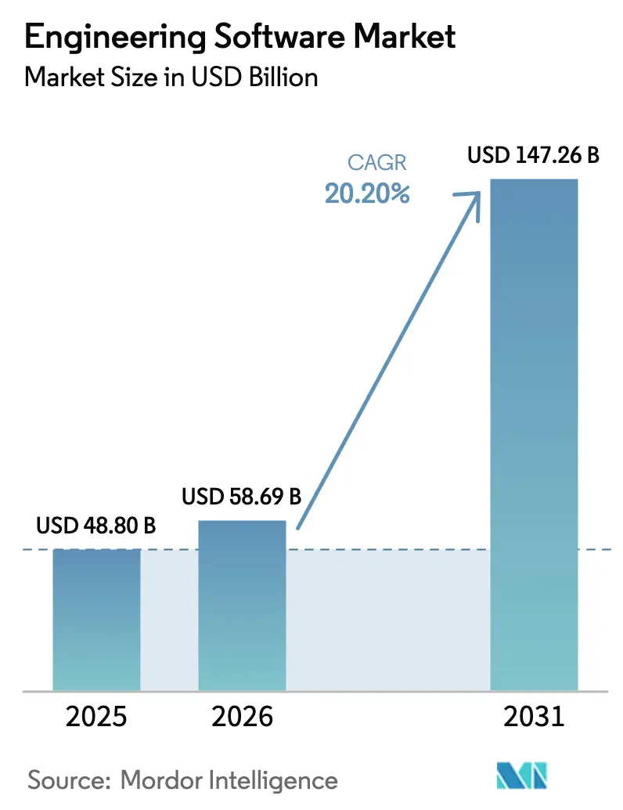
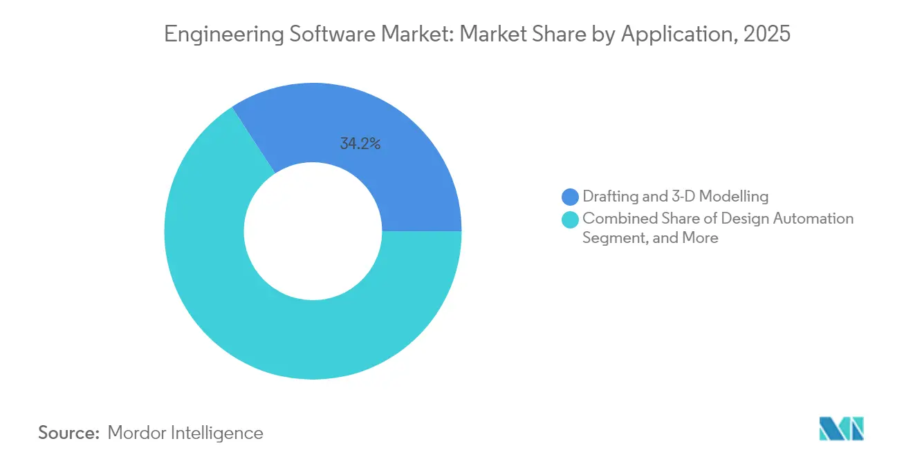
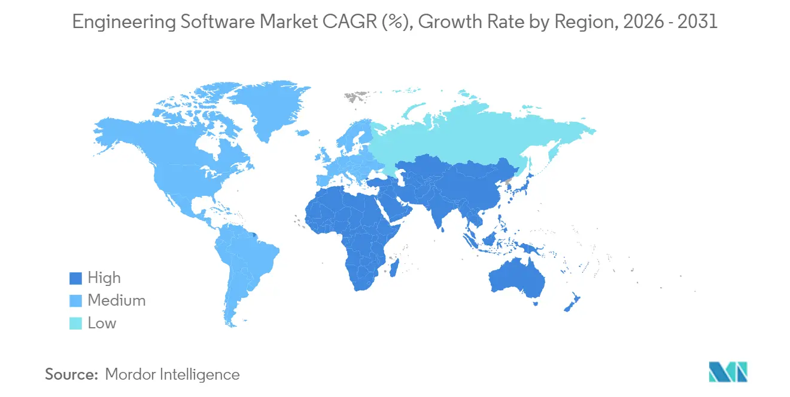
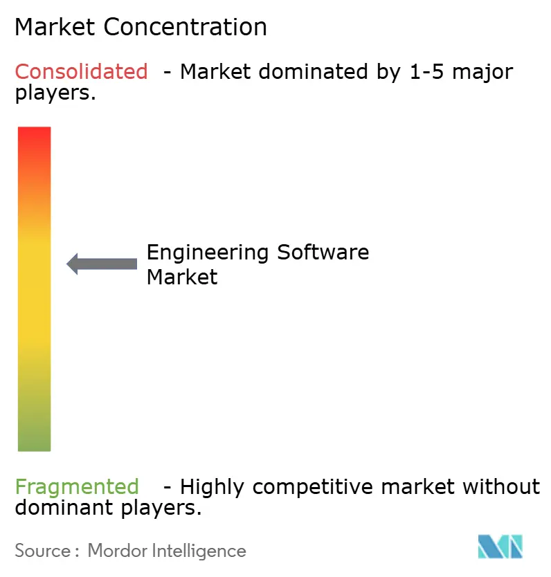

# ENGINEERING SOFTWARE MARKET SIZE & SHARE ANALYSIS - GROWTH TRENDS AND FORECAST (2026 - 2031)

> 原始素材条目：Engineering Software Market Size & Trends 2031（Mordor Intelligence）

> 原文链接：https://www.mordorintelligence.com/industry-reports/engineering-software-market

> 摘要：The Engineering Software Market worth USD 58.69 billion in 2026 is growing at a CAGR of 20.2% to reach USD 147.26 billion by 2031. Autodesk Inc., Siemens Digital Industries Software, Synopsys Inc., Dassault Systèmes SE and Bentley Systems Inc. are the major companies operating in this market.

## 正文

## Engineering Software Market Size and Share

### Market Overview

| Study Period | 2020 - 2031 |\n| --- | --- |\n| Market Size (2026) | USD 58.69 Billion |
| Market Size (2031) | USD 147.26 Billion |
| Growth Rate (2026 - 2031) | 20.20% CAGR |
| Fastest Growing Market | Asia Pacific |
| Largest Market | North America |
| Market Concentration | Medium |
| Major Players *Disclaimer: Major Players sorted in no particular order Image © Mordor Intelligence. Reuse requires attribution under CC BY 4.0. |

### Major Players

*Disclaimer: Major Players sorted in no particular order

Image © Mordor Intelligence. Reuse requires attribution under CC BY 4.0.

Compare market size and growth of Engineering Software Market with other markets in Technology, Media and Telecom Industry

## Engineering Software Market Analysis by Mordor Intelligence

Engineering software market size in 2026 is estimated at USD 58.7 billion, growing from 2025 value of USD 48.8 billion with 2031 projections showing USD 147.3 billion, growing at 20.2% CAGR over 2026-2031. Intensifying generative-AI integration slashes iteration cycles from hours to seconds while preserving 90% validation accuracy, easing the talent crunch that will leave India short by up to 1.9 million engineers by 2026. Cloud deployment is widening access for small and medium enterprises, and the 37% jump in 2024 industrial-software M&A reveals vendors racing to assemble end-to-end digital-twin stacks. Regional momentum comes from North America’s aerospace and automotive digital-twin uptake, China’s double-digit software revenue growth, and EU sustainability mandates that embed life-cycle assessment in every design decision. Competitive dynamics feature heavyweight suites from Autodesk, Dassault Systèmes and Siemens pitched against AI-native upstarts and cloud-first specialists.

### Key Report Takeaways

- By deployment, cloud-based solutions grew at 18.8% and now account for 45.70% of the engineering software market size, while on-premise still holds a 54.30% share in 2025.

- By product type, CAD software commanded 37.10% engineering software market share in 2025; CAE tools are set to expand at a 13.3% CAGR through 2031.

- By application, drafting and 3-D modelling captured 34.20% of the engineering software market size in 2025, whereas digital twin and simulation led growth at 14.0% CAGR.

- By end-user, automotive and transportation held 27.90% revenue share in 2025, but healthcare and medical devices is growing at 13.5% CAGR to 2031.

- Regionally, North America led with 32.10% engineering software market share in 2025 while APAC is advancing at 14.8% CAGR.

Note: Market size and forecast figures in this report are generated using Mordor Intelligence’s proprietary estimation framework, updated with the latest available data and insights as of 2026.

## Market Trends and Insights

### Drivers Impact Analysis of Engineering Software Market*

| DRIVER | ( ~ ) % IMPACT ON CAGR FORECAST | GEOGRAPHIC RELEVANCE | IMPACT TIMELINE |\n| --- | --- | --- | --- |\n| Cloud-based deployment becomes default | +3.2% | Global, early North America and EU | Medium term (2-4 years) |
| Rising CAD and 3-D use among SMEs | +2.8% | APAC core, spill-over to LatAm and MEA | Long term (≥ 4 years) |
| Simulation-driven digital-twin workflows | +4.1% | North America and EU, expanding to APAC | Medium term (2-4 years) |
| Subscription SaaS pricing widens adoption | +2.5% | Global | Short term (≤ 2 years) |
| Generative-AI design automation | +3.7% | North America and EU initially, rapid APAC rise | Short term (≤ 2 years) |
| Mandatory sustainability LCA integration | +1.9% | EU and APAC chiefly, North America spill-over | Long term (≥ 4 years) |
| Source: Mordor Intelligence |

#### Cloud-based deployment becomes default licensing model

Enterprises are shifting budget from servers to subscriptions as Siemens’ cloud-native Designcenter and Autodesk’s Token Flex show how continuous updates and global collaboration offset capital budgets. Two-thirds of manufacturers are already reskilling staff for these platforms, yet multi-tenant architectures raise IP-security questions, spurring hybrid models that keep sensitive work on-premise while outsourcing compute spikes to the cloud. Vendors that deliver zero-trust encryption and sovereign-cloud options will capture the hesitant segments of the engineering software market.

#### Growing adoption of CAD and 3-D modelling across SMEs

Affordable SaaS tiers are opening the engineering software market to millions of small firms: Kenyan case studies show productivity jumps once manual drafting is replaced with digital files. Yet OECD data confirm that financial and skills gaps still obstruct uptake, highlighting a need for low-code design wizards and built-in training. Where vendors wrap onboarding, templates, and partner ecosystems into the license, they compress time-to-value and expand the engineering software market faster in price-sensitive economies.

#### Simulation-driven digital-twin engineering workflows

Aerospace programs now match physical and virtual twins with 99.99% fidelity, trimming inspection by 45% and lifting first-time-right builds by 60%. Healthcare twins deliver patient-specific treatment vectors, and additive-manufacturing twins help factories model spare-parts logistics. The cadence of real-world data into design means simulation modules must sit natively inside CAD suites, anchoring a rich seam of recurring revenue inside the engineering software market.

#### Subscription–SaaS price model expands addressable base

PTC’s move to subscriptions lifted ARR to USD 1.27 billion and grew recurring revenue 26%, validating pay-as-you-go licences that flex with project peaks. ANSYS’ Elastic Licensing bills hourly compute, letting startups spin up high-end solvers without cap-ex. As long-term total cost often exceeds perpetual models, vendors must prove a pipeline of features and cloud optimizations that justify renewal, a cornerstone in stabilizing the engineering software market.

### Restraints Impact Analysis of Engineering Software Market*

| RESTRAINT | ( ~ ) % IMPACT ON CAGR FORECAST | GEOGRAPHIC RELEVANCE | IMPACT TIMELINE |\n| --- | --- | --- | --- |\n| High licence & training costs | -2.1% | Global, acute for SMEs in emerging markets | Short term (≤ 2 years) |
| Shortage of specialised CAE/CAD talent | -1.8% | Global, most acute North America & EU | Long term (≥ 4 years) |
| IP-security concerns on cloud | -1.3% | Global, strong in defense & aerospace | Medium term (2-4 years) |
| Interoperability gaps across AI-native tools | -0.9% | Global, rising as AI adoption accelerates | Short term (≤ 2 years) |
| Source: Mordor Intelligence |

#### High upfront licence and training costs for advanced suites

Enterprise-class simulation bundles from ANSYS push beyond USD 2.8 billion in annual sales, reflecting price points that few SMEs can absorb without staggered ROI. Training magnifies the hurdle because 65% of manufacturers are reskilling for new tools, inflating onboarding budgets. Although subscriptions spread expense, all-in ownership sometimes outstrips legacy perpetual licences, slowing the engineering software market in cost-sensitive regions.

#### Global shortage of specialised CAE/CAD talent

India alone needs up to 1.9 million extra engineers by 2026, while the US construction lists 382,000 monthly vacancies, illustrating a global supply lag. Without seasoned users, sophisticated suites lie underutilized, capping productivity gains. Automation raises baseline efficiency but cannot fully substitute domain insight, throttling the engineering software market where education pipelines trail demand.

*Our forecasts treat driver/restraint impacts as directional, not additive. The impact forecasts reflect baseline growth, mix effects, and variable interactions.

## Engineering Software Market Segment Analysis

### By Type:

The engineering software market size reached USD 18.11 billion for CAD tools in 2025, equal to 37.10% of total revenue, underscoring their role as the industry’s baseline workspace. Continuous usage-based upgrades keep these tools sticky across architecture, mechanical, and industrial design teams. Generative-AI sketching accelerates concept formation, yet downstream manufacturability remains contingent on precise parametric CAD, preserving its primacy in workflows.

Computer-Aided Engineering solutions are scaling at 13.3% CAGR to 2031 on the back of AI-powered solvers that slash compute time by blending physics-based simulation with surrogate models. As multidisciplinary optimisation embeds inside broader platforms, CAE’s share of the engineering software market revenue is projected to close the gap with CAD. CAM, PLM, and EDA suites provide essential continuity into production, yet their growth rates trail the flagship CAD and CAE categories because many customers already license basic modules and add incremental seats only as programmes scale.

Image © Mordor Intelligence. Reuse requires attribution under CC BY 4.0.

### By Deployment:

On-premise installations still hold 54.30% engineering software market share as of 2025, supported by entrenched infrastructure in defence, heavy machinery, and aerospace firms guarding classified IP. Local compute clusters also ensure deterministic performance for dense, multi-physics simulations that can swamp bandwidth-limited locations.

Cloud deployments are expanding at 18.8% CAGR because subscription billing, instant scaling, and browser access appeal to SMEs and globally distributed teams. The engineering software market size for cloud seats is forecast to surpass USD 92.4 billion by 2031 as compliance-ready sovereign clouds and confidential computing mature. Hybrid architecture is becoming the default: design vaults reside on-premise while burst capacity routes to encrypted cloud nodes, satisfying IT policy without forfeiting elasticity. Vendors that provide transparent license roaming between environments will temper churn risk and capture longer lifetime value.

### By Application:

Drafting and 3-D modelling delivered 34.20% revenue in 2025, yet their growth is plateauing as these capabilities saturate design functions. Value now concentrates on integrated simulation workflows where digital twins compare live sensor data with virtual models to predict field performance.

Digital twin and simulation platforms are advancing at a 14.0% CAGR, widening the engineering software market size for predictive analytics modules. As-built data syncs back into design intent, shrinking warranty costs and feeding circular-economy objectives. Design automation and plant-process modelling address sector-specific needs—process chemical plants, energy grids, or smart buildings—but the lines blur once unified data models underpin all assets in a single environment. Enterprises demanding closed-loop verification will prioritise vendors excelling in twin fidelity, real-time data ingestion, and cross-disciplinary interoperability.

Image © Mordor Intelligence. Reuse requires attribution under CC BY 4.0.

### By End-user Industry:

Automotive and transportation cornered 27.90% of the engineering software market share in 2025, reflecting decades of embedded CAD and CAE practice. Electric-vehicle chassis, ADAS electronics, and lightweight composites keep seat counts high, yet growth moderates as tools already blanket most OEM tiers.

The healthcare and medical devices segment is scaling at 13.5% CAGR as FDA’s AI-SaMD guidelines clear pathways for software-based diagnostics that rely on heart-flow and organ-replica twins. Digital twins reduce clinical trial loops, pushing the engineering software market into regulated clinical workflows once viewed as outside core engineering. Aerospace and defence sustains premium licence density because programmes demand certified traceability and ITAR-aligned hosting. Construction and infrastructure depends on BIM coordination: studies show up to 40% clash reduction when 5-D BIM permeates contractors. Semiconductor, energy, and heavy equipment verticals likewise intensify simulation spending as component complexity and decarbonisation targets expand modelling scope.

## Geography Analysis

### North America Engineering Software Market

North America generated 32.10% of the engineering software market revenue in 2025, buoyed by aerospace and automotive pioneers that embed twins across the product lifecycle and factory operations. The region’s policy leadership in AI-enabled medical devices creates spill-over demand from healthcare OEMs, while Canada’s clean-electricity roadmap triggers demand for renewable-energy design suites. Venture investment continues to seed AI-native startups, intensifying competition.

### Europe Engineering Software Market

APAC records the fastest cadence at 14.8% CAGR, with China’s software revenue topping 98,281 billion yuan in the first nine months of 2024 and local champions increasing R&D budgets to close feature gaps with Western majors. India’s engineer shortfall stimulates demand for AI-assisted tools, while Japan and South Korea drive EDA innovation for advanced node semiconductors. As Southeast Asian governments court manufacturing shifts, SMEs there adopt cloud subscriptions, widening the engineering software market footprint. Europe maintains stringent sustainability laws that oblige every OEM to run embedded LCA before product release, converting compliance cost into software spend. Nordic harmonisation of building-lifecycle data amps BIM uptake, and German industrial exporters integrate digital twins for remote service optimisation. Data-sovereignty rules shape cautious cloud adoption, nudging vendors toward multi-tenant instances within EU borders to safeguard IP.

Image © Mordor Intelligence. Reuse requires attribution under CC BY 4.0.

## Regulatory Landscape

Engineering software vendors operate under product-safety, cybersecurity, software-quality, and trade compliance requirements that vary by end-user industry and geography. In automotive, evolving rules and technical regulations for automated driving systems affect validation and traceability features embedded in simulation, digital twin, and requirements management workflows. For example, UN WP.29 activity on globally harmonized requirements for autonomous-vehicle performance increases the emphasis on repeatable verification evidence across toolchains.

Across industries, widely adopted engineering standards for software and systems processes influence procurement criteria and quality-management expectations, including the 2026 updates to ISO/IEC/IEEE 12207 (software life cycle processes), IEEE 730-2026 (software quality assurance), and ISO/IEC/IEEE 24748-4:2026 (systems engineering management planning). Vendors with global customer bases also need to maintain export-control and sanctions compliance for software delivery and cloud access controls, including U.S. Bureau of Industry and Security and OFAC requirements. Enterprise cloud terms further codify cybersecurity and data-handling obligations, as reflected in Siemens Digital Industries Software updates to its software terms during April and June 2026.

## Competitive Landscape

The engineering software market features a moderate concentration anchored by three platform leaders—Autodesk, Dassault Systèmes, and Siemens—whose combined installed base locks in training ecosystems and data gravity. Siemens’ USD 10 billion Altair acquisition in 2024 deepened AI simulation breadth while creating the industry’s most expansive PLM-to-shop-floor stack. Autodesk sustains brand reach through AutoCAD ubiquity and accelerates cloud migration via Forge microservices.

Competitive tension rises from AI-native players offering text-to-CAD generation or browser-only BIM, often at sub-USD 100 monthly tiers. These specialists address narrow pain points, such as generative massing studies or PCB co-design, then expand horizontally. Switching costs remain high: model histories, libraries, and macros entrench incumbents, but SaaS free tiers encourage experimentation, especially in emerging markets where software piracy historically eroded revenues. M&A tallied 86 deals in 2024, showing incumbents prefer acquisition over internal build to plug portfolio gaps.

Strategic themes include embedding LCA and ESG analytics, zero-trust cloud architectures and low-code configurators that democratise design among non-engineers. Significant white space persists in SME enablement where complex UIs still intimidate first-time buyers. Vendors that balance simplicity, compliance and AI-augmented productivity will expand their slice of the engineering software market ahead of peers tethered to legacy desktop models.

### Engineering Software Industry Leaders

- Autodesk Inc.

Autodesk Inc.

- Siemens Digital Industries Software

Siemens Digital Industries Software

- Synopsys Inc.

Synopsys Inc.

- Dassault Systèmes SE

Dassault Systèmes SE

- Bentley Systems Inc.

Bentley Systems Inc.

- *Disclaimer: Major Players sorted in no particular order

Image © Mordor Intelligence. Reuse requires attribution under CC BY 4.0.

### Engineering Software Market Companies Covered in this Report

- Autodesk Inc.

- Dassault Systèmes SE

- Siemens Digital Industries Software

- Bentley Systems Inc.

- PTC Inc.

- ANSYS Inc.

- Synopsys Inc.

- Hexagon AB (Intergraph)

- Trimble Inc.

- AVEVA Group

- IBM Corporation

- SAP SE

- HCLTech

- Altair Engineering Inc.

- Oracle Corporation

- Rockwell Automation Inc.

- Geometric Ltd.

- Tech Soft 3D

- Aspen Tech

Read Analysis of Engineering Software Companies

## Market Opportunities and Future Outlook

A core opportunity is the shift from selling stand-alone engineering applications toward integrated platforms that connect design, simulation, manufacturing, and operations in a single data model, often positioned as an industrial operating system. This theme is reinforced by consolidation and portfolio build-outs, including Siemens broadening its stack via its Altair acquisition in 2024, and by platform moves that extend engineering data into operations, such as Autodesk announcing a definitive agreement in May 2026 to acquire MaintainX as part of a unified platform strategy. As customers push for closed-loop digital threads, from design intent to as-built to in-service, vendors that reduce friction across CAD, CAE, PLM, MES, and enterprise systems have whitespace to capture spend currently distributed across disconnected tools and services.

A second whitespace is AI-native workflow automation and agent-assisted engineering, where a large startup ecosystem attacks specific bottlenecks like concept generation, translation, and repetitive-task automation before expanding horizontally. Evidence of scale in this challenger layer includes reports of more than 600 engineering software startups backed by about USD 15.7 billion in venture capital, increasing pressure on incumbent UX, onboarding, and interoperability. At the same time, cloud execution and data governance remain differentiators for regulated industries and IP-sensitive programs, supporting offerings that pair secure hybrid deployment with auditable software-quality practices aligned with the 2026 standards updates (ISO/IEC/IEEE 12207 and IEEE 730), while enabling integration patterns for concurrent, distributed engineering across partners.

## Recent Industry Developments in Engineering Software Market

- July 2026: Siemens to acquire Defacto Technologies to enhance its electronic design automation (EDA) portfolio with automated SoC design creation capabilities. The acquisition strengthens EDA tools and AI-driven chip design capabilities. The move expands Siemens' footprint in design-to-manufacture AI-enabled workflow.

- June 2026: Autodesk signed a strategic collaboration agreement with Amazon Web Services (AWS) to advance cloud-based design and make solutions. The collaboration enables cloud-enabled design-to-development workflow scalability. It deepens Autodesk cloud strategy and SaaS adoption among engineers.

- May 2026: Autodesk entered into a definitive agreement to acquire MaintainX for approximately $3.6 billion to advance its operations-focused platform strategy. The acquisition advances Autodesk's operations-focused platform capabilities within its engineering software portfolio. It consolidates Autodesk's operations management offering across its product suite.

## Table of Contents for Engineering Software Industry Report

1. INTRODUCTION

- 1.1 Study Assumptions and Market Definition

- 1.2 Scope of the Study

2. RESEARCH METHODOLOGY

3. EXECUTIVE SUMMARY

4. MARKET LANDSCAPE

- 4.1 Market Overview

- 4.2 Market Drivers 4.2.1 Cloud-based deployment becomes default licensing model 4.2.2 Growing adoption of CAD and 3D modelling across SMEs 4.2.3 Simulation-driven digital-twin engineering workflows 4.2.4 Subscription-SaaS price model expands addressable base 4.2.5 Generative-AI assisted design automation unlocks productivity 4.2.6 Mandatory sustainability LCA modules in EU and Asia-Pacific design codes

- 4.2.1 Cloud-based deployment becomes default licensing model

- 4.2.2 Growing adoption of CAD and 3D modelling across SMEs

- 4.2.3 Simulation-driven digital-twin engineering workflows

- 4.2.4 Subscription-SaaS price model expands addressable base

- 4.2.5 Generative-AI assisted design automation unlocks productivity

- 4.2.6 Mandatory sustainability LCA modules in EU and Asia-Pacific design codes

- 4.3 Market Restraints 4.3.1 High upfront licence and training costs for advanced suites 4.3.2 Global shortage of specialised CAE/CAD talent 4.3.3 IP-security concerns on multi-tenant cloud platforms 4.3.4 Format / data-model interoperability gaps across AI-native tools

- 4.3.1 High upfront licence and training costs for advanced suites

- 4.3.2 Global shortage of specialised CAE/CAD talent

- 4.3.3 IP-security concerns on multi-tenant cloud platforms

- 4.3.4 Format / data-model interoperability gaps across AI-native tools

- 4.4 Regulatory Landscape

- 4.5 Technological Outlook

- 4.6 Porter's Five Forces Analysis 4.6.1 Bargaining Power of Suppliers 4.6.2 Bargaining Power of Buyers 4.6.3 Threat of New Entrants 4.6.4 Threat of Substitutes 4.6.5 Intensity of Competitive Rivalry

- 4.6.1 Bargaining Power of Suppliers

- 4.6.2 Bargaining Power of Buyers

- 4.6.3 Threat of New Entrants

- 4.6.4 Threat of Substitutes

- 4.6.5 Intensity of Competitive Rivalry

5. MARKET SIZE AND GROWTH FORECASTS (VALUE)

- 5.1 By Type 5.1.1 Computer-Aided Design (CAD) Software 5.1.2 Computer-Aided Engineering (CAE) Software 5.1.3 Computer-Aided Manufacturing (CAM) Software 5.1.4 Architecture, Engineering and Construction (AEC/BIM) Software 5.1.5 Electronic Design Automation (EDA) Software 5.1.6 Product Lifecycle Management (PLM) Software 5.1.7 Geotechnical/Infrastructure Engineering Software

- 5.1.1 Computer-Aided Design (CAD) Software

- 5.1.2 Computer-Aided Engineering (CAE) Software

- 5.1.3 Computer-Aided Manufacturing (CAM) Software

- 5.1.4 Architecture, Engineering and Construction (AEC/BIM) Software

- 5.1.5 Electronic Design Automation (EDA) Software

- 5.1.6 Product Lifecycle Management (PLM) Software

- 5.1.7 Geotechnical/Infrastructure Engineering Software

- 5.2 By Deployment 5.2.1 On-premise 5.2.2 Cloud 5.2.3 Hybrid

- 5.2.1 On-premise

- 5.2.2 Cloud

- 5.2.3 Hybrid

- 5.3 By Application 5.3.1 Design Automation 5.3.2 Plant and Process Design 5.3.3 Product Design, Testing and Digital Twin 5.3.4 Drafting and 3-D Modelling 5.3.5 Other Specialised Applications

- 5.3.1 Design Automation

- 5.3.2 Plant and Process Design

- 5.3.3 Product Design, Testing and Digital Twin

- 5.3.4 Drafting and 3-D Modelling

- 5.3.5 Other Specialised Applications

- 5.4 By End-user Industry 5.4.1 Automotive and Transportation 5.4.2 Aerospace and Defence 5.4.3 Industrial Machinery and Heavy Equipment 5.4.4 Construction and Infrastructure 5.4.5 Electronics and Semiconductor 5.4.6 Energy and Utilities 5.4.7 Healthcare and Medical Devices 5.4.8 Others

- 5.4.1 Automotive and Transportation

- 5.4.2 Aerospace and Defence

- 5.4.3 Industrial Machinery and Heavy Equipment

- 5.4.4 Construction and Infrastructure

- 5.4.5 Electronics and Semiconductor

- 5.4.6 Energy and Utilities

- 5.4.7 Healthcare and Medical Devices

- 5.4.8 Others

- 5.5 By Geography 5.5.1 North America 5.5.1.1 United States 5.5.1.2 Canada 5.5.1.3 Mexico 5.5.2 South America 5.5.2.1 Brazil 5.5.2.2 Argentina 5.5.2.3 Rest of South America 5.5.3 Europe 5.5.3.1 Germany 5.5.3.2 United Kingdom 5.5.3.3 France 5.5.3.4 Italy 5.5.3.5 Spain 5.5.3.6 Russia 5.5.3.7 Rest of Europe 5.5.4 Asia-Pacific 5.5.4.1 China 5.5.4.2 Japan 5.5.4.3 India 5.5.4.4 South Korea 5.5.4.5 South-East Asia 5.5.4.6 Rest of Asia-Pacific 5.5.5 Middle East and Africa 5.5.5.1 Middle East 5.5.5.1.1 Saudi Arabia 5.5.5.1.2 United Arab Emirates 5.5.5.1.3 Turkey 5.5.5.1.4 Rest of Middle East 5.5.5.2 Africa 5.5.5.2.1 South Africa 5.5.5.2.2 Nigeria 5.5.5.2.3 Rest of Africa

- 5.5.1 North America

- 5.5.1.1 United States

- 5.5.1.2 Canada

- 5.5.1.3 Mexico

- 5.5.2 South America

- 5.5.2.1 Brazil

- 5.5.2.2 Argentina

- 5.5.2.3 Rest of South America

- 5.5.3 Europe

- 5.5.3.1 Germany

- 5.5.3.2 United Kingdom

- 5.5.3.3 France

- 5.5.3.4 Italy

- 5.5.3.5 Spain

- 5.5.3.6 Russia

- 5.5.3.7 Rest of Europe

- 5.5.4 Asia-Pacific

- 5.5.4.1 China

- 5.5.4.2 Japan

- 5.5.4.3 India

- 5.5.4.4 South Korea

- 5.5.4.5 South-East Asia

- 5.5.4.6 Rest of Asia-Pacific

- 5.5.5 Middle East and Africa

- 5.5.5.1 Middle East

- 5.5.5.1.1 Saudi Arabia

- 5.5.5.1.2 United Arab Emirates

- 5.5.5.1.3 Turkey

- 5.5.5.1.4 Rest of Middle East

- 5.5.5.2 Africa

- 5.5.5.2.1 South Africa

- 5.5.5.2.2 Nigeria

- 5.5.5.2.3 Rest of Africa

6. COMPETITIVE LANDSCAPE

- 6.1 Market Concentration Analysis

- 6.2 Strategic Moves (MandA, Funding, Partnerships)

- 6.3 Market Share Analysis

- 6.4 Company Profiles (includes Global level Overview, Market level overview, Core Segments, Financials as available, Strategic Information, Market Rank/Share, Products and Services, Recent Developments) 6.4.1 Autodesk Inc. 6.4.2 Dassault Systèmes SE 6.4.3 Siemens Digital Industries Software 6.4.4 Bentley Systems Inc. 6.4.5 PTC Inc. 6.4.6 ANSYS Inc. 6.4.7 Synopsys Inc. 6.4.8 Hexagon AB (Intergraph) 6.4.9 Trimble Inc. 6.4.10 AVEVA Group 6.4.11 IBM Corporation 6.4.12 SAP SE 6.4.13 HCLTech 6.4.14 Altair Engineering Inc. 6.4.15 Oracle Corporation 6.4.16 Rockwell Automation Inc. 6.4.17 Geometric Ltd. 6.4.18 Tech Soft 3D 6.4.19 Aspen Tech

- 6.4.1 Autodesk Inc.

- 6.4.2 Dassault Systèmes SE

- 6.4.3 Siemens Digital Industries Software

- 6.4.4 Bentley Systems Inc.

- 6.4.5 PTC Inc.

- 6.4.6 ANSYS Inc.

- 6.4.7 Synopsys Inc.

- 6.4.8 Hexagon AB (Intergraph)

- 6.4.9 Trimble Inc.

- 6.4.10 AVEVA Group

- 6.4.11 IBM Corporation

- 6.4.12 SAP SE

- 6.4.13 HCLTech

- 6.4.14 Altair Engineering Inc.

- 6.4.15 Oracle Corporation

- 6.4.16 Rockwell Automation Inc.

- 6.4.17 Geometric Ltd.

- 6.4.18 Tech Soft 3D

- 6.4.19 Aspen Tech

7. MARKET OPPORTUNITIES AND FUTURE OUTLOOK

- 7.1 White-space and Unmet-need Assessment

## Engineering Software Market Report Scope and Research Methodology

### Market Definition and Coverage

This market covers revenue earned from engineering software used to design, model, simulate, validate, and manage engineering work across industries, regardless of whether the tools are delivered on premises or through the cloud.

Scope exclusions: We exclude general IT services not tied to engineering software use (such as broad consulting, custom app development, and infrastructure-only spend).

### Segments Covered in This Report

### Data Sources, Market Sizing, and Validation

### Market-Sizing & Forecasting

### Data Validation & Update Cycle

### Mordor Intelligence's Engineering Software Market Size Compared Against Other Published Estimates

## Key Questions Answered in the Report

Page last updated on: August 12, 2026

## 图片

### 图片 1：Major players in Engineering Software industry

原图：https://s3.mordorintelligence.com/engineering-software-market/engineering-software-market_1671218741180_Picture1.webp

### 图片 2：Engineering Software Market (2025 - 2030)

原图：https://s3.mordorintelligence.com/engineering-software-market/engineering-software-market-size-image-1775122224570.webp

### 图片 3：Engineering Software Market: Market Share by Type, 2025

原图：https://s3.mordorintelligence.com/engineering-software-market/engineering-software-market-Engineering-Software-Market-Market-Share-by-Type-2025-1767799843525.webp

### 图片 4：Engineering Software Market: Market Share by Application, 2025

原图：https://s3.mordorintelligence.com/engineering-software-market/engineering-software-market-Engineering-Software-Market-Market-Share-by-Application-2025-1767799849257.webp

### 图片 5：Engineering Software Market

原图：https://s3.mordorintelligence.com/engineering-software-market/engineering-software-market-Engineering-Software-Market-CAGR--Growth-Rate-by-Region-2026---2031-1767799854381.webp

### 图片 6：Pic 2.png

原图：https://s3.mordorintelligence.com/engineering-software-market/engineering-software-market-competitive-landscape-1750132227891.webp

## 抓取记录

- 页面标题：ENGINEERING SOFTWARE MARKET SIZE & SHARE ANALYSIS - GROWTH TRENDS AND FORECAST (2026 - 2031)
- 抓取状态：ok
- 成功下载图片：6
- 图片失败：0
- 处理耗时：8.3 秒