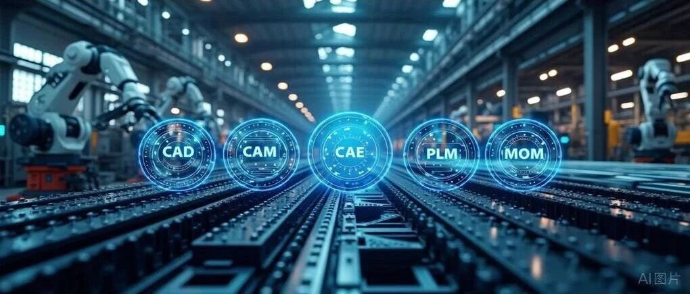

# 全球工业软件Top5：制造业的数字底座

> 原始素材条目：全球工业软件 Top5（软服之家）

> 原文链接：https://www.ruanfujia.com/post/11582066

> 摘要：全球工业软件Top5 NO.1 Siemens - 西门子数字化工业软件 总部：德国 核心产品：NX、Teamcenter、Simcenter 工业软件相关收入：约70+亿美元 典型应用。

## 正文

# 全球工业软件Top5：制造业的数字底座

全球工业软件Top5

## NO.1 Siemens – 西门子数字化工业软件

总部：德国 核心产品：NX、Teamcenter、Simcenter 工业软件相关收入：约70+亿美元 典型应用场景：高铁、核电、大飞机、工业物联网

最新动态：

- 2025年3月，西门子完成对 Altair Engineering 的 100 亿美元收购，进一步强化仿真与 AI 能力。

2025年3月，西门子完成对 Altair Engineering 的 100 亿美元收购，进一步强化仿真与 AI 能力。

## NO.2 Dassault Systèmes – 达索系统

总部：法国 核心产品：CATIA、SOLIDWORKS、ENOVIA、3DEXPERIENCE 工业软件相关收入：约60+亿美元 典型应用场景：飞机、汽车、船舶、电池结构设计

## NO.3 Autodesk – 欧特克

总部：美国 核心产品：AutoCAD、Inventor、Revit、Fusion 360 工业软件相关收入：约55+亿美元 典型应用场景：建筑BIM、机械设计、工厂数字化交付

## NO.4 Ansys-安似科技

总部：美国 核心产品：Mechanical、Fluent、HFSS、optiSLang 工业软件相关收入：约25+亿美元 典型应用场景：结构仿真、电池热失控、芯片封装

最新动态：

- 2025年7月，Ansys 被 Synopsys 以 350 亿美元收购，品牌与产品线保持独立运营；

2025年7月，Ansys 被 Synopsys 以 350 亿美元收购，品牌与产品线保持独立运营；

- 2025年11月，Synopsys 宣布裁员 10% 以优化整合。

2025年11月，Synopsys 宣布裁员 10% 以优化整合。

## NO.5 PTC – 参数技术

总部：美国 核心产品：Creo、Windchill、ThingWorx 工业软件相关收入：约23亿美元 典型应用场景：高科技电子、机械设备、PLM

最新动态：

- 2025年11月，PTC宣布将 ThingWorx 与 Kepware IoT 业务出售给 TPG，交易价值 7.25 亿美元，预计 2026 上半年完成，以聚焦核心 PLM 与 CAD 业务。

2025年11月，PTC宣布将 ThingWorx 与 Kepware IoT 业务出售给 TPG，交易价值 7.25 亿美元，预计 2026 上半年完成，以聚焦核心 PLM 与 CAD 业务。

—THE END—

## 图片

### 图片 1

原图：https://img.rfjia.cn/wp-content/uploads/2026/01/%E5%85%A8%E7%90%83%E5%B7%A5%E4%B8%9A%E8%BD%AF%E4%BB%B6Top5%EF%BC%9A%E5%88%B6%E9%80%A0%E4%B8%9A%E7%9A%84%E6%95%B0%E5%AD%97%E5%BA%95%E5%BA%A7.png

## 抓取记录

- 页面标题：全球工业软件Top5：制造业的数字底座
- 抓取状态：ok
- 成功下载图片：1
- 图片失败：0
- 处理耗时：5.3 秒