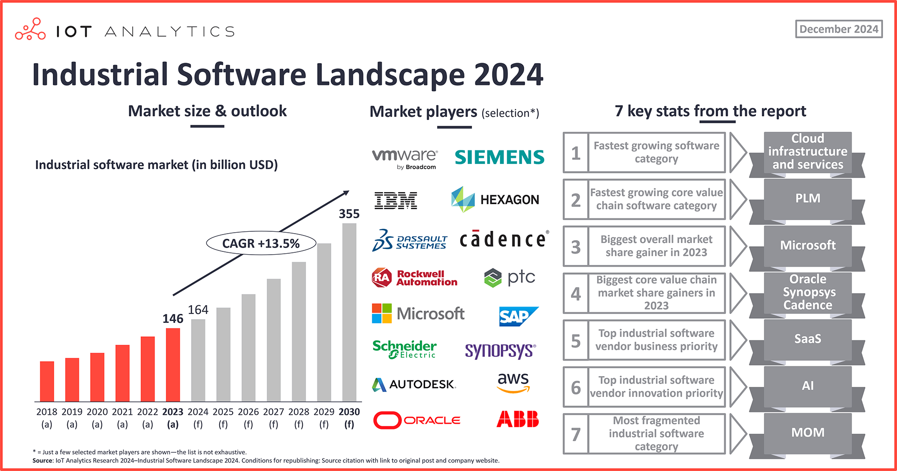

# The industrial software market landscape: 7 key statistics going into 2025

> 原始素材条目：The industrial software market landscape: 7 key statistics（IoT Analytics）

> 原文链接：https://iot-analytics.com/industrial-software-market-landscape/

> 摘要：The global industrial software market reached $146 billion in 2023 and is forecasted to reach $355 billion by the end of the decade [...]

## 正文

- Log In

- FAQ

- Contact

- Our Coverage

- Reports & Databases

- Market Data

- Pricing

- Research Blog

- About

- REQUEST A DEMO

# The industrial software market landscape: 7 key statistics going into 2025

In short

- The global industrial software market reached $146 billion in 2023, according to IoT Analytics’ 132-page Industrial Software Landscape Report 2024–2030, and is forecasted to reach $355 billion by the end of the decade, growing at a CAGR of 13.5%.

- Cloud infrastructure and services is the fastest-growing overall industrial software category, while EDA is set to be the fastest for the core industrial value chain software category.

- Microsoft gained the most overall market share since 2021, while Oracle, Synopsys, and Cadence Design Systems gained the most in the “core industrial value chain software” segment.

- SaaS is the top vendor business priority, and AI and generative AI are the top innovation priorities.

Why it matters

- For industrial software vendors: With cloud vendors gaining market share and EDA, CAD, and PLM tools gaining importance in the market, vendors need to reassess competitive dynamics, key partnerships, and their technology foundations.

- For industrial software adopters: Some vendors are gaining market share because they are simply better than their competitors. Adopters should watch for the best solutions in the market and technological changes related to SaaS and AI.

## Industrial software market and outlook

2024 has been a challenging year for manufacturing technology vendors. Throughout 2023 and 2024, economic concerns have remained the most discussed topics in CEO earnings calls. As a result, enterprise spending on IT and OT grew slower than in previous years across the board, with industrial automation hardware even seeing market declines across the board (e.g., industrial connectivity hardware, which is forecasted to decline more than 5% in 2024). In May 2024, the CEO of Siemens–one of the top 5 industrial software companies, reported muted industrial demands, and in November, Siemens reported a 26% year-over-year revenue decline for their industrial automation business and announced a cut of up to 5,000 jobs worldwide. The bright spot in Siemens’ portfolio is its industrial software segment (Siemens PLM), which grew 7% in the same timeframe.

Global industrial software market expected to surpass $160 billion in 2024 amid turbulence. Despite recent weakness in the market, IoT Analytics forecasts 12% growth in 2024—surpassing $160 billion—and 13.5% CAGR until 2030, driven by continued spending growth of manufacturers on cloud infrastructure and related services (more on this below).

The insights from this article are based on

Industrial Software Landscape 2024–2030

A 132-page report detailing the industrial software market size and forecast, market shares, vendor strategies, deep dives per software category, and overarching trends.

Download a sample to learn more about the report structure, select definitions, select market data, additional data points, and trends.

Already a subscriber? View your reports here →

The industrial software market: The 14 main categories

When considering what comprises the industrial software market, IoT Analytics breaks the market into two segments: 1) core industrial value chain software and 2) general & overarching software. Together, these segments have 5 software groups and 14 software categories.

Segment 1: Core industrial value chain

Design and engineering

- Computer-aided design (CAD)

- Electronic design automation (EDA)

- Product lifecycle management (PLM)

Manufacturing

- Machine control

- Manufacturing operations management (MOM)

- Enterprise asset management (EAM)

Supply chain

- Supply chain planning and design

- Supply chain execution

Service

- Field service

Segment 2: General & overarching software (its own group)

- Cloud infrastructure and services (I&S)

- Cybersecurity

- Virtualization

- Remote access

- Data & analytics

Note: The market sizing only considers the spending of industrial companies for the respective software categories (i.e., all manufacturers, including oil & gas, mining, and logistics).

Overarching manufacturing software is outgrowing core industrial value chain software. In 2023, the core industrial value chain software segment comprised 54% of the global industrial software market. IoT Analytics forecasts both segments to be near equal by the end of 2024, and starting in 2025, the general & overarching software is expected to take a larger share of the overall industrial software market.

## 7 key industrial market stats

Here are 7 key stats on the current state of the Industrial Software Landscape:

### Stat 1: Fastest growing software category overall: Cloud infrastructure and services

The industrial cloud infrastructure and services software category reached $32.7 billion in 2023 (i.e., cloud infrastructure and services for manufacturers and other industrial companies). Cloud services continue to be the biggest market driver as manufacturers shift key software workloads into the cloud and adopt SaaS solutions. The cloud is also starting to emerge as the go-to place for running manufacturing data analytics and AI, as noted by several CEOs of major cloud vendors:

> “Where do we expect Oracle Cloud Infrastructure to go from here? Frankly, the only limiting factor is our ability to get the data centers handed over and filled up fast enough. So, again, the demand is extraordinary, and we can build the data centers relatively fast. I expect the OCI growth rate to be over 50% in a few years.” Safra Ada Catz, CEO of Oracle, Q2 2024

“Where do we expect Oracle Cloud Infrastructure to go from here? Frankly, the only limiting factor is our ability to get the data centers handed over and filled up fast enough. So, again, the demand is extraordinary, and we can build the data centers relatively fast. I expect the OCI growth rate to be over 50% in a few years.”

Safra Ada Catz, CEO of Oracle, Q2 2024

> “Azure again took share as customers use our platforms and tools to build their own AI solutions. Overall, we are seeing an acceleration in the number of large Azure deals from leaders across industries, including billion-dollar-plus, multiyear commitments announced this month from Cloud Software Group and the Coca-Cola Company.” Satya Nadella, CEO of Microsoft, Q2 2024

“Azure again took share as customers use our platforms and tools to build their own AI solutions. Overall, we are seeing an acceleration in the number of large Azure deals from leaders across industries, including billion-dollar-plus, multiyear commitments announced this month from Cloud Software Group and the Coca-Cola Company.”

Satya Nadella, CEO of Microsoft, Q2 2024

### Stat 2: Fastest growing core value chain software category: Product Lifecycle Management (PLM)

Zooming in on the core value chain software segment, the PLM software category had the fastest growth between 2021 and 2023, growing at a 13.6% CAGR. While strong growth remains expected for PLM, the EDA software segment may take over as the “fastest growing core value chain software” category in the coming years. Driving EDA’s boost in share is the start of a new AI chipset super cycle, in which companies are using EDA software to design and simulate these new, high-power chips.

### Stat 3: Biggest overall market share gainer in 2023: Microsoft

US-based technology company Microsoft had a 13% share of the global industrial software market in 2023, a 2-percentage-point gain over its 2021 market share. Driving Microsoft’s industrial software market performance was its Azure cloud services deployed in manufacturing and industrial scenarios, which aligns with the growth of the cloud infrastructure and services category (other cloud services like AWS and Google also saw sizeable gains). Recent analysis from IoT Analytics found that Microsoft is leading in the cloud AI and cloud generative AI (GenAI) race.

### Stat 4: Biggest core value chain market share gainers: Oracle, Synopsys, and Cadence

When it comes to the companies that gained the most share in the core value chain software market since 2021, three companies saw the most at 0.6 percentage points each:

- Oracle, a US-based information technology company

- Synopsys, a US-based EDA solutions company

- Cadence Design Systems, a US-based EDA solutions company

Oracle’s market share gain is attributed to its supply chain planning, design, and execution software, its cloud services, and its field service software. Meanwhile, as EDA vendors, Synopsys and Cadence are benefitting from EDA’s market boost mentioned above.

### Stat 5: Top industrial software vendor business priority: SaaS

Industrial software vendors are increasingly focusing on expanding their SaaS revenue. Though few vendors publicly publish their SaaS revenue figures specifically, those who do have a common trait: they are currently increasing the share of SaaS in their overall revenue mix.

For example, for Germany-based enterprise software company SAP, SaaS comprised 41% of its revenue in 2023, up from 34% in 2022. SAP aims to have all its customers transitioned to cloud-based solutions by 2027, with a former head of product management noting in Q4 2023 that the company feels it “[does not] have a choice but to move to the cloud” and make its customers recognize that it is necessary.

Meanwhile, France-based 3D design and manufacturing software company Dassault Systèmes reported that 24% of its FY2023 software revenue was from cloud revenue, up 12% from FY2022.

> “We will continue to invest, enhancing the strong fundamentals of our business, driven by an increasing share of predictable revenue and an accelerating 3DEXPERIENCE and Cloud adoption.” Bernard Charlès, CFO, Dassault Systèmes in June 2023

“We will continue to invest, enhancing the strong fundamentals of our business, driven by an increasing share of predictable revenue and an accelerating 3DEXPERIENCE and Cloud adoption.”

Bernard Charlès, CFO, Dassault Systèmes in June 2023

### Stat 6: Top industrial software vendor innovation priority: AI and GenAI

Many of the leading industrial software vendors have made the introduction of GenAI capabilities their top strategic innovation priority for 2024. The analysis shows that 88% of the 180 leading industrial software vendors have now launched at least one new AI-based software feature, and many more are planning to release similar products. Examples of recent GenAI features in industrial software include:

- Manhattan Associates’ Active Mavin, a GenAI-powered customer service chatbot

- IBM’s Maximo Application Suite, which leverages IBM watsonx’s GenAI to improve asset management workflows

Key industrial software vendor quotes on AI/GenAI

> “There have been many hype cycles with technologies in the past, but with generative AI, it feels truly different. Customers see value very fast, and we keep on getting positive feedback.” Tony Hemmelgarn, CEO of Siemens Digital Industries Software

“There have been many hype cycles with technologies in the past, but with generative AI, it feels truly different. Customers see value very fast, and we keep on getting positive feedback.”

Tony Hemmelgarn, CEO of Siemens Digital Industries Software

> “Of course, I have to say that our 1st business priority is about Business AI now. It is, for us, key. We are not just developing AI for the sake of AI. We want to add value with new AI capabilities in our entire portfolio.” Salvatore Castro, Sr. director of digital manufacturing at SAP

“Of course, I have to say that our 1st business priority is about Business AI now. It is, for us, key. We are not just developing AI for the sake of AI. We want to add value with new AI capabilities in our entire portfolio.”

Salvatore Castro, Sr. director of digital manufacturing at SAP

*Note: IoT Analytics plans to publish its Generative AI report in December 2024. Those interested in accessing the report when it is released can sign up for IoT Analytics’ IoT Research Newsletter by clicking below.

### Stat 7: Most fragmented industrial software category: Manufacturing operations management (MOM)

Of all the industrial software category markets, MOM is the only one where no vendor has a 2-digit market share, indicating the market is highly fragmented yet highly competitive. A core reason is that different manufacturing sectors, such as automotive, electronics, pharmaceuticals, and food and beverage, have specific operational requirements. Similarly, manufacturers vary across regions in terms of specific technology used, regulatory requirements, and operational complexity. Further, manufacturers require varying functionalities, including production scheduling, quality management, maintenance, and inventory tracking.

With so much specificity and varying functional requirements, few vendors are capable of providing the full range of industry- and regional-specific requirements and meeting all operational needs. Therefore, many vendors specialize in distinct industrial or regional aspects, leading to more companies entering the market with solutions tailored to very targeted end users.

*Note: IoT Analytics plans to publish a MES market report in Q1 2025. Those interested in accessing the report when it is released can sign up for IoT Analytics’ IoT Research Newsletter by clicking below.

## Analyst opinion

Digital transformation and AI innovations set to drive long-term growth. Industrial software plays a key role in digital transformation in the manufacturing sector, and companies report strong ROI from introducing or expanding various industrial software tools. Further, AI is now showing its influence on software, specifically EDA, data analytics, and cloud, as well as in general. AI integration enhances software functionality, offering greater efficiency and insights (thus, value) to end users. Whether vendors will succeed in monetizing those new features remains to be seen, as it is not clear whether customers will expect AI features to be part of standard offerings in the near future or whether they are willing to pay a premium for AI features.

Software boundaries are fading. Enterprises are decreasingly using large, well-defined, on-premises software suites with limited interoperability. During the last decade, software suites have become more integrated—and sometimes overlapping—with added application elements being delivered from the (public) cloud and, in some cases, at the edge. This trend offers end users the flexibility of selecting the specific capabilities they need without necessarily purchasing a large, all-encompassing software suite. One future scenario is that large software suites (such as a full-scale MOM suite) may get entirely replaced by a bundle of small SaaS applications that can run anywhere and be procured from edge or cloud marketplaces, such as AWS Marketplace in the cloud or BoschRexroth ctrlX marketplace at the edge.

General & overarching software outgrowing value chain-specific software. Industrial software applications that are not tied to a specific industrial value chain step (e.g., general data analytics or cybersecurity) are currently outgrowing those that are value chain specific (e.g., CAD for design or MOM for manufacturing) as companies see the biggest need in procuring holistic cybersecurity solutions or overarching cloud and data analytics solutions that set them up for a future where data is the key currency.

The best software companies assist their customers in moving to the cloud. As indicated in stat 5, some manufacturers remain reluctant to move to the cloud (for various reasons, including security and privacy-related ones) despite the often superior technical performance of cloud-based software. IoT Analytics research shows that successful software vendors help their customers overcome these hurdles and continue to support modern on-premise software stacks.

4 traits to win in the industrial software market. Based on the above analysis, future market winners will be those vendors that can do the following:

- Create true end-to-end offerings. Combine different parts of the value chain into meaningful end-to-end offerings (e.g., from design to service and closing the feedback loop to design), either by themselves or through deep partnerships.

- Provide maximum deployment flexibility. Balance end users’ desires for both cloud and on-premises software, leaving deployment flexibility while providing robust technology also for those customers that will not allow cloud-based deployments.

- Take the customer by the hand. Help customers integrate new technology well (e.g., through additional services) and help solve non-technological barriers, such as change management inside organizations (e.g., by involving key stakeholders throughout the entire project or by offering relevant training).

- Turn AI into customer value. Translate AI into meaningful value for end users (e.g., by simplifying user interfaces or providing coding assistance and documentation) that saves developers significant time and speeds up time-to-market or time-to-action.

## Disclosure

Companies mentioned in this article—along with their products—are used as examples to showcase market developments. No company paid or received preferential treatment in this article, and it is at the discretion of the analyst to select which examples are used. IoT Analytics makes efforts to vary the companies and products mentioned to help shine attention to the numerous IoT and related technology market players.

It is worth noting that IoT Analytics may have commercial relationships with some companies mentioned in its articles, as some companies license IoT Analytics market research. However, for confidentiality, IoT Analytics cannot disclose individual relationships. Please contact compliance(at)iot-analytics.com for any questions or concerns on this front.

## More information and further reading

### Are you interested in learning more about industrial software?

#### Industrial Software Landscape 2024–2030

A 132-page report detailing the industrial software market size and forecast, market shares, vendor strategies, deep dives per software category, and overarching trends.

Download the sample to learn more about the report structure, select definitions, select data, additional data points, trends, and more.

Already a subscriber? View your reports here →

### Related articles

You may also be interested in the following articles:

- IT/OT convergence: The 27 themes that define the future of industrial integration

- Avoiding digital transformation icebergs: Can industrial DataOps steer projects away from disaster?

- The top 6 paradigms shaping the factory of the future—insights from 500 manufacturers

- Challenges with IoT product launches: Why time-to-market has increased 80% in 4 years

### Related publications

You may also be interested in the following reports:

- Smart Factory Adoption Report 2024

- IT OT Convergence Insights Report 2024

- Industrial Connectivity Market Report 2024–2028

- Data Management and Analytics Market Report 2024–2030

- IoT Software Go-to-Market & Commercialization Report 2023

### Related dashboard and trackers

You may also be interested in the following dashboards and trackers:

- Global IoT Enterprise Spending

Subscribe to our newsletter and follow us on LinkedIn to stay up-to-date on the latest trends shaping the IoT markets. For complete enterprise IoT coverage with access to all of IoT Analytics’ paid content & reports including dedicated analyst time check out Enterprise subscription.

- Subscribe to newsletter

- Follow on LinkedIn

#### Share this with others:

#### Knud Lasse Lueth

#### Research Newsletter

#### Search the Blog

#### Blog Categories

- CEO Digital Agenda

- Smart Manufacturing

- Artificial Intelligence (AI)

- IoT

- Vertical Applications

## IoT Analytics, founded and operating out of Germany, is a leading provider of strategic IoT market insights and a trusted advisor for 1,000+ corporate partners worldwide

Learn more about how we can help you achieve your goals faster with the right data-driven insights and intelligence.

## 图片

### 图片 1：Industrial Software Market Landscape 2024

原图：https://iot-analytics.com/wp-content/uploads/2024/12/Industrial-Software-Landscape-2024-vf-vweb.png

## 抓取记录

- 页面标题：The industrial software market landscape: 7 key statistics going into 2025
- 抓取状态：ok
- 成功下载图片：1
- 图片失败：0
- 处理耗时：5.8 秒